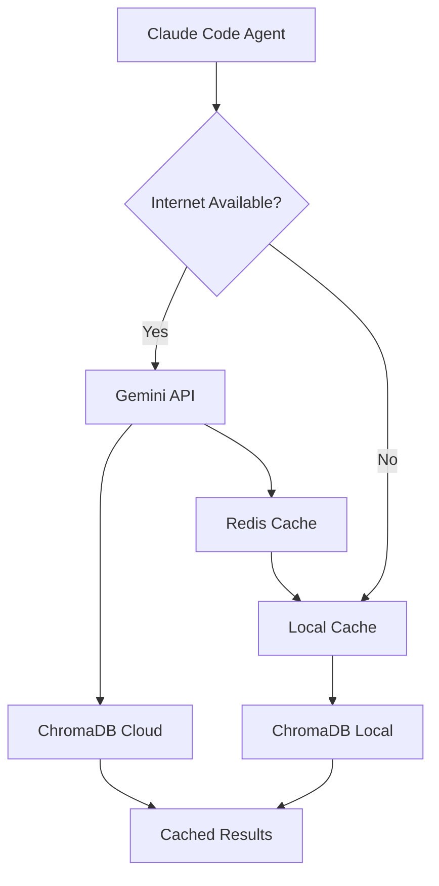

# Epic 2.5.3 Gemini Embedding Updates

## Architecture Overview



## Issue #243: RAG Foundation & ChromaDB Setup (UPDATE)

### Changes Required

**Replace** Sentence Transformers with Gemini embeddings:

```python
# OLD: sentence-transformers
# NEW: Google Generative AI
# requirements.txt
chromadb>=0.4.22
google-generativeai>=0.3.0
google-cloud-aiplatform>=1.38.0
redis>=5.0.0  # For caching
tenacity>=8.0.0  # For rate limiting
```

### New Implementation

```python
# .claude/rag/core/embeddings.py
import os
import hashlib
import json
from typing import List, Optional
import google.generativeai as genai
from tenacity import retry, stop_after_attempt, wait_exponential
import redis

class GeminiEmbedder:
    """Hybrid embedder with caching and offline fallback"""
    
    def __init__(self):
        # Configure Gemini
        genai.configure(api_key=os.getenv("GEMINI_API_KEY"))
        self.model = 'models/gemini-embedding-001'
        
        # Local cache
        self.cache_dir = ".claude/rag/cache/embeddings"
        os.makedirs(self.cache_dir, exist_ok=True)
        
        # Redis cache (optional)
        try:
            self.redis = redis.Redis(host='localhost', port=6379, decode_responses=True)
            self.redis.ping()
        except:
            self.redis = None
    
    @retry(stop=stop_after_attempt(3), wait=wait_exponential(multiplier=1, min=4, max=10))
    def embed_batch(self, texts: List[str], task_type: str = "RETRIEVAL_DOCUMENT") -> List[List[float]]:
        """Generate embeddings with caching and retry logic"""
        embeddings = []
        uncached_texts = []
        uncached_indices = []
        
        # Check cache first
        for i, text in enumerate(texts):
            cached = self._get_cached(text)
            if cached:
                embeddings.append(cached)
            else:
                embeddings.append(None)
                uncached_texts.append(text)
                uncached_indices.append(i)
        
        # Generate new embeddings
        if uncached_texts:
            result = genai.embed_content(
                model=self.model,
                content=uncached_texts,
                task_type=task_type,
                output_dimensionality=768  # Optimize for storage
            )
            
            # Update results and cache
            for idx, embedding in zip(uncached_indices, result['embedding']):
                embeddings[idx] = embedding
                self._cache_embedding(texts[idx], embedding)
        
        return embeddings
    
    def _get_cached(self, text: str) -> Optional[List[float]]:
        """Retrieve from cache hierarchy"""
        key = hashlib.sha256(text.encode()).hexdigest()
        
        # Try Redis first
        if self.redis:
            try:
                cached = self.redis.get(f"emb:{key}")
                if cached:
                    return json.loads(cached)
            except:
                pass
        
        # Try local file cache
        cache_file = os.path.join(self.cache_dir, f"{key}.json")
        if os.path.exists(cache_file):
            with open(cache_file, 'r') as f:
                return json.load(f)
        
        return None
    
    def _cache_embedding(self, text: str, embedding: List[float]):
        """Store in cache hierarchy"""
        key = hashlib.sha256(text.encode()).hexdigest()
        
        # Cache in Redis
        if self.redis:
            try:
                self.redis.setex(
                    f"emb:{key}", 
                    86400,  # 24 hour TTL
                    json.dumps(embedding)
                )
            except:
                pass
        
        # Always cache locally
        cache_file = os.path.join(self.cache_dir, f"{key}.json")
        with open(cache_file, 'w') as f:
            json.dump(embedding, f)
```

### TDD Updates

```python
# .claude/rag/tests/test_gemini_embeddings.py
import pytest
from unittest.mock import Mock, patch
from ..core.embeddings import GeminiEmbedder

class TestGeminiEmbedder:
    @patch('google.generativeai.embed_content')
    def test_embed_with_caching(self, mock_embed):
        """Test embedding generation with caching"""
        mock_embed.return_value = {'embedding': [[0.1, 0.2, 0.3]]}
        
        embedder = GeminiEmbedder()
        
        # First call - should hit API
        result1 = embedder.embed_batch(["test text"])
        assert mock_embed.called
        
        # Second call - should use cache
        mock_embed.reset_mock()
        result2 = embedder.embed_batch(["test text"])
        assert not mock_embed.called
        assert result1 == result2
    
    def test_offline_fallback(self):
        """Test behavior when API is unavailable"""
        embedder = GeminiEmbedder()
        # Pre-cache some embeddings
        embedder._cache_embedding("cached text", [0.1, 0.2, 0.3])
        
        # Simulate API failure
        with patch('google.generativeai.embed_content', side_effect=Exception("API Error")):
            # Cached text should still work
            result = embedder._get_cached("cached text")
            assert result == [0.1, 0.2, 0.3]
            
            # New text should raise
            with pytest.raises(Exception):
                embedder.embed_batch(["new text"])
```

### Documentation Links
- [Gemini Embeddings Guide](https://ai.google.dev/gemini-api/docs/embeddings)
- [Authentication Setup](https://cloud.google.com/docs/authentication/getting-started)
- [ChromaDB Documentation](https://docs.trychroma.com/)

---

## Issue #244: C# Calculation Parser (UPDATE)

### Changes Required

Add batch processing for efficiency:

```python
# .claude/rag/chunkers/csharp.py
class CSharpCalculationParser:
    def __init__(self, embedder: GeminiEmbedder):
        self.embedder = embedder
        self.batch_size = 100  # Process in batches
    
    def parse_and_embed_repository(self, repo_path: str) -> List[CodeChunk]:
        """Parse repository and generate embeddings efficiently"""
        chunks = []
        batch_texts = []
        batch_metadata = []
        
        for file_path in self._find_calculation_files(repo_path):
            file_chunks = self.parse_file(file_path)
            
            for chunk in file_chunks:
                batch_texts.append(chunk.content)
                batch_metadata.append(chunk.metadata)
                
                if len(batch_texts) >= self.batch_size:
                    # Process batch
                    embeddings = self.embedder.embed_batch(
                        batch_texts, 
                        task_type="RETRIEVAL_DOCUMENT"
                    )
                    
                    for text, meta, embedding in zip(batch_texts, batch_metadata, embeddings):
                        chunks.append(CodeChunk(
                            content=text,
                            metadata=meta,
                            embedding=embedding
                        ))
                    
                    batch_texts = []
                    batch_metadata = []
        
        # Process remaining
        if batch_texts:
            embeddings = self.embedder.embed_batch(batch_texts)
            # ... process remaining chunks
        
        return chunks
```

### Documentation Links
- [Batch Embedding Best Practices](https://ai.google.dev/gemini-api/docs/embeddings#embed-multiple-texts)
- [Rate Limiting Guide](https://ai.google.dev/gemini-api/docs/rate-limits)

---

## Issue #246: Native Sub-Agent RAG Interface (UPDATE)

### Critical Addition: Authentication Management

```python
# .claude/rag/agents/auth_manager.py
import os
from google.auth import default
from google.oauth2 import service_account

class AuthManager:
    """Manage authentication for sub-agents"""
    
    @staticmethod
    def setup_credentials():
        """Setup ADC or service account"""
        # Check for explicit service account
        if os.getenv("GOOGLE_APPLICATION_CREDENTIALS"):
            return service_account.Credentials.from_service_account_file(
                os.getenv("GOOGLE_APPLICATION_CREDENTIALS")
            )
        
        # Use Application Default Credentials
        credentials, project = default()
        return credentials
    
    @staticmethod
    def get_api_key() -> str:
        """Get Gemini API key from environment"""
        api_key = os.getenv("GEMINI_API_KEY")
        if not api_key:
            raise ValueError(
                "GEMINI_API_KEY not set. Get one at: "
                "https://makersuite.google.com/app/apikey"
            )
        return api_key
```

### Updated Interface

```python
# .claude/rag/agents/interface.py
class AgentRAGInterface:
    def __init__(self, agent_type: str):
        self.agent_type = agent_type
        self.auth_manager = AuthManager()
        self.embedder = GeminiEmbedder()
        self.vectordb = self._init_vectordb()
    
    async def search(self, query: str, limit: int = 5) -> str:
        """Search with automatic collection routing"""
        try:
            # Generate query embedding
            query_embedding = self.embedder.embed_batch(
                [query], 
                task_type="RETRIEVAL_QUERY"
            )[0]
            
            # Search appropriate collections
            collections = self._get_agent_collections()
            results = []
            
            for collection in collections:
                results.extend(
                    self.vectordb.query(
                        query_embeddings=[query_embedding],
                        n_results=limit,
                        where={"collection": collection}
                    )
                )
            
            return self._format_results(results)
            
        except Exception as e:
            # Fallback to cached results if available
            return self._search_cache(query)
```

### Documentation Links
- [ADC Setup Guide](https://cloud.google.com/docs/authentication/application-default-credentials)
- [API Key Management](https://ai.google.dev/gemini-api/docs/quickstart#set-up-api-key)

---

## Issue #247: MidsReborn Repository Connector (UPDATE)

### Add Rate Limiting and Cost Optimization

```python
# .claude/rag/connectors/midsreborn.py
class MidsRebornConnector:
    def __init__(self):
        self.rate_limiter = RateLimiter(
            calls_per_minute=1500,  # Gemini free tier
            batch_size=100  # Optimize API calls
        )
    
    async def index_repository(self, use_batch_api: bool = True):
        """Index with batch processing for 50% cost savings"""
        if use_batch_api:
            # Use Vertex AI batch prediction for 50% discount
            batch_request = {
                "model": "gemini-embedding-001",
                "contents": [],
                "config": {
                    "task_type": "RETRIEVAL_DOCUMENT",
                    "output_dimensionality": 768
                }
            }
            
            # Accumulate files for batch processing
            for file_content in self._get_calculation_files():
                batch_request["contents"].append(file_content)
                
                if len(batch_request["contents"]) >= 1000:
                    # Submit batch job
                    await self._submit_batch_job(batch_request)
                    batch_request["contents"] = []
```

### Documentation Links
- [Batch Prediction Guide](https://cloud.google.com/vertex-ai/docs/generative-ai/embeddings/batch-prediction-genai-embeddings)
- [Cost Optimization](https://cloud.google.com/vertex-ai/pricing#genai-models)

---

## New Issue Required: #249 - Authentication & Security Setup

```markdown
# Epic 2.5.3.10: Authentication & Security for Gemini RAG

**Parent Epic:** #178

## 📋 Description
Implement secure authentication and API key management for Gemini embeddings with proper local development workflow.

## 🎯 TDD Requirements

### Unit Tests
- [ ] Test API key loading from environment
- [ ] Test ADC credential setup
- [ ] Test fallback authentication methods
- [ ] Test secure key storage

### Integration Tests
- [ ] Test authentication with Gemini API
- [ ] Test rate limit handling
- [ ] Test offline fallback behavior

## 🛠️ Implementation

### Environment Setup
\`\`\`bash
# .env.example
GEMINI_API_KEY=your-api-key-here
GOOGLE_CLOUD_PROJECT=your-project-id
# Optional: For production
GOOGLE_APPLICATION_CREDENTIALS=/path/to/service-account.json
\`\`\`

### Just Commands
\`\`\`makefile
# justfile additions
rag-setup:
    #!/usr/bin/env bash
    echo "Setting up Gemini RAG authentication..."
    
    # Check for API key
    if [ -z "$GEMINI_API_KEY" ]; then
        echo "Please set GEMINI_API_KEY in .env file"
        echo "Get one at: https://makersuite.google.com/app/apikey"
        exit 1
    fi
    
    # Setup ADC for local development
    gcloud auth application-default login
    
    # Verify setup
    uv run python -c "import google.generativeai as genai; genai.configure(api_key='$GEMINI_API_KEY'); print('✅ Gemini API configured')"

rag-test-auth:
    uv run python .claude/rag/tests/test_auth.py
\`\`\`

## 📚 Documentation
- [API Key Setup](https://ai.google.dev/gemini-api/docs/quickstart#set-up-api-key)
- [ADC Configuration](https://cloud.google.com/docs/authentication/application-default-credentials)
- [Security Best Practices](https://cloud.google.com/docs/authentication/best-practices-applications)
```

---

## Missing Components Identified

1. **Cost Monitoring**
   ```python
   # .claude/rag/monitoring/cost_tracker.py
   class CostTracker:
       """Track API usage and costs"""
       def __init__(self):
           self.token_count = 0
           self.cost_per_million = 0.15
       
       def track_embedding_call(self, texts: List[str]):
           # Estimate tokens (rough: 1 token ≈ 4 chars)
           tokens = sum(len(text) // 4 for text in texts)
           self.token_count += tokens
           
       @property
       def estimated_cost(self) -> float:
           return (self.token_count / 1_000_000) * self.cost_per_million
   ```

2. **Offline Mode Detection**
   ```python
   # .claude/rag/utils/connectivity.py
   class ConnectivityChecker:
       @staticmethod
       def is_online() -> bool:
           try:
               import requests
               response = requests.get("https://www.google.com", timeout=2)
               return response.status_code == 200
           except:
               return False
       
       @staticmethod
       def can_reach_gemini() -> bool:
           try:
               import google.generativeai as genai
               genai.configure(api_key=os.getenv("GEMINI_API_KEY"))
               # Try a minimal API call
               return True
           except:
               return False
   ```

3. **Sync Mechanism**
   ```python
   # .claude/rag/sync/hybrid_sync.py
   class HybridSync:
       """Sync between local and cloud vector stores"""
       def __init__(self, local_db, cloud_db):
           self.local_db = local_db
           self.cloud_db = cloud_db
       
       async def sync_embeddings(self):
           """Sync new embeddings from cloud to local"""
           # Get latest from cloud
           cloud_docs = await self.cloud_db.get_all()
           
           # Update local cache
           for doc in cloud_docs:
               if not self.local_db.exists(doc.id):
                   self.local_db.add(doc)
   ```

## Summary of Changes

1. **Embedding Model**: Sentence Transformers → Gemini-embedding-001
2. **Vector DB**: Keep ChromaDB (works with any embeddings)
3. **New Components**: 
   - Authentication management
   - Caching layer (Redis + local)
   - Cost tracking
   - Offline fallback
   - Batch processing

4. **Documentation**: All issues now include:
   - Official Google documentation links
   - TDD test examples
   - Cost optimization strategies
   - Security best practices

5. **Integration**: Seamless with Claude Code through:
   - Environment variables
   - Just commands
   - Automatic fallback
   - Progress tracking