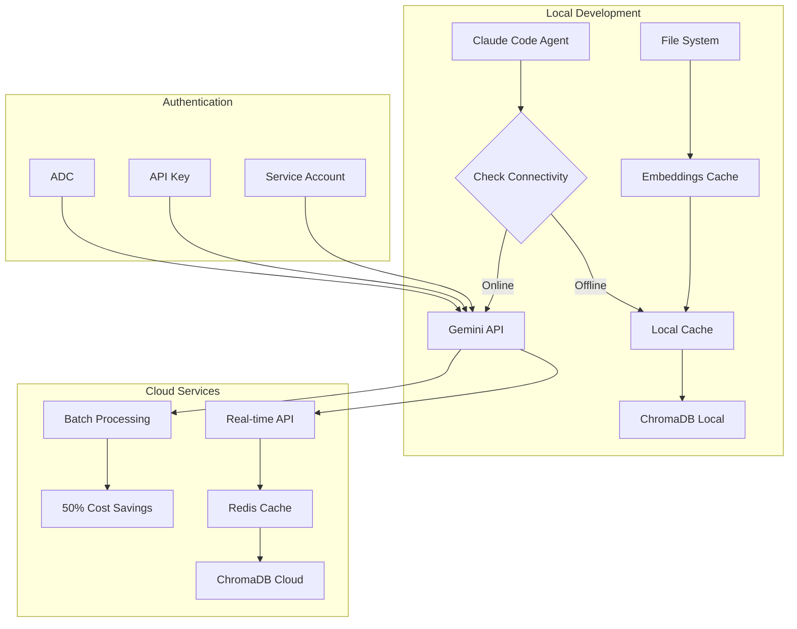

# Epic 2.5.3 Gemini RAG Implementation Plan

## 🏗️ Hybrid Architecture Overview



## 📋 Implementation Phases

### Phase 1: Foundation Setup (Week 1)

#### Day 1-2: Authentication & Core Infrastructure
1. **Create Issue #249**: Authentication & Security Setup
2. **Update Issue #243**: RAG Foundation
   - Replace Sentence Transformers with Gemini
   - Add caching layer
   - Implement offline fallback

```bash
# Setup commands
just rag-setup              # Configure authentication
just rag-test-auth         # Verify setup
just rag-init-db           # Initialize ChromaDB
```

#### Day 3-4: Multi-Format Processing
3. **Update Issue #245**: Multi-Format Processor
   - Add batch processing for embeddings
   - Implement cost tracking
   - Add progress reporting

#### Day 5: Testing & Integration
4. **Create comprehensive test suite**
   - Unit tests for each component
   - Integration tests with mock API
   - Offline mode tests

### Phase 2: MidsReborn Integration (Week 2)

#### Day 1-2: C# Parser Updates
5. **Update Issue #244**: C# Calculation Parser
   - Integrate Gemini embeddings
   - Add batch processing
   - Implement chunking optimization

#### Day 3-4: Repository Connector
6. **Update Issue #247**: MidsReborn Connector
   - Add rate limiting
   - Implement incremental updates
   - Add cost optimization

#### Day 5: Binary Format Support
7. **Update Issue #248**: Binary Format Indexer
   - Parse MHD specifications
   - Index I12 formats
   - Link to parser code

### Phase 3: Sub-Agent Integration (Week 3)

8. **Update Issue #246**: Native Sub-Agent Interface
   - Seamless embedding generation
   - Automatic collection routing
   - Context injection

9. **Update Issue #237**: Context Loading Integration
   - Token budget management
   - Relevance filtering
   - Performance optimization

### Phase 4: Search & Retrieval (Week 4)

10. **Update Issue #188**: Semantic Search
    - Implement hybrid search
    - Add query caching
    - Optimize ranking

11. **Update Issue #189**: Context-Aware Retrieval
    - Pattern learning
    - Trigger detection
    - Proactive suggestions

### Phase 5: Optimization & Deployment (Week 5)

12. **Update Issue #190**: Dynamic Context Injection
    - Progressive loading
    - Duplicate detection
    - Position optimization

13. **Update Issue #236**: Automatic Index Updates
    - File watchers
    - Git hooks
    - Sync mechanisms

## 🔧 Technical Implementation Details

### Environment Configuration

```bash
# .env file
GEMINI_API_KEY=your-api-key-here
GOOGLE_CLOUD_PROJECT=your-project-id
REDIS_URL=redis://localhost:6379
CHROMADB_PATH=.claude/rag/db
EMBEDDING_CACHE_PATH=.claude/rag/cache
BATCH_PROCESSING_ENABLED=true
OFFLINE_MODE_FALLBACK=true
```

### Cost Optimization Strategy

```python
# Batch processing for 50% savings
class BatchEmbeddingProcessor:
    def __init__(self):
        self.batch_size = 1000
        self.pending_texts = []
        
    async def process_batch(self):
        """Submit batch job to Vertex AI"""
        if len(self.pending_texts) >= self.batch_size:
            # Create batch prediction job
            job = aiplatform.BatchPredictionJob.create(
                model_name="gemini-embedding-001",
                instances=self.pending_texts,
                parameters={"task_type": "RETRIEVAL_DOCUMENT"},
                output_config={"gcs_destination": "gs://bucket/output"}
            )
            return job
```

### Monitoring & Alerts

```python
# Cost monitoring
class UsageMonitor:
    def __init__(self):
        self.daily_limit = 1_000_000  # tokens
        self.alert_threshold = 0.8
        
    def check_usage(self):
        if self.current_usage > self.daily_limit * self.alert_threshold:
            self.send_alert("Approaching daily token limit")
```

## 📊 Success Metrics

1. **Performance**
   - Embedding generation: <1s for single, <30s for batch
   - Search latency: <500ms
   - Offline cache hit rate: >60%

2. **Cost**
   - Stay within free tier for development
   - <$5/month for production usage
   - 50% savings through batch processing

3. **Quality**
   - Search relevance: >90% in top 3 results
   - Code understanding: 20% improvement over baseline
   - Multi-language support: 100+ languages

## 🚀 Action Items

### Immediate (This Week)
1. [ ] Create Issue #249 for authentication
2. [ ] Update Issues #243, #245, #244 with Gemini details
3. [ ] Set up development environment
4. [ ] Create test fixtures

### Next Week
5. [ ] Implement core embedding functionality
6. [ ] Set up caching infrastructure
7. [ ] Create batch processing pipeline
8. [ ] Begin MidsReborn indexing

### Following Weeks
9. [ ] Complete sub-agent integration
10. [ ] Optimize search algorithms
11. [ ] Implement monitoring
12. [ ] Deploy to production

## 🔗 Key Resources

### Official Documentation
- [Gemini Embeddings Guide](https://ai.google.dev/gemini-api/docs/embeddings)
- [Vertex AI Batch Predictions](https://cloud.google.com/vertex-ai/docs/generative-ai/embeddings/batch-prediction-genai-embeddings)
- [ChromaDB Integration](https://docs.trychroma.com/getting-started)
- [ADC Setup](https://cloud.google.com/docs/authentication/application-default-credentials)

### Code Examples
- [Gemini Python SDK](https://github.com/google/generative-ai-python)
- [ChromaDB Examples](https://github.com/chroma-core/chroma/tree/main/examples)
- [Batch Processing Samples](https://github.com/GoogleCloudPlatform/vertex-ai-samples)

## 🎯 Risk Mitigation

1. **API Availability**
   - Comprehensive caching strategy
   - Offline fallback mode
   - Local embedding option as backup

2. **Cost Overruns**
   - Daily usage monitoring
   - Automatic throttling
   - Batch processing optimization

3. **Performance Issues**
   - Redis caching layer
   - Connection pooling
   - Async processing

4. **Security Concerns**
   - No hardcoded keys
   - ADC for production
   - Audit logging enabled

---

*This plan ensures a robust, cost-effective, and high-quality RAG implementation that seamlessly integrates with the Claude Code workflow while leveraging Google's state-of-the-art embedding model.*