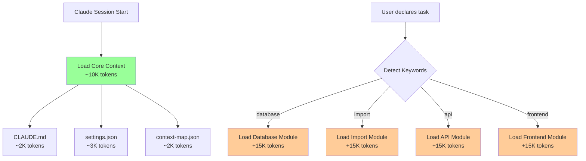
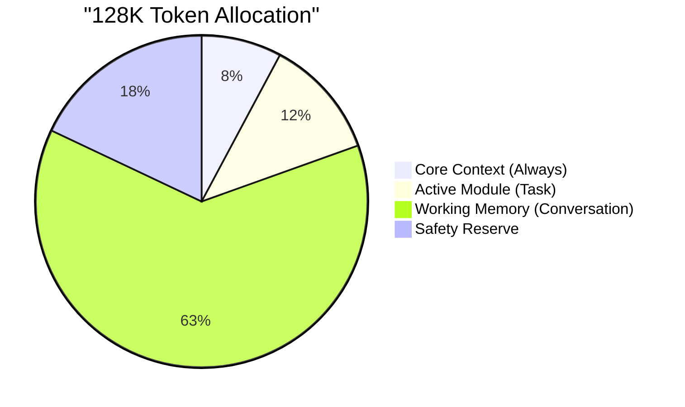
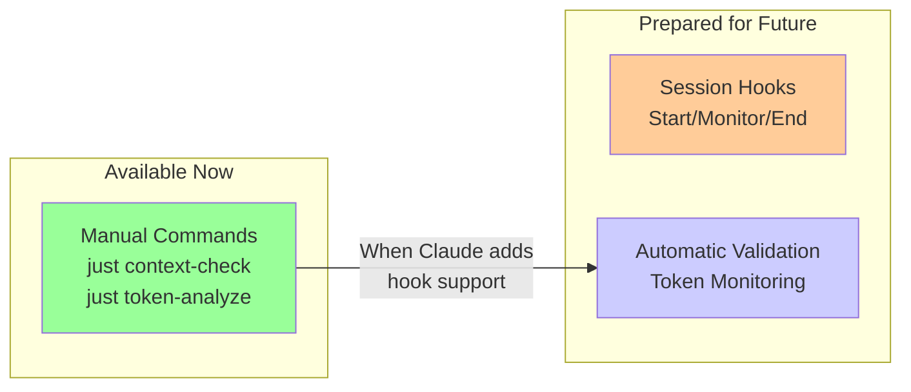

# Claude Context System

> **Quick Start**: Claude automatically loads `CLAUDE.md` and this directory. Keep CLAUDE.md under 5K tokens as your primary guide.

## How Claude Context Works

### 🎯 Core Principle: Progressive Context Loading

Claude doesn't need everything at once. We load context progressively based on your task:



### 📊 Token Budget Management



- **Core context**: ~10K (always loaded)
- **Active modules**: ~20-40K (task-specific)
- **Working memory**: ~40-80K (conversation)
- **Safety reserve**: ~8K

**Warnings at 90K, auto-pruning at 110K**

### 🗂️ Directory Structure

```
.claude/
├── README.md          # You are here
├── settings.json      # Claude behavior configuration
├── context-map.json   # Loading rules and limits
│
├── core/             # Always loaded (max 10K total)
├── modules/          # Task-specific contexts
├── workflows/        # Standard procedures
├── automation/       # Scripts and commands
├── state/            # Project state (git-ignored)
└── docs/             # Meta-documentation
```

### 🚀 Common Tasks

**Starting work on database:**
```bash
# Claude auto-loads database module when you mention database work
"I need to work on database migrations"
```

**Import operations:**
```bash
# Claude loads import module for import tasks
"I need to import I12 power data"
```

**Context health checks:**
```bash
just context-check      # Full validation and analysis
just context-validate   # Check structure and limits
just token-analyze      # Analyze token usage
```

**Quick reference:**
- See `CLAUDE.md` for project overview
- See `.claude/core/quick-reference.md` for common commands
- See `.claude/workflows/daily.md` for development workflow

### ⚡ Best Practices

1. **Start with task declaration** - Helps Claude load right context
2. **Use /clear between tasks** - Prevents context pollution  
3. **Check token usage** - Run `just context-check` regularly
4. **One task per session** - Maintains focus
5. **Validate before commits** - Ensure context stays healthy

### 🤖 Automation Status



**Current**: Run commands manually during sessions  
**Future**: Hooks will run automatically when Claude Code adds support

### 🔧 Available Commands

```bash
# Context validation
just context-check      # Full health check (validate + analyze)
just context-validate   # Validate structure against limits
just token-analyze      # Analyze token usage in directories

# Manual hook execution (until automated)
bash .claude/automation/hooks/session-start-hook.sh
bash .claude/automation/hooks/session-end-hook.sh
```

### ⚙️ Customization

Edit `.claude/context-map.json` to:
- Adjust token limits
- Change loading rules
- Add new modules
- Set file size limits
- Configure tool loadouts per task

### ❓ Troubleshooting

**Context overflow?**
- Use /clear command
- Start new session
- Check for large files in modules/

**Missing context?**
- Explicitly mention your task domain
- Check context-map.json rules
- Verify file exists in expected location

**Conflicting information?**
- Check for duplicates across modules
- Ensure single source of truth
- Report in GitHub issue

---

*Based on context management best practices from ["How Contexts Fail"](https://www.dbreunig.com/2025/06/22/how-contexts-fail-and-how-to-fix-them.html)*