# Claude Context System

This directory contains the Claude Code context management system for the Mids Hero Web project.

## 📁 Directory Structure

- **`agents/`** - Native Claude Code sub-agents for specialized tasks
- **`docs/`** - All project documentation
- **`hooks/`** - Active Claude Code hooks for automation
- **`modules/`** - Task-based context modules (database, api, frontend, etc.)
- **`sessions/`** - Session data and summaries
- **`state/`** - Runtime state including progress tracking and logs
- **`workflows/`** - Development workflow guides

## 🔧 Configuration Files

- **`settings.json`** - Claude Code configuration and permissions
- **`context-map.json`** - Context loading rules and thresholds
- **`CLEANUP_LOG.md`** - Recent directory reorganization details

## 📖 How It Works

1. **Progressive Loading**: Claude loads only the context needed for your declared task
2. **Token Management**: Automatic warnings when approaching limits
3. **Activity Tracking**: All actions logged for session continuity
4. **Native Sub-Agents**: Specialized agents for database, frontend, API work

## 🚀 Quick Start

Tell Claude what you're working on:
- "I need to work on database migrations"
- "Help me import I12 power data"
- "I want to build API endpoints"

Claude will automatically load the appropriate modules and tools for your task.

## 📊 Context Health

Run `just context-validate` to check:
- File sizes and token counts
- Required files presence
- Module organization
- Loading scenarios

## 🔗 Related Documentation

- Main guide: `/CLAUDE.md`
- Development workflow: `.claude/docs/development-workflow.md`
- Session management: `.claude/docs/session-management.md`

### 🔧 Quick Commands

**Import operations:**
```bash
# Claude loads import module for import tasks
"I need to import I12 power data"
```

**Context health checks:**
```bash
just context-check      # Full validation and analysis
just context-validate   # Check structure and limits
just token-analyze      # Analyze token usage
```

### ⚡ Best Practices

1. **Start with task declaration** - Helps Claude load right context
2. **Use /clear between tasks** - Prevents context pollution  
3. **Check token usage** - Run `just context-check` regularly
4. **One task per session** - Maintains focus
5. **Validate before commits** - Ensure context stays healthy

### 🤖 Automation Status

```mermaid
graph LR
    subgraph "ACTIVE NOW ✨"
        Hooks[Claude Code Hooks<br/>UserPromptSubmit<br/>PreToolUse<br/>PostToolUse<br/>Stop]
        Auto[Automatic Validation<br/>Token Limiting<br/>Activity Logging]
    end
    
    subgraph "Manual Backup"
        Manual[Manual Commands<br/>just context-check<br/>just token-analyze]
    end
    
    Hooks --> Auto
    Auto --> Manual
    
    style Hooks fill:#99ff99
    style Auto fill:#99ff99
    style Manual fill:#ccccff
```



**Current**: ✅ Hooks run automatically on every Claude interaction
**Backup**: Manual commands available for debugging and analysis

### 🪝 Hook Execution

Hooks are configured in `.claude/settings.json` under the `"hooks"` section.
Claude triggers them at several points:

- **UserPromptSubmit** – right after you send a message.
- **PreToolUse** – before any tool or command executes.
- **PostToolUse** – after a tool finishes running.
- **Stop** – when the session ends.

Each hook lists commands that Claude runs automatically, powering
context validation, token limits and activity logging.

### 🔧 Available Commands

```bash
# Context validation
just context-check      # Full health check (validate + analyze)
just context-validate   # Validate structure against limits
just token-analyze      # Analyze token usage in directories

# Manual hook execution (if needed)
bash .claude/automation/hooks/session-start-hook.sh
bash .claude/automation/hooks/session-end-hook.sh
```

### ⚙️ Customization

Edit `.claude/context-map.json` to:
- Adjust token limits
- Change loading rules
- Add new modules
- Set file size limits
- Configure tool loadouts per task

### ❓ Troubleshooting

**Context overflow?**
- Use /clear command
- Start new session
- Check for large files in modules/

**Missing context?**
- Explicitly mention your task domain
- Check context-map.json rules
- Verify file exists in expected location

**Conflicting information?**
- Check for duplicates across modules
- Ensure single source of truth
- Report in GitHub issue

## 🔧 GitHub Integration

The Claude context system integrates seamlessly with GitHub workflows to provide:

### Automated Features

1. **PR Code Review** (claude-auto-review.yml)
   - Automatic review on every PR
   - City of Heroes domain knowledge
   - Inline code suggestions

2. **Interactive Assistant** (claude-code-integration.yml)
   - Use `@claude` in PR/issue comments
   - Get help with implementation
   - Ask about project status

3. **Documentation Sync** (doc-auto-sync.yml)
   - Automatic updates when code changes
   - Weekly consistency checks
   - Token limit enforcement

4. **Context Health** (context-health-check.yml)
   - Runs every 6 hours
   - Monitors file sizes
   - Validates structure

### Working with Workflows

**Local Development**:
- Claude Code hooks trigger automatically
- Context loads based on your task
- Activity tracked for continuity

**GitHub Integration**:
- PRs get automatic review
- Documentation stays in sync
- Health checks prevent issues

**Example Workflow**:
```bash
# 1. Create feature branch
git checkout -b feature/new-power

# 2. Tell Claude your task
"I need to add a new power calculation"

# 3. Make changes (Claude loads calculation context)
# 4. Create PR (automatic review starts)
# 5. Use @claude for help in PR comments
# 6. Documentation updates suggested automatically
```

See [/.github/workflows/README.md](/.github/workflows/README.md) for detailed workflow documentation.

---

*Based on context management best practices from ["How Contexts Fail"](https://www.dbreunig.com/2025/06/22/how-contexts-fail-and-how-to-fix-them.html)*
