# API Specifications

This document provides detailed API specifications with visual diagrams for the Mids Hero Web REST API.

## API Overview

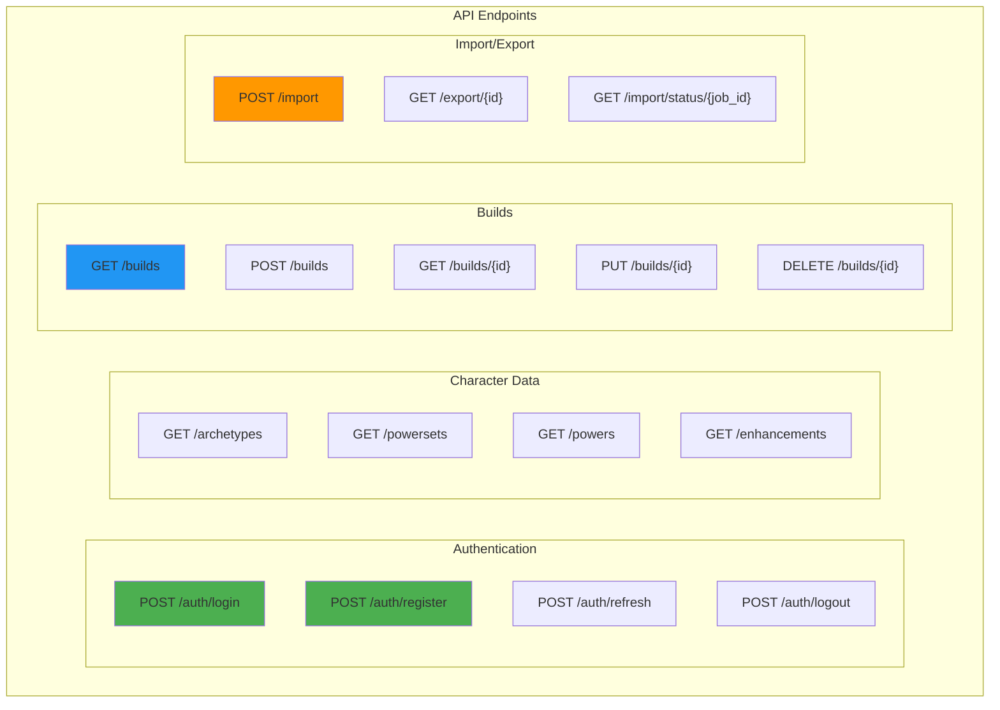

## Authentication Endpoints

### POST /auth/login

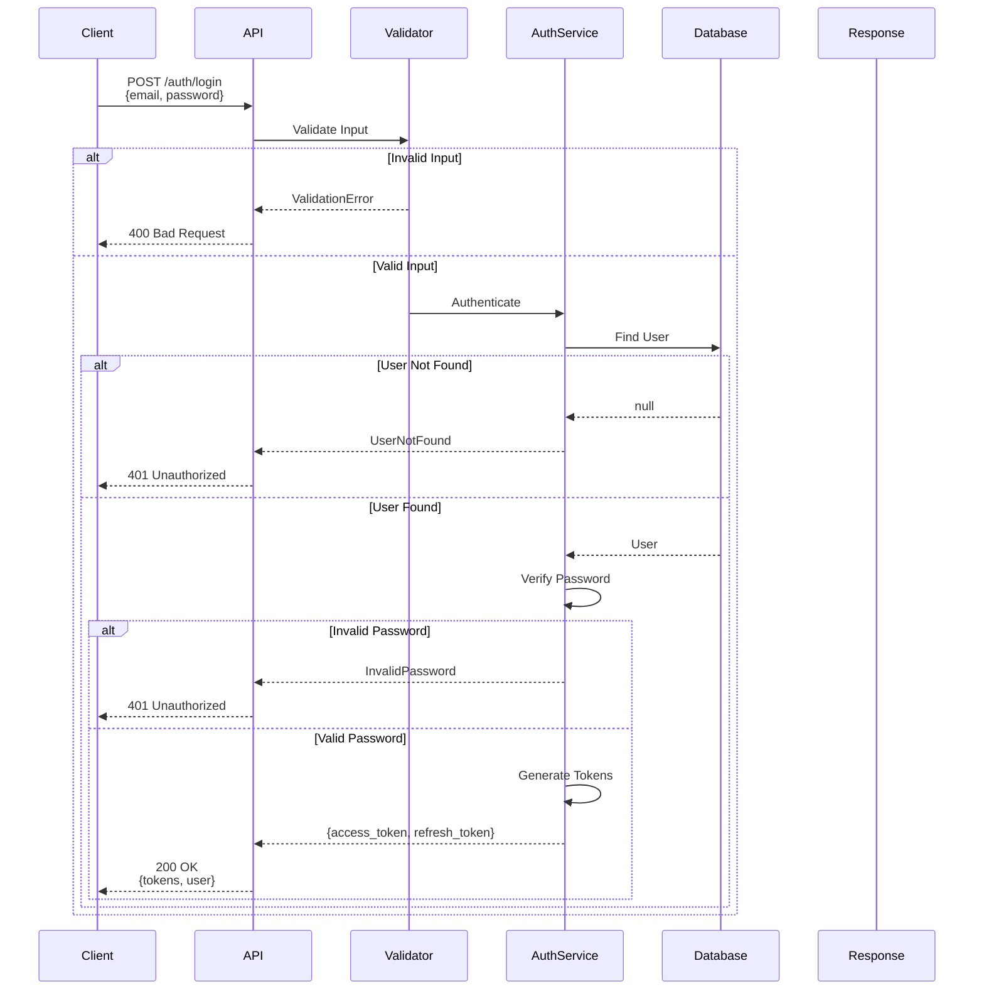

**Request Schema:**
```json
{
  "email": "string",
  "password": "string"
}
```

**Response Schema:**
```json
{
  "access_token": "string",
  "refresh_token": "string",
  "token_type": "bearer",
  "user": {
    "id": "uuid",
    "email": "string",
    "username": "string"
  }
}
```

### POST /auth/register

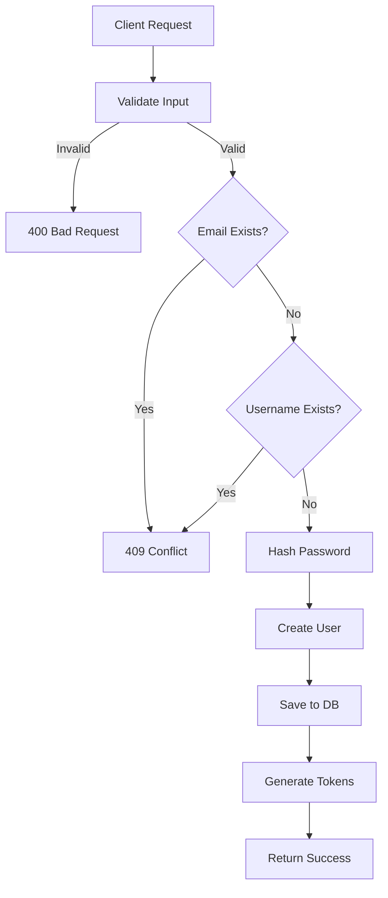

## Character Data Endpoints

### GET /archetypes

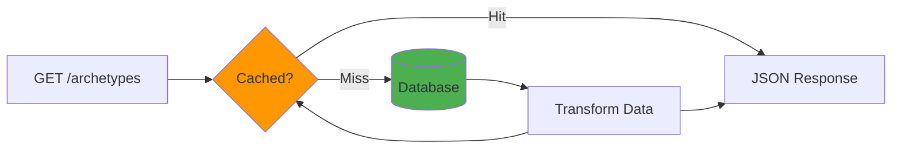

**Response Schema:**
```json
{
  "archetypes": [
    {
      "id": 1,
      "name": "Blaster",
      "display_name": "Blaster",
      "description": "Offensive ranged damage dealer",
      "icon": "blaster.png",
      "primary_category": "Ranged",
      "secondary_category": "Support",
      "hit_points_base": 1204.8,
      "hit_points_max": 1606.4,
      "inherent_powers": ["Defiance"]
    }
  ],
  "total": 13
}
```

### GET /powers

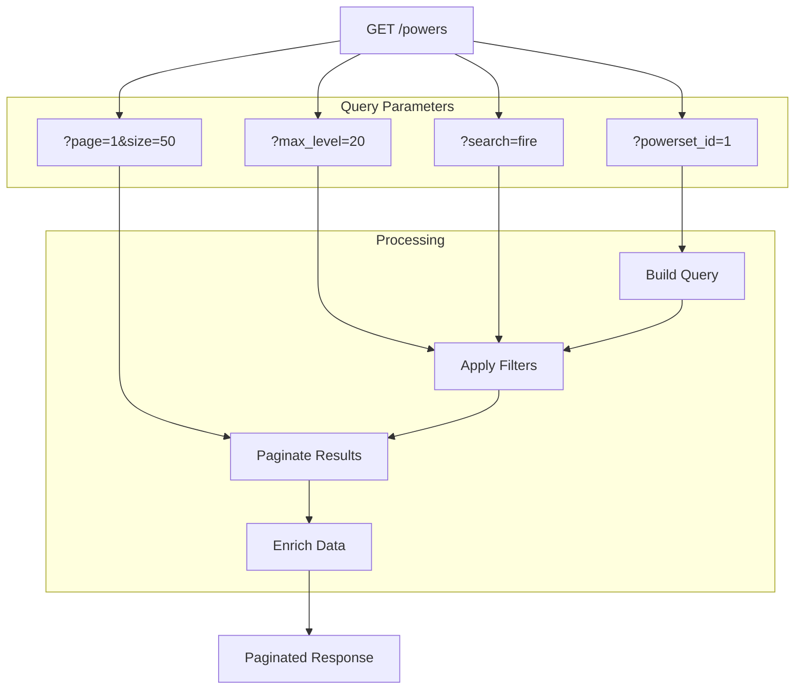

**Query Parameters:**
- `powerset_id` (optional): Filter by powerset
- `archetype_id` (optional): Filter by archetype
- `max_level` (optional): Maximum level available
- `search` (optional): Search in name/description
- `page` (default: 1): Page number
- `size` (default: 50): Page size

## Build Management Endpoints

### POST /builds

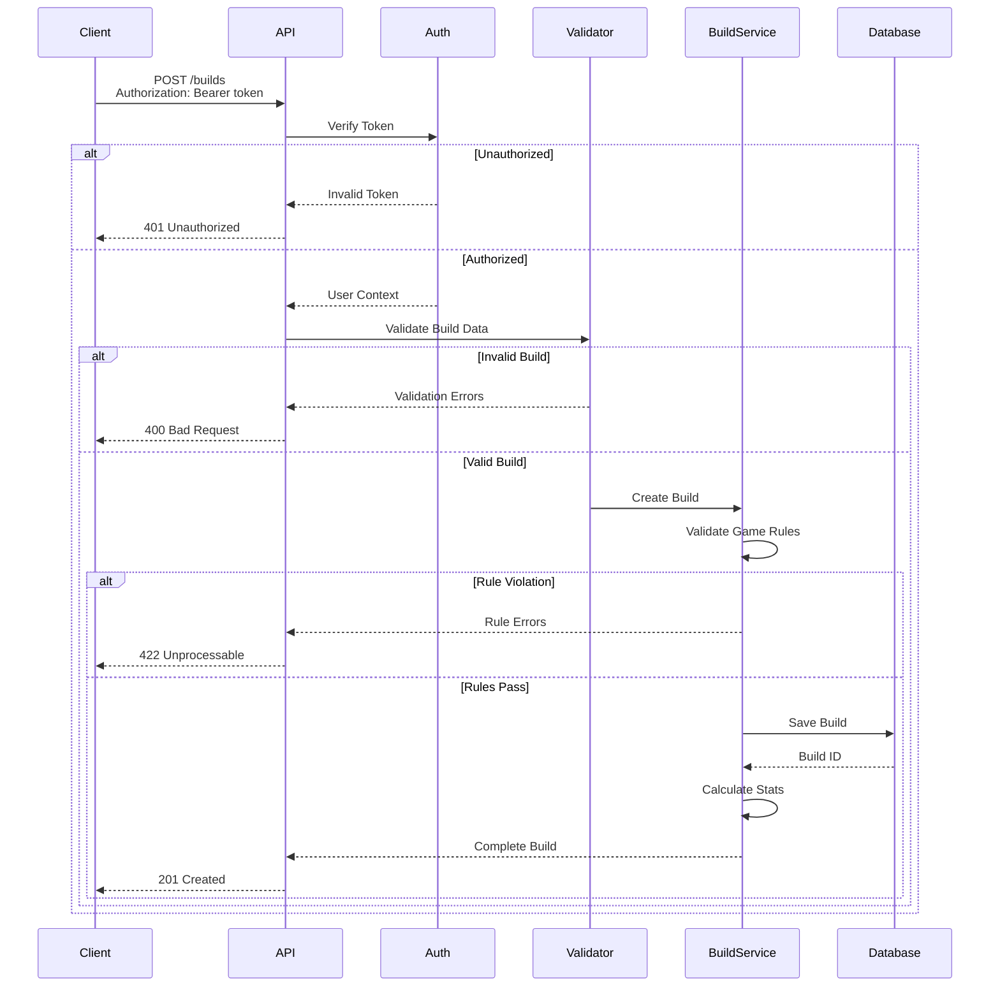

**Request Schema:**
```json
{
  "name": "Fire/Fire Blaster",
  "archetype_id": 1,
  "primary_powerset_id": 1,
  "secondary_powerset_id": 2,
  "powers": [
    {
      "power_id": 101,
      "level_taken": 1,
      "slots": [
        {
          "level": 1,
          "enhancement_id": 501
        }
      ]
    }
  ]
}
```

### GET /builds/{id}

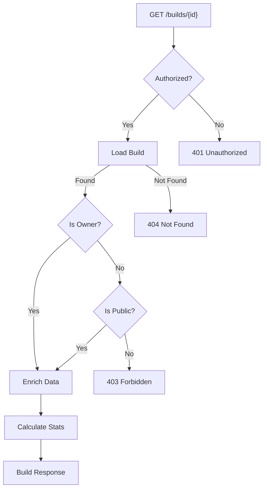

## Import/Export Endpoints

### POST /import

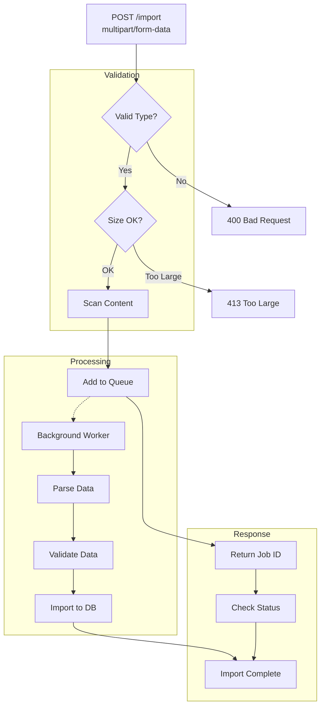

**File Upload Schema:**
```
Content-Type: multipart/form-data

file: build_data.mhd (binary)
type: "mhd" | "json" | "mxd"
options: {
  "override_existing": false,
  "validate_only": false
}
```

### GET /import/status/{job_id}

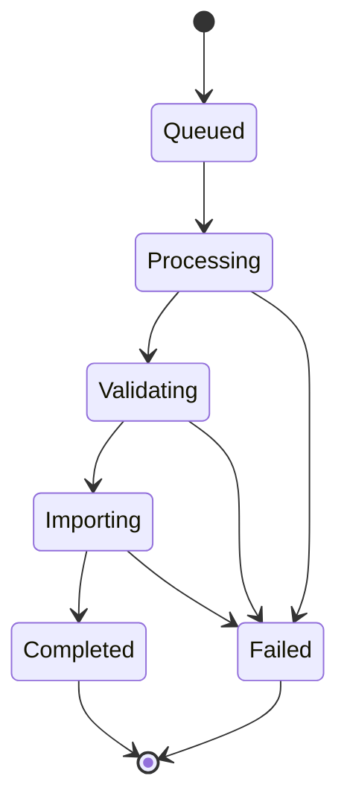

**Response Schema:**
```json
{
  "job_id": "uuid",
  "status": "processing",
  "progress": 45,
  "total_records": 1000,
  "processed_records": 450,
  "errors": [],
  "started_at": "2025-01-19T10:00:00Z",
  "completed_at": null,
  "result": null
}
```

## Error Response Format

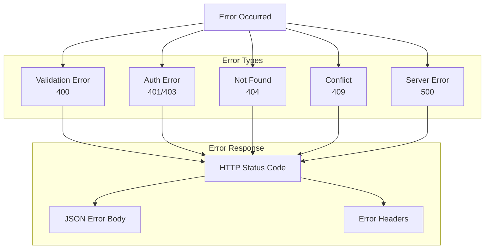

**Standard Error Response:**
```json
{
  "error": {
    "code": "VALIDATION_ERROR",
    "message": "Invalid input data",
    "details": {
      "field_errors": {
        "email": ["Invalid email format"],
        "password": ["Password too short"]
      }
    },
    "request_id": "req_123456",
    "timestamp": "2025-01-19T10:00:00Z"
  }
}
```

## Rate Limiting

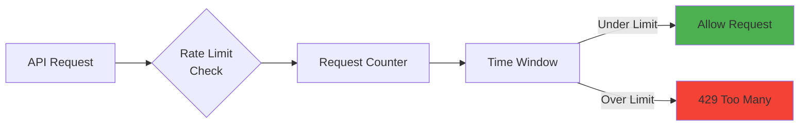

**Rate Limit Headers:**
```
X-RateLimit-Limit: 100
X-RateLimit-Remaining: 45
X-RateLimit-Reset: 1737284400
X-RateLimit-Window: 3600
```

## API Versioning

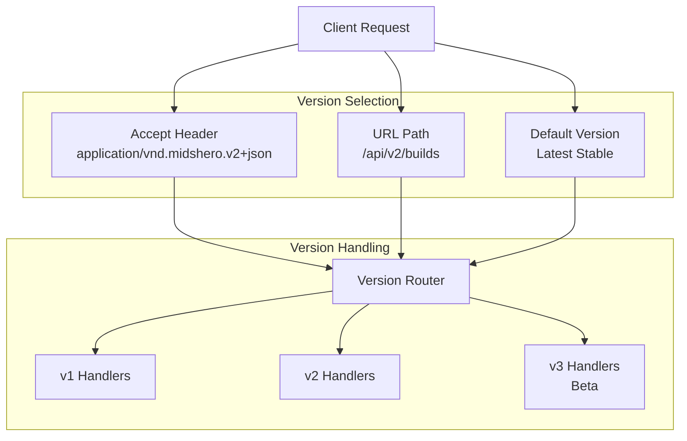

## WebSocket Events

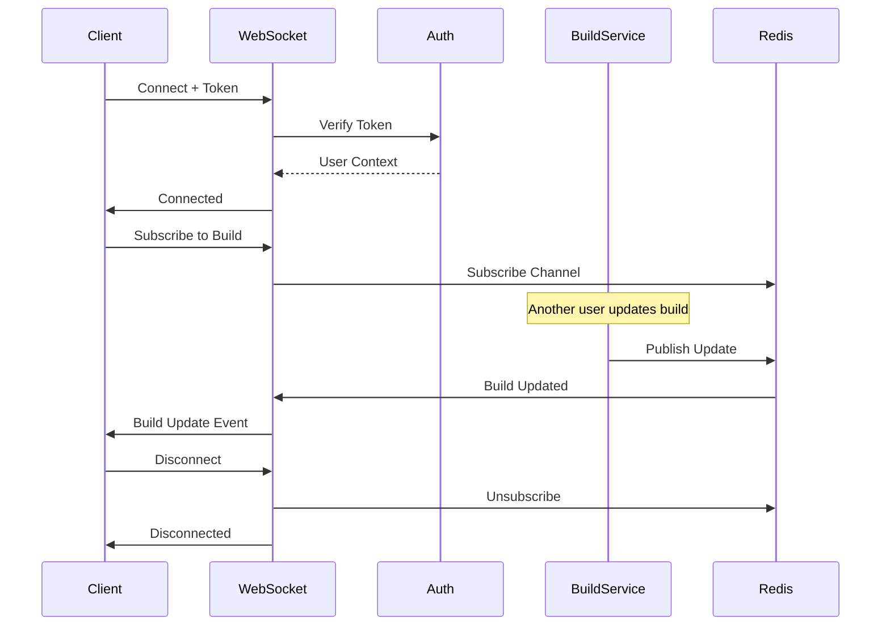

**WebSocket Events:**
- `build.updated`: Build data changed
- `build.deleted`: Build was deleted
- `import.progress`: Import job progress
- `import.complete`: Import job finished

This API specification provides a comprehensive overview of all endpoints, their behavior, and data formats.