# Data Flow Documentation

This document visualizes how data flows through the Mids Hero Web system, from import to user interaction.

## Complete Data Flow Overview

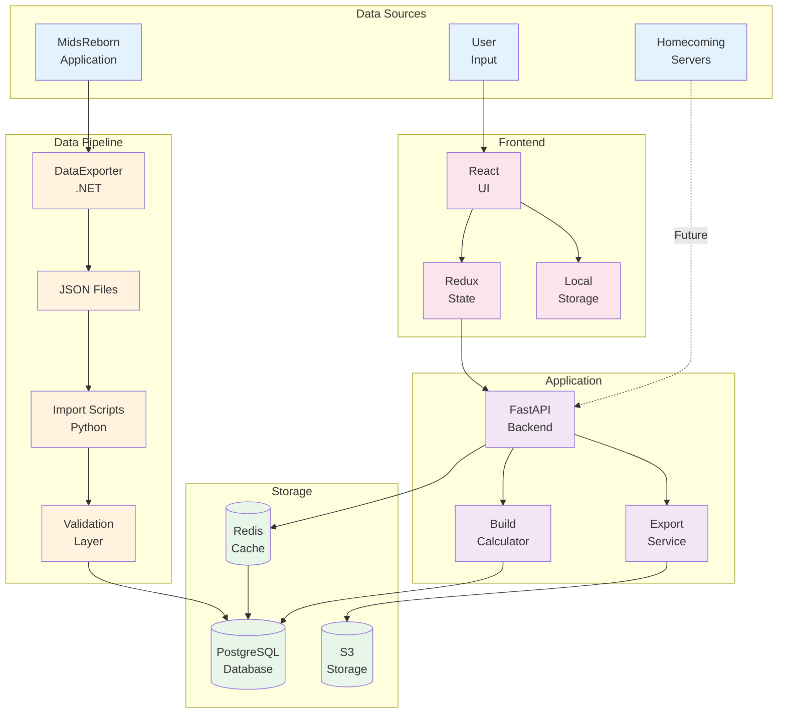

## Import Data Flow

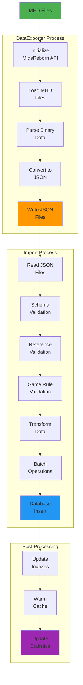

## User Interaction Data Flow

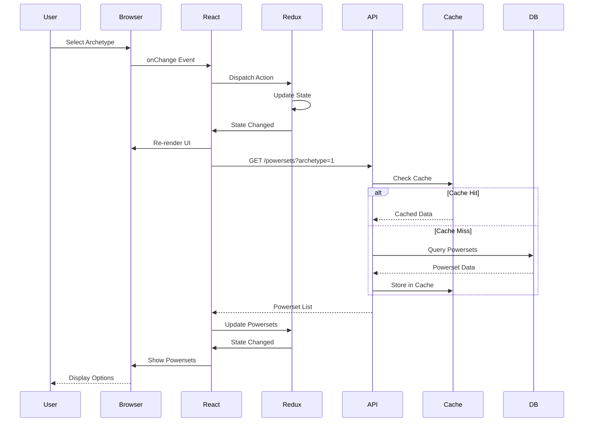

## Build Calculation Data Flow

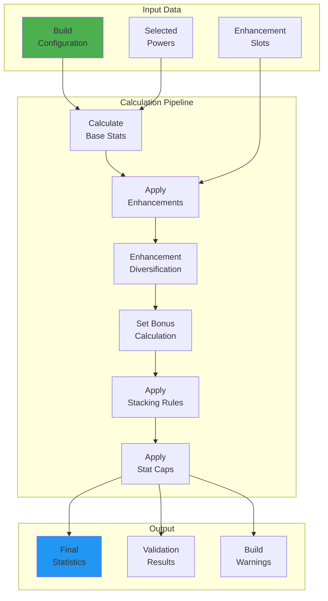

## Real-time Update Flow

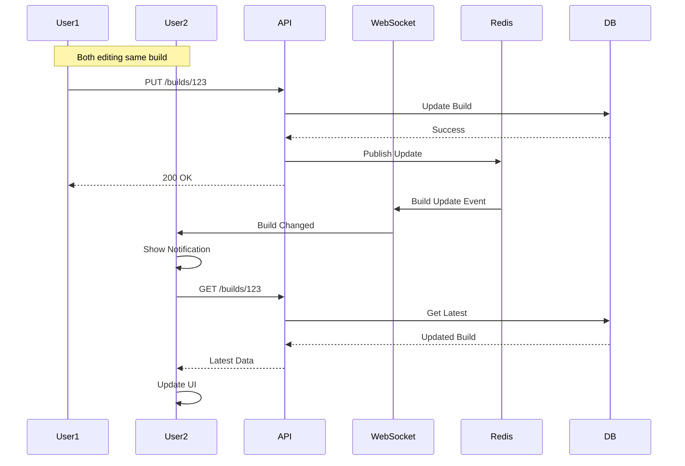

## Cache Strategy Flow

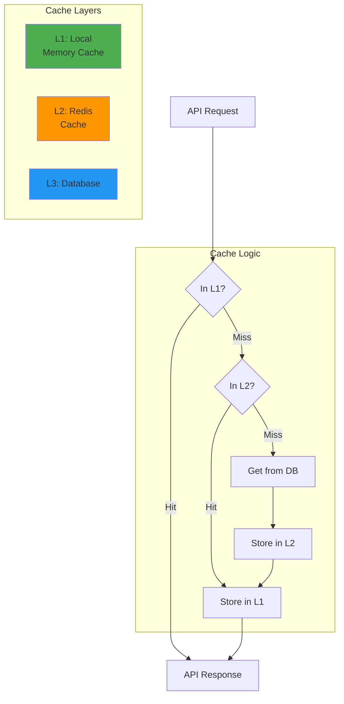

## Export Data Flow

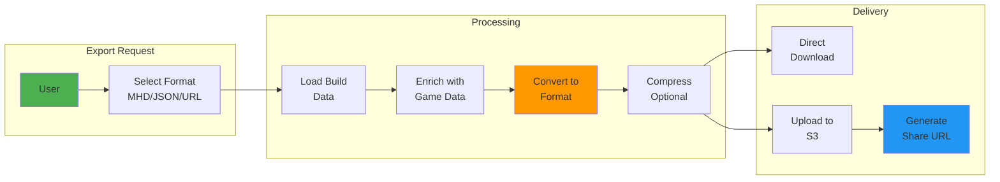

## Error Handling Flow

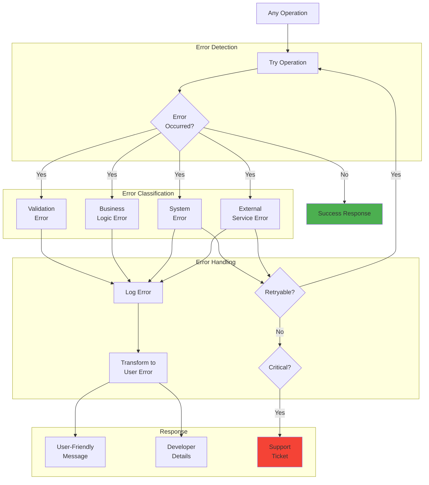

## Performance Optimization Flow

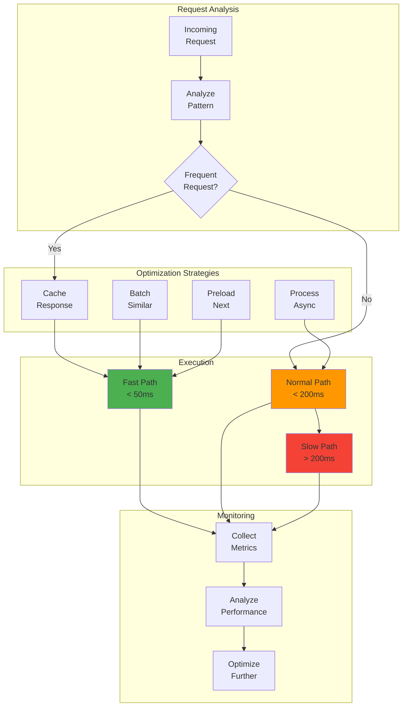

## Data Validation Flow

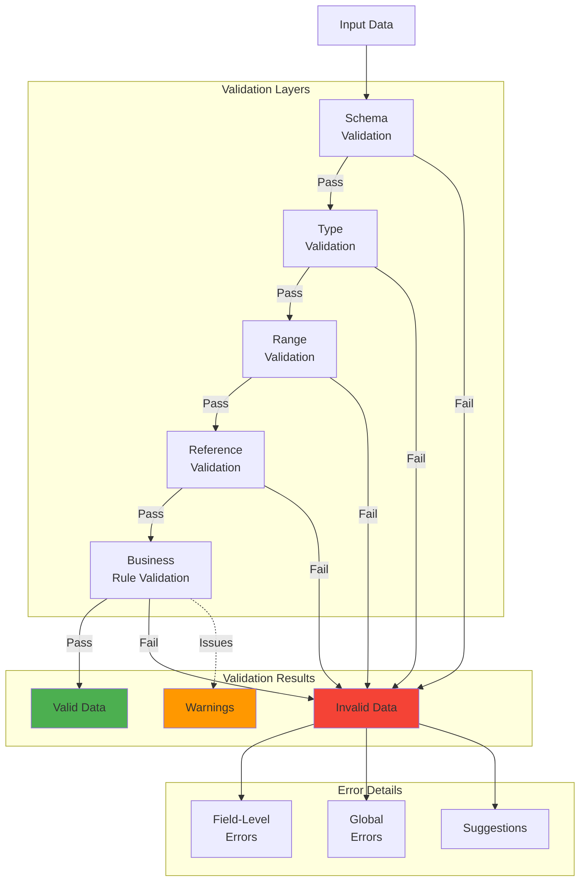

## Session Management Flow

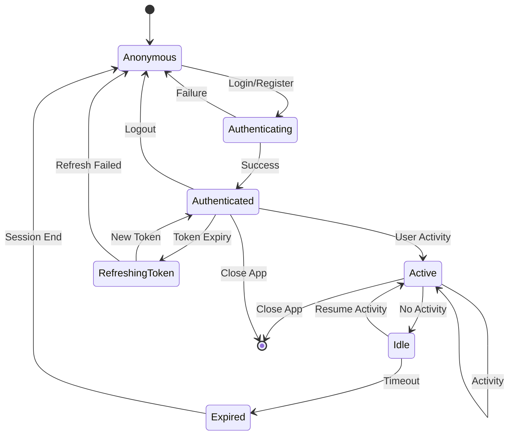

This data flow documentation provides a comprehensive view of how data moves through the system, from import to user interaction, including error handling and optimization strategies.