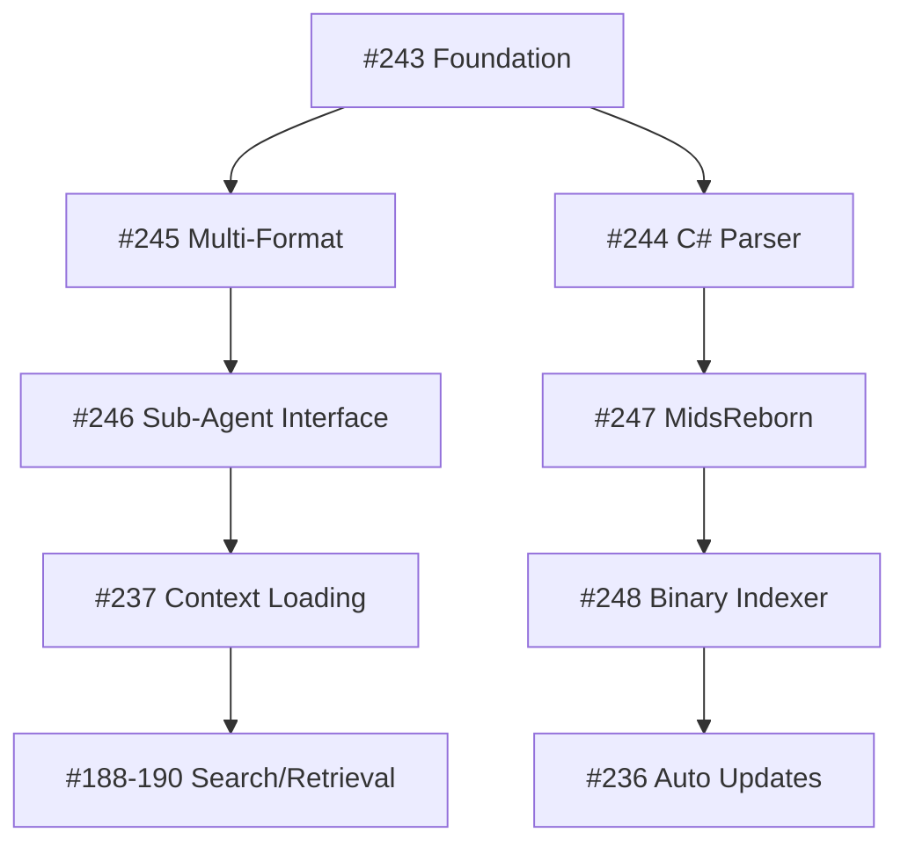

# Epic 2.5.3 RAG Implementation - Issue Updates

## Summary of Changes

Created 6 new GitHub issues (#243-248) to address critical gaps in the RAG implementation. The existing issues need updates to align with the comprehensive plan.

## Updates Needed for Existing Issues

### #178 - Parent Epic
```markdown
**Current Status**: 0% (not 65% as stated)
**Add to Description**:
- New subtasks: #243-248
- Updated timeline: 5 weeks
- Technical stack decision: ChromaDB + Sentence Transformers
```

### #236 - Automatic Index Updates
```markdown
**Add to Acceptance Criteria**:
- [ ] Git post-commit hook for local changes
- [ ] GitHub webhook listener for MidsReborn updates
- [ ] Parallel indexing with progress tracking
- [ ] Differential update algorithm
```

### #237 - RAG Integration with Context Loading
```markdown
**Add to Technical Spec**:
- Sub-agent injection without tool calls
- Token budget: 2K max per search
- Automatic trigger keywords per agent type
- Performance target: <500ms total latency
```

### #188 - Semantic Search Engine
```markdown
**Add to Implementation**:
- Hybrid search: 0.7 * semantic + 0.3 * keyword
- BM25 for keyword matching
- Code-specific boosting factors
- Result caching: 15-minute TTL
```

### #189 - Context-Aware Retrieval
```markdown
**Add Pattern Learning**:
- Track search -> selection mappings
- Build agent-specific preferences
- Implement relevance feedback loop
- A/B test retrieval strategies
```

### #190 - Dynamic Context Injection
```markdown
**Add Optimization Details**:
- Progressive loading based on relevance
- Duplicate detection across sources
- Context position optimization (top/middle/bottom)
- Integration with existing progressive loading
```

## Implementation Dependencies



## Success Metrics

1. **Search Quality**: >90% relevance in top 3 results
2. **Performance**: <500ms end-to-end search
3. **Coverage**: 100% of MidsReborn calculation files indexed
4. **Integration**: Zero disruption to existing workflows
5. **Maintenance**: <5 min/week for index updates

---
🤖 Generated with [Claude Code](https://claude.ai/code)