# Backend Architecture Overview

This document provides visual diagrams and explanations of the Mids Hero Web backend architecture.

## System Architecture

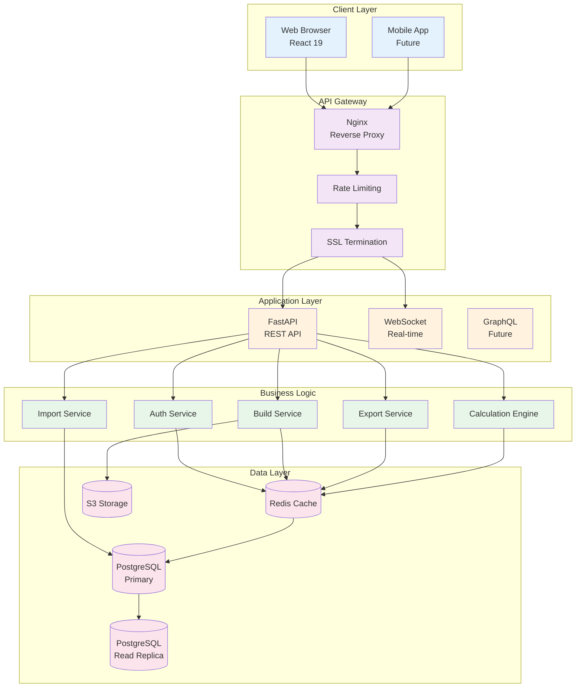

## API Architecture

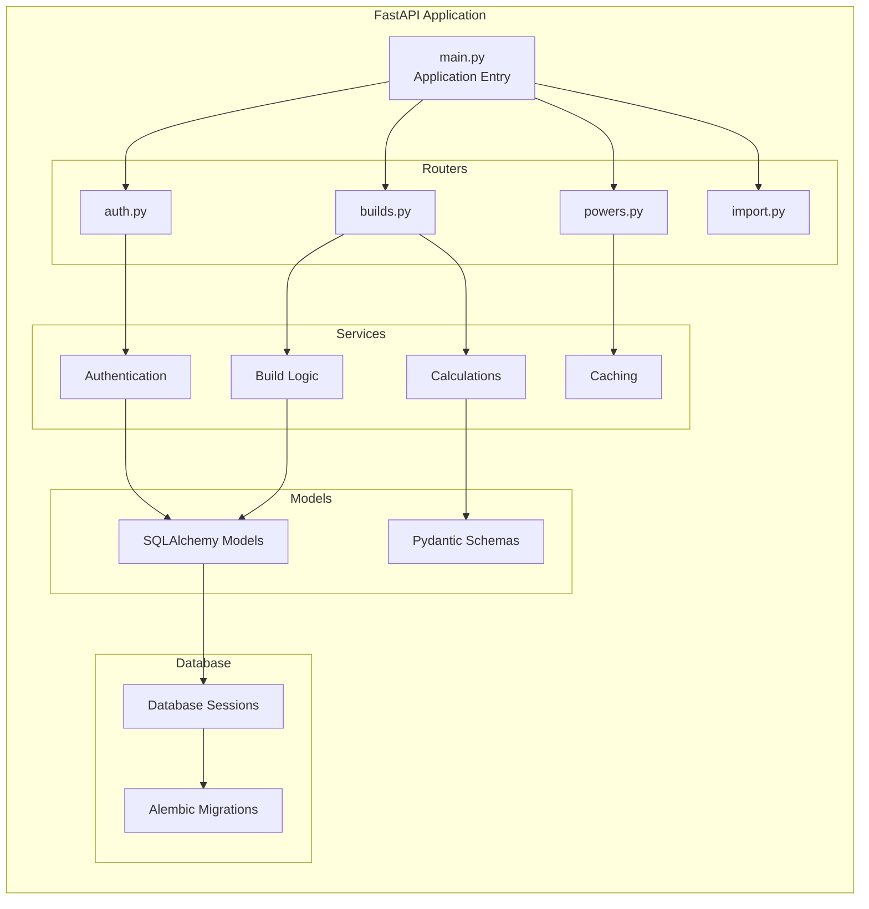

## Request Flow

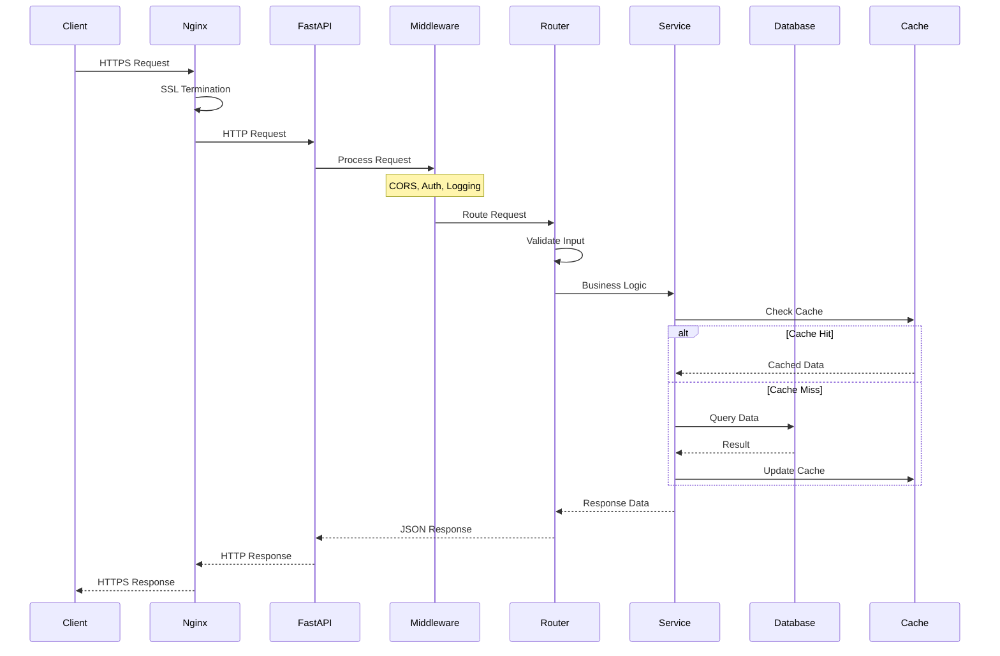

## Database Schema Overview

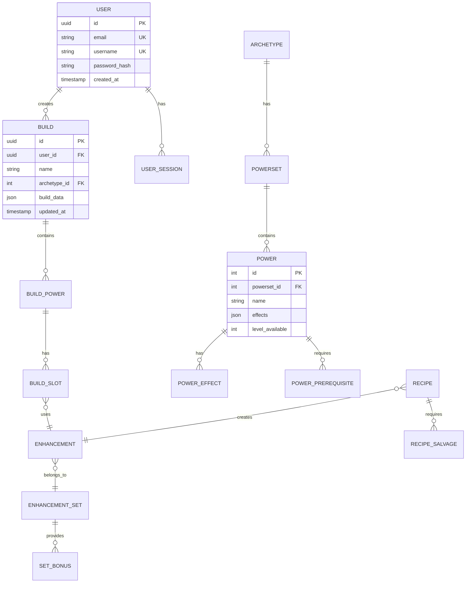

## Service Layer Architecture

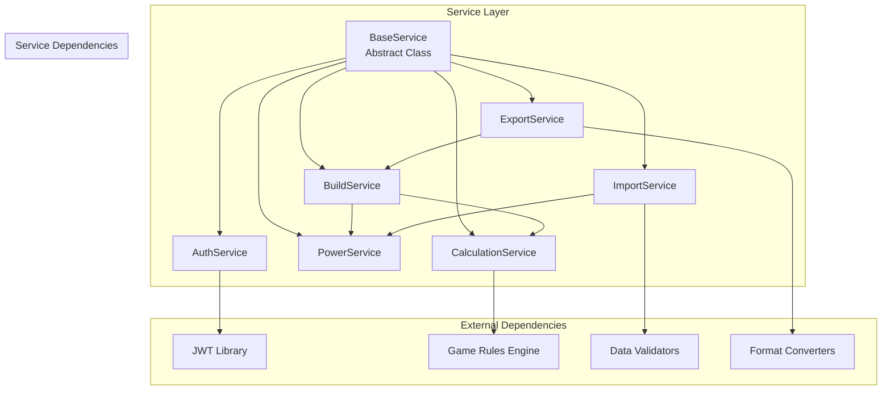

## Authentication Flow

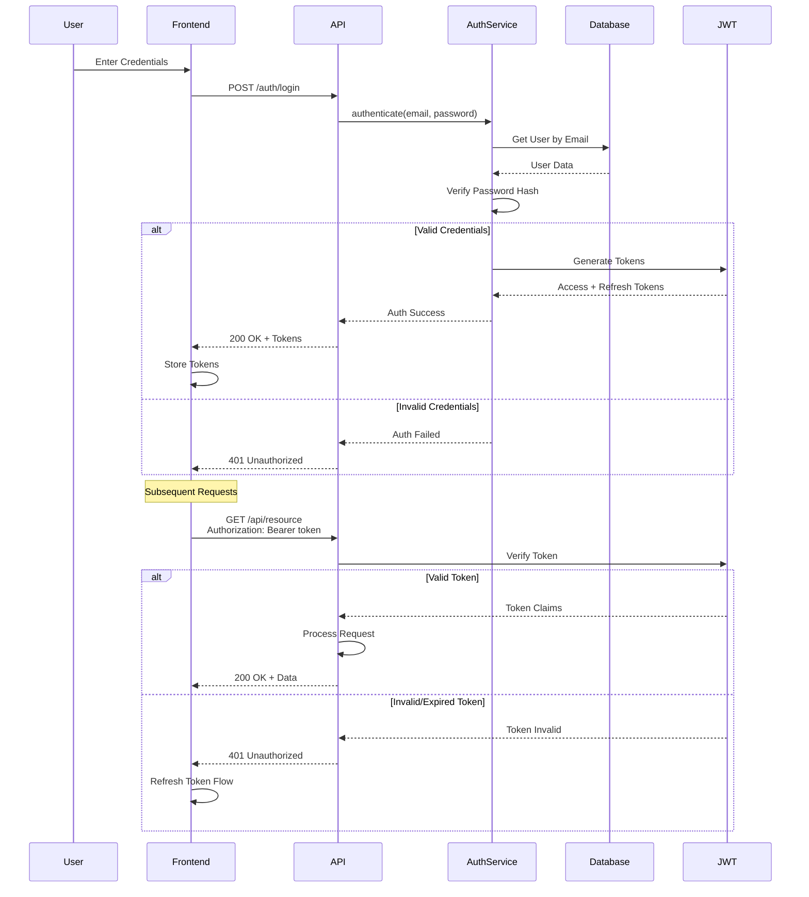

## Import System Architecture

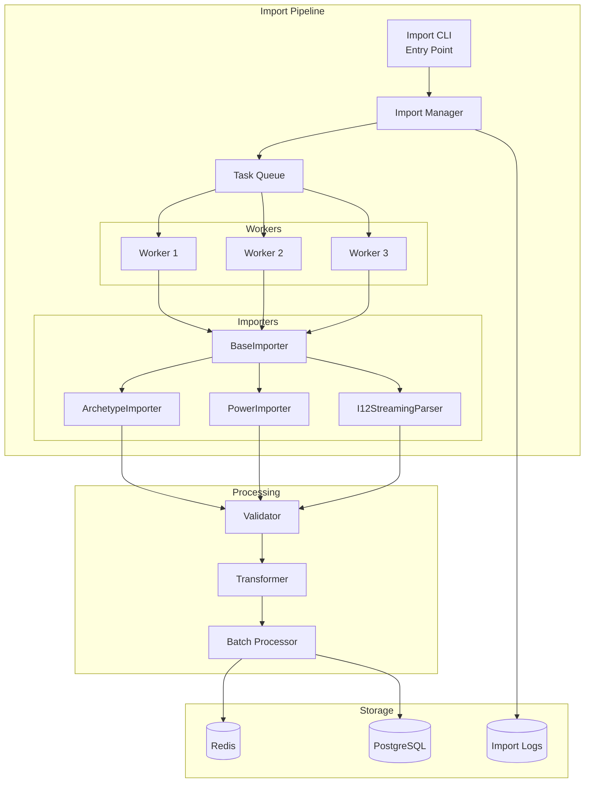

## Calculation Engine

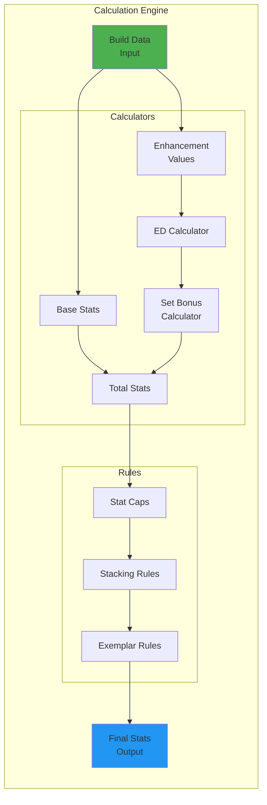

## Deployment Architecture

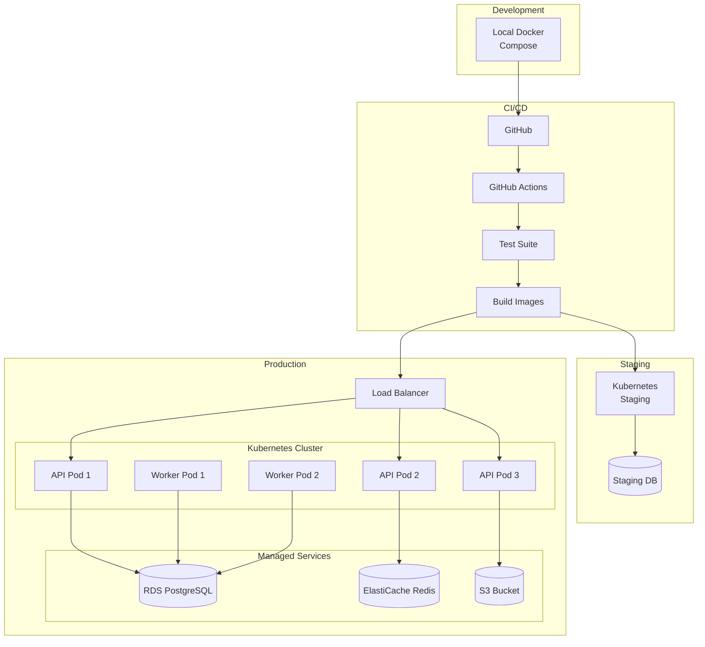

## Error Handling Flow

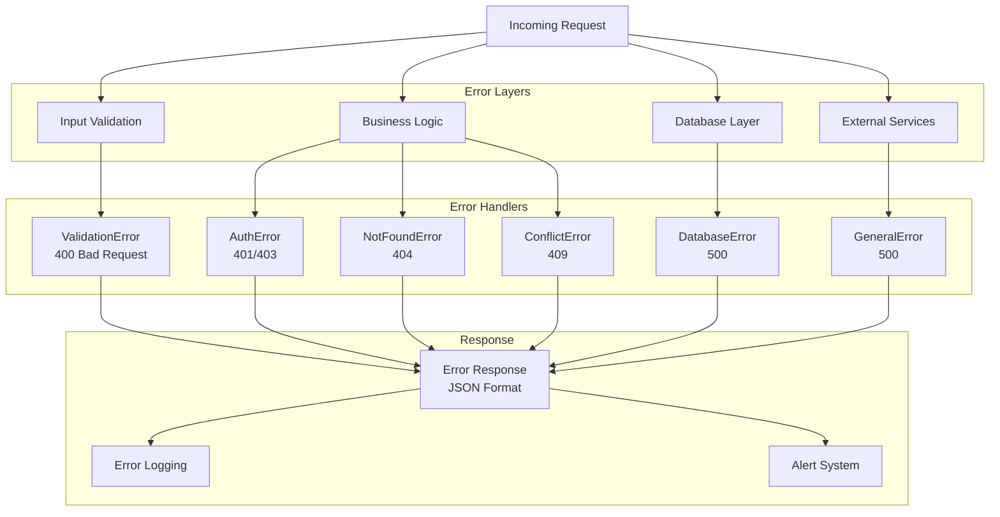

## Performance Optimization Points

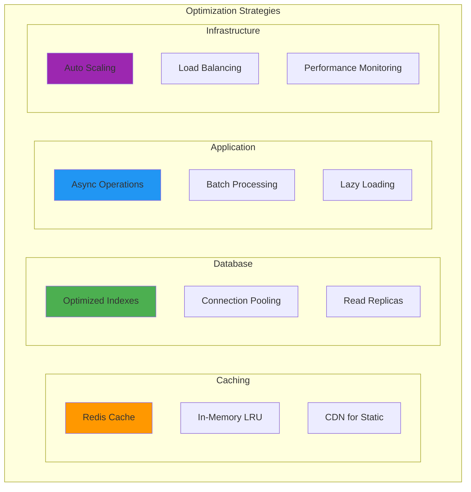

This architecture documentation provides a comprehensive visual overview of the backend system, making it easier for developers to understand the system design and data flow.