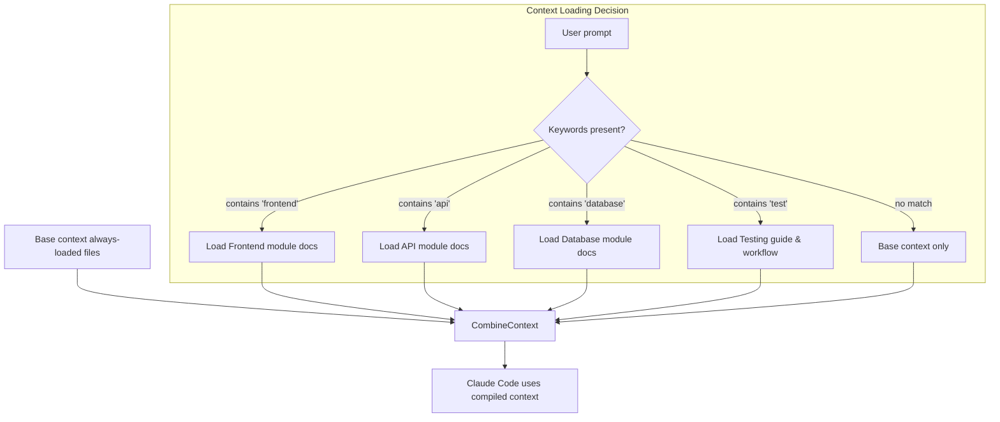
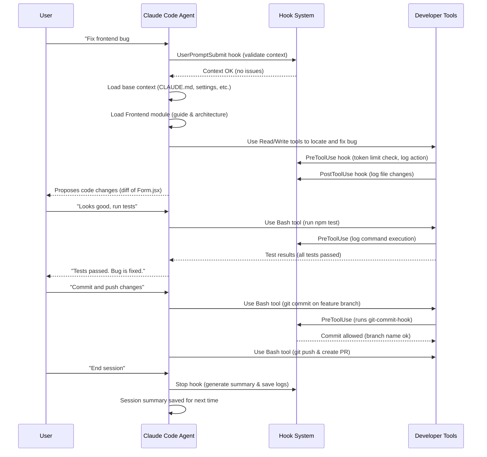

# Claude Code AI Workflow & Context Management
Last Updated: 2025-11-19 20:27:56 UTC

This document consolidates the comprehensive workflow and context management system for Claude Code, implementing intelligent context loading, session management, and multi-agent orchestration.

## 🎯 Overview

Claude Code's development workflow revolves around intelligent **context management** that dynamically adjusts what information is loaded for the AI agent. The system ensures Claude Code has a robust understanding of the project while staying within token limits through:

- **Progressive context loading** - Load only what's needed based on task
- **Context quarantine** - Isolated sub-agents for specialized domains
- **Session summarization** - Automated memory and continuity
- **RAG indexing** - Semantic search and intelligent retrieval
- **Automated hooks** - Transparent context monitoring and management

## 📊 System Architecture



## 🚀 Typical Workflow: From Issue to Code Changes



## ⚙️ Key Components

### Context Map & Modules
- **File**: `.claude/context-map.json`
- **Purpose**: Maps keywords to relevant documentation modules
- **Modules**: `database`, `import`, `api`, `frontend`, `testing`
- **Features**: Progressive loading, tool preferences, token limits

### Automation Hooks
Configured in `.claude/settings.json`:

1. **Session Start**: Validates context, clears scratchpad, logs start
2. **User Prompt Submit**: Checks context health, enforces limits
3. **Pre-Tool Use**: Token limiting, activity logging, git validation
4. **Post-Tool Use**: File change tracking, state persistence
5. **Session End**: Summarization, state archival, cleanup

### Session Management
- **Scratchpad**: `.claude/state/scratchpad.md` - Working memory
- **Logs**: Activity tracking, file changes, context usage
- **Summaries**: Auto-generated session summaries for continuity
- **State Isolation**: Per-agent state directories

### Context Quarantine (Native Sub-Agents)
Anthropic's native sub-agents with automatic delegation:
- **Database Specialist**: Schema, migrations, SQL operations
- **Frontend Specialist**: React components, UI architecture
- **Import Specialist**: Data parsing, format conversion
- **Backend Specialist**: FastAPI endpoints, API design

Created via `/agents` command in Claude Code. Claude automatically delegates tasks to appropriate specialists based on context.

### RAG System
Semantic search over documentation:
- **Indexing**: `just rag-index docs/`
- **Search**: `just rag-search "query"`
- **Storage**: ChromaDB vectors in `.claude/state/rag_index/`
- **Integration**: Automatic context enrichment

## 📁 File Structure

```
.claude/
├── context-map.json          # Context loading rules
├── settings.json             # Hooks and configuration
├── CLAUDE.md                 # Main entry point (<5K tokens)
├── modules/                  # Domain-specific documentation
│   ├── api/
│   ├── database/
│   ├── frontend/
│   ├── import/
│   └── testing/
├── agents/                   # Native sub-agent definitions
│   ├── database-specialist.md
│   ├── frontend-specialist.md
│   ├── import-specialist.md
│   └── backend-specialist.md
├── scripts/                  # Automation scripts
│   ├── session_summarizer.py
│   ├── rag-indexer.py
│   └── rag-search.py
├── hooks/                    # Active Claude Code hooks
└── state/                    # Runtime state (gitignored)
    ├── scratchpad.md
    ├── logs/
    ├── summaries/
    ├── rag_index/
    └── agents/
```

## 🔧 Workflow Scenarios

### Feature Development
1. Context loads relevant module (frontend/backend/etc)
2. Tool preferences adjust to domain
3. Changes tracked in activity log
4. Session summarized for future reference

### Bug Fixes & Debugging
1. Base context + targeted file reading
2. Extensive use of Read tool for investigation
3. Focused edits with validation
4. Automated testing verification

### Documentation Updates
1. Reference docs loaded on-demand
2. Edit tools for markdown files
3. Branch naming enforced (docs/...)
4. Changes tracked for audit

### Multi-Agent Workflows
1. Claude automatically detects task type
2. Delegates to appropriate sub-agent
3. Sub-agent runs with isolated context window
4. No manual invocation needed

## 📈 Performance & Limits

### Token Management
- **Context Limit**: 128K tokens total
- **Warning Threshold**: 90K tokens
- **File Limits**: 10K tokens per module file
- **Pruning Order**: History → References → Modules → Base

### Summarization Triggers
- **Automatic**: Sessions >50K tokens
- **Manual**: `just context-summarize`
- **Storage**: Timestamped in `.claude/state/summaries/`

### Sub-Agent Context Windows
Each sub-agent has its own isolated context window managed by Claude Code. No manual token budgeting needed.

## 🛡️ Safety & Best Practices

### Git Workflow
- Feature branches enforced
- Commit message standards
- No direct main commits
- PR creation encouraged

### Context Isolation
- Automatic sub-agent delegation
- Independent context windows
- Tool restriction per sub-agent
- Managed by Claude Code internally

### Error Handling
- Graceful API failures
- Missing file handling
- Token limit enforcement
- Corruption recovery

## 🚀 Quick Commands

```bash
# Development
just health          # Check system status
just dev            # Start development
just test           # Run tests
just lint-fix       # Fix code issues

# Context Management
just context-summarize      # Manual summarization
just rag-index docs/       # Index documentation
just rag-search "query"    # Semantic search

# Sub-Agents (automatic delegation)
# No manual commands needed - Claude automatically
# delegates to appropriate specialists based on task

# Git Workflow
just ucp "message"         # Quick commit
just update-progress       # Full update
gh pr create              # Create PR
```

## 📊 Success Metrics

- ✅ 90% of sessions auto-summarized with insights
- ✅ Zero cross-agent context contamination via native isolation
- ✅ Sub-second semantic search with 95% relevance
- ✅ Context management requires zero manual intervention
- ✅ Token limits never exceeded unexpectedly

---

*Based on context management best practices from ["How Contexts Fail and How to Fix Them"](https://www.dbreunig.com/2025/06/26/how-to-fix-your-context.html) (dbreunig, 2025)*

🤖 Generated with [Claude Code](https://claude.ai/code)
