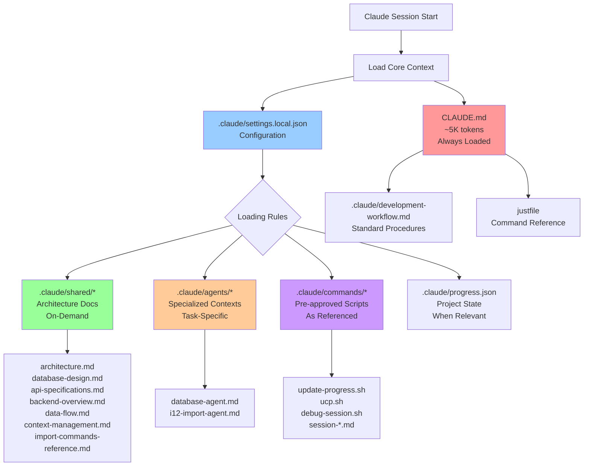
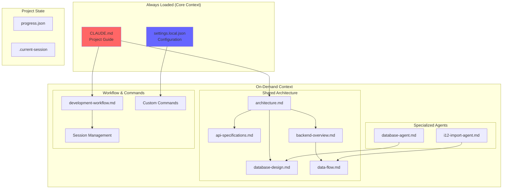
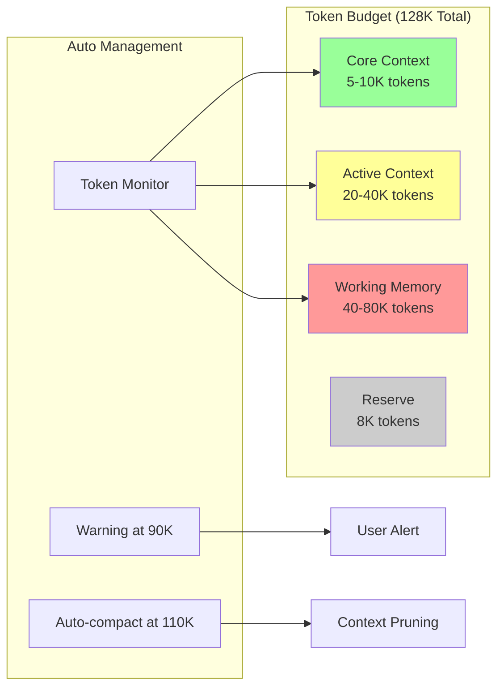
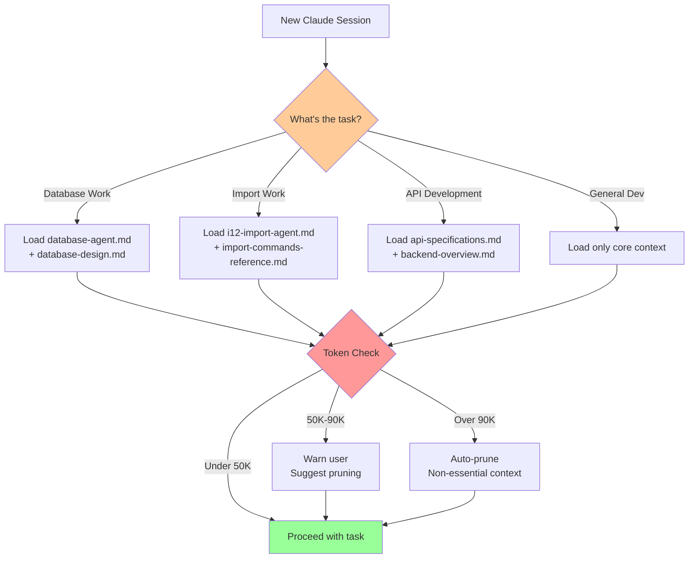
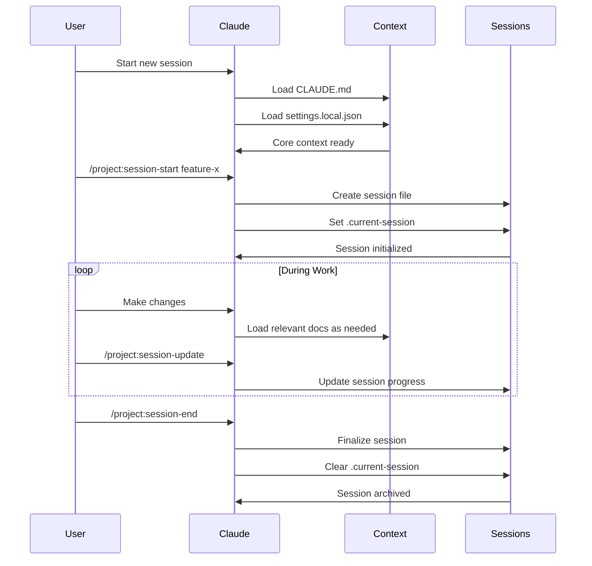

# Claude Code Context Loading Architecture
Last Updated: 2025-11-19 20:27:56 UTC

## Overview

This document explains how Claude Code loads and manages context in the Mids Hero Web project, with visual diagrams and best practices for context management.

## Context Loading Flow

## Context Hierarchy and Dependencies

## Token Management Strategy

## Context Loading Decision Tree

## Session Lifecycle

## Best Practices for Context Management

### 1. **Modular Loading**
- Core context (CLAUDE.md) stays under 5K tokens
- Load specialized contexts only when needed
- Use agent-specific contexts for focused work

### 2. **Clear Boundaries**
- Shared: Architecture and design docs
- Agents: Task-specific guidance
- Commands: Automation scripts
- Sessions: Work tracking

### 3. **Token Efficiency**
- Monitor token usage continuously
- Prune context between unrelated tasks
- Use references instead of duplicating content

### 4. **Explicit Dependencies**
- CLAUDE.md references other docs but doesn't include them
- Agents reference shared architecture as needed
- Commands are loaded only when invoked

### 5. **Progressive Loading**
- Start with minimal context
- Load additional context based on task
- Unload when switching contexts

## Context Loading Rules

1. **Always Load**:
   - CLAUDE.md (project guide)
   - settings.local.json (configuration)

2. **Load on Reference**:
   - Files mentioned in CLAUDE.md
   - Dependencies of loaded files

3. **Load on Task**:
   - Relevant agent context
   - Associated shared documentation

4. **Never Auto-Load**:
   - Session files (privacy)
   - Command scripts (until invoked)
   - Debug configurations (unless debugging)

## Failure Points and Mitigations

### Common Failures:
1. **Context Overflow**: Too many files loaded
   - Mitigation: Auto-pruning, token monitoring

2. **Stale Context**: Outdated information
   - Mitigation: Progress tracking, session management

3. **Missing Context**: Required info not loaded
   - Mitigation: Clear dependency mapping

4. **Conflicting Context**: Contradictory information
   - Mitigation: Single source of truth principle

### Solutions:
- Use `.claude/shared/` for canonical documentation
- Keep CLAUDE.md as the primary entry point
- Implement clear loading priorities
- Regular context maintenance and updates
