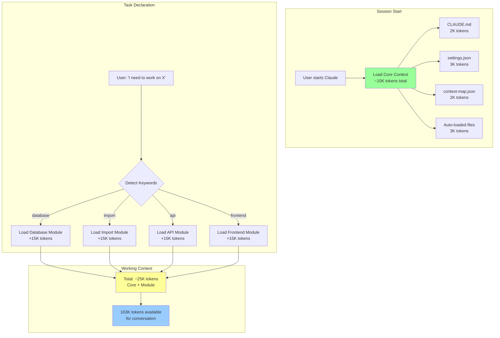
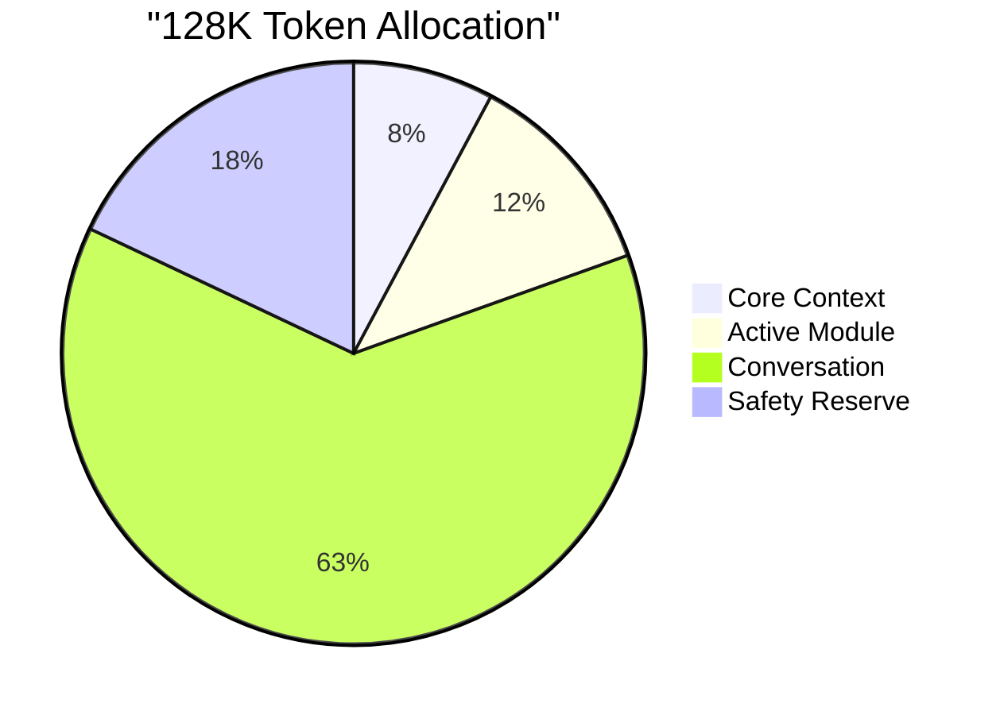
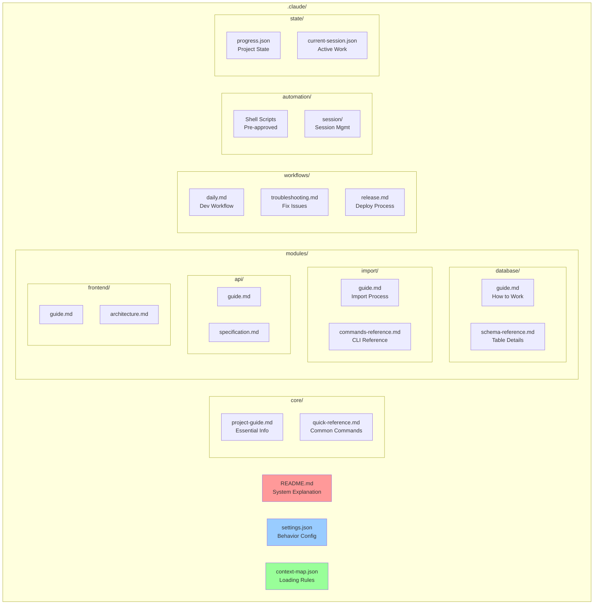

# Claude Context System Overview

## How Context Loading Works Now

## Token Budget Visualization

## Context Loading Decision Flow

```mermaid
flowchart LR
    Start[Session Start] --> LoadCore[Load CLAUDE.md]
    LoadCore --> CheckTask{Task Mentioned?}
    
    CheckTask -->|Yes| LoadModule[Load Relevant Module]
    CheckTask -->|No| WaitTask[Wait for Task Declaration]
    
    LoadModule --> CheckTokens{Under 50K?}
    WaitTask --> UserSays[User Declares Task]
    UserSays --> LoadModule
    
    CheckTokens -->|Yes| Ready[Ready to Work]
    CheckTokens -->|No| Prune[Prune Old Context]
    Prune --> Ready
    
    Ready --> Monitor[Monitor Token Usage]
    Monitor -->|90K Warning| Alert[Alert User]
    Monitor -->|110K Limit| AutoPrune[Auto-prune]
    
    style LoadCore fill:#99ff99
    style Ready fill:#99ff99
    style Alert fill:#ffcc99
    style AutoPrune fill:#ff9999
```

## File Organization Map

## Benefits Realized

### Before (Monolithic)
- 15K+ tokens always loaded
- Information scattered
- No clear loading strategy
- Context overflow common

### After (Modular)
- 10K core + task modules
- Clear organization
- Explicit loading rules
- Efficient token usage

## Quick Reference

| Command | Purpose | Context Loaded |
|---------|---------|----------------|
| "work on database" | Database tasks | +database module |
| "import data" | Import operations | +import module |
| "build API" | API development | +api module |
| "React component" | Frontend work | +frontend module |
| "fix error" | Debugging | +troubleshooting |

## Key Files

1. **CLAUDE.md** - Your entry point (2K tokens)
2. **.claude/README.md** - How this system works
3. **.claude/context-map.json** - All loading rules
4. **.claude/core/** - Always loaded essentials
5. **.claude/modules/** - Task-specific contexts

---
*This reorganization reduces context size by 33% while improving clarity and maintainability.*