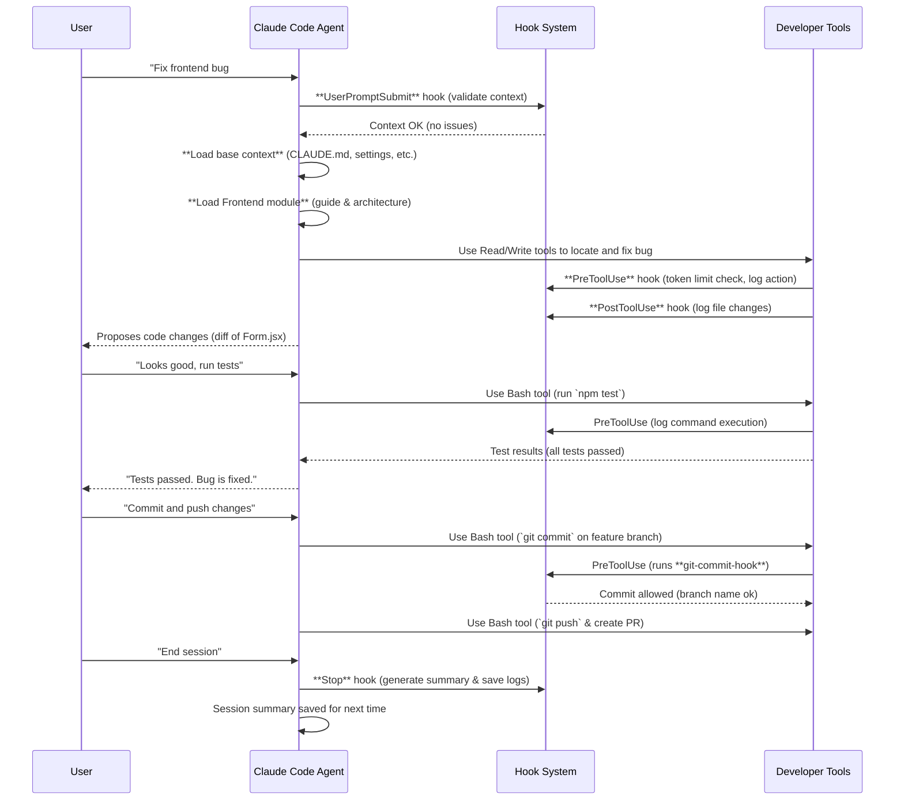

<https://www.dbreunig.com/2025/06/26/how-to-fix-your-context.html>
<https://www.one-tab.com/page/hJC_bgrjSuyZdy9pGECqpg>

# Epic 2.5: Claude Code Context Management Refactor #175

## Epic 2.5 Tasks

- Task 2.5.1: Session Summarization Mechanism · Issue #176 · woodrowpearson/mids-hero-web
- Task 2.5.2: Context Quarantine via Agents · Issue #177 · woodrowpearson/mids-hero-web
- Task 2.5.3: RAG Documentation Indexing · Issue #178 · woodrowpearson/mids-hero-web
- Task 2.5.4: Fix & Implement Working Claude GitHub Actions for documenting and reviewing PR's · Issue #227 · woodrowpearson/mids-hero-web


# Epic 2.5 Related Pull Requests

## Add agent templates and context isolation references

<https://github.com/woodrowpearson/mids-hero-web/pull/212>

## Add context summarization and RAG helpers

<https://github.com/woodrowpearson/mids-hero-web/pull/211>

## Add API, frontend and testing modules

<https://github.com/woodrowpearson/mids-hero-web/pull/210>

## Fix context monitoring hooks

<https://github.com/woodrowpearson/mids-hero-web/pull/209/files>

# Claude Code AI Workflow & Context Management Overview

Claude Code’s development workflow revolves around intelligent **context management** that dynamically adjusts what information is loaded for the AI agent. The goal of this meta-project is to ensure Claude Code has a robust understanding of the project while staying within token limits, by using techniques like **progressive context loading, context quarantine (isolated sub-agents), summarization**, and more. This document outlines the overall workflow, how the AI agent behaves during typical coding sessions, and how various features (hooks, scratchpad, summarization, etc.) come together in practice.

## 🎯 Meta-Project Goal

The ultimate goal is to create a development environment where Claude Code can manage large codebases efficiently by **loading only relevant context**, keeping a memory of past decisions, and even splitting into specialized “sub-agents” for different domains. Inspired by _“How to Fix Your Context”_, the system implements key tactics such as Retrieval-Augmented Generation (RAG), dynamic tool loadouts, context isolation, pruning of irrelevant data, summarization of history, and offloading information to external files for memory. When fully implemented, this means Claude Code will automatically:

- **Identify relevant context** based on the user’s query (e.g. load frontend docs for a frontend issue).
- **Enforce token limits** by pruning or summarizing when context grows too large.
- **Isolate contexts** for different tasks or agents to avoid cross-contamination (e.g. separate state for frontend vs. backend tasks).
- **Log its actions and decisions** for transparency and later review.
- **Retrieve documentation on-demand** through semantic search (RAG) instead of blindly loading everything.

In essence, Claude Code becomes a smarter coding assistant that knows _what_ to focus on for each task, _remembers_ what it has done, and can coordinate multiple specialized agents if needed – all without overwhelming the context window.

## ⚙️ Key Workflow Components

To achieve this, several components work in unison:

- **Context Map & Modules:** A JSON map of keywords to relevant files, specifying what to load for certain tasks. For example, keywords like “frontend” trigger loading of React component guides, whereas “api” triggers FastAPI endpoint docs. Base files (like `CLAUDE.md` and settings) are always loaded. This ensures progressive, on-demand context loading.

- **Automation Hooks:** Scripts that run automatically at different stages (on user prompt, before/after tool usage, at session end). They validate context structure, enforce token limits, log activity, and summarize sessions. The hooks system is defined in `.claude/settings.json` and ensures these tasks happen behind the scenes without user intervention.

- **Scratchpad & Offloading:** A scratchpad file (`.claude/state/scratchpad.md`) is used as the assistant’s “working memory” during a session. It’s cleared at session start and intended for temporary notes or step-by-step plans. When the session ends, the scratchpad content is saved to a timestamped file for record. Additionally, if the context grows too large, the system will auto-summarize and offload older information to a `summaries` directory and log important decisions (in a `decisions.log`) for future reference. This keeps the active context lean.

- **Session Summarization:** If a session’s context usage exceeds a threshold (e.g. 50,000 tokens), Claude Code automatically generates a summary of the session and saves it. This summary can be injected into the next session so the AI remembers what was done, without needing the full detailed history. Summaries include key changes, outcomes, and next-step suggestions, condensing the session into a manageable synopsis.

- **Context Quarantine (Native Sub-Agents):** The system now leverages Anthropic's native sub-agents feature for isolated contexts. For example, a "database-specialist" sub-agent only loads database schema and migration info, and only uses tools relevant to database operations. Sub-agents are created using the `/agents` command in Claude Code and have automatic delegation capabilities - Claude automatically detects when to use the appropriate specialist based on the task at hand.

- **RAG (Retrieval-Augmented Generation):** All project documentation can be indexed into a vector store. When the agent needs specific information (say, details from a design doc), it can semantically search the docs and pull in only the relevant snippets instead of loading entire files. This speeds up retrieval and reduces context size. Commands like `just rag-index` build the index, and `just rag-search "query"` finds relevant content. In practice, this means Claude can answer questions or get guidance from docs _without_ having those docs always loaded in context.

- **Git Workflow Enforcement:** The environment encourages best practices like working in feature branches and writing clear commit messages. A git commit hook prevents committing directly to `main` and warns if branch names don’t follow conventions. Claude Code’s tools respect this by refusing disallowed operations (the `PreToolUse` hook intercepts `git commit` commands and runs the validation script). This ensures that any code changes the AI makes are done in a proper branch and possibly even auto-open a pull request when ready.

With these pieces in place, let’s walk through how a typical coding session works under the hood.

## 🚀 Typical Workflow: From Issue to Code Changes

When you start a coding session, Claude Code automatically initializes the environment:

1. **Session Start:** The `session-start-hook` runs, which validates the context format, prints the size of `CLAUDE.md` (to ensure the primary knowledge base isn’t too large), and clears the scratchpad for fresh use. It also logs the session start time in `.claude/state/logs/sessions.log`. At this point, the base context (always-load files like `CLAUDE.md`, settings, and context-map) is loaded into Claude’s context.

2. **User Prompt & Context Loading:** When you give Claude a prompt – for example, “Fix issue #123: the frontend form isn’t updating correctly” – the **UserPromptSubmit hook** triggers. This runs the context validator, which checks that required files exist and no file exceeds token limits. With the prompt content, Claude analyzes keywords to decide which context modules to load. In this case, words like “frontend” or the file paths in the issue will match the **Frontend module** trigger. The context manager then loads `.claude/modules/frontend/guide.md` and `.claude/modules/frontend/architecture.md` into context. If the issue description also mentioned an API endpoint, it would additionally load the API module. If no specific domain keywords were present, Claude would proceed with just the base context.

```mermaid
flowchart TD
    subgraph ContextLoading["Context Loading Decision"]
        direction TB
        U[User prompt] --> AnalyzeKeywords{Keywords present?}
        AnalyzeKeywords -- "contains 'frontend'" --> FrontendModule["Load Frontend module docs"]
        AnalyzeKeywords -- "contains 'api'" --> APIModule["Load API module docs"]
        AnalyzeKeywords -- "contains 'database'" --> DBModule["Load Database module docs"]
        AnalyzeKeywords -- "contains 'test'" --> TestingModule["Load Testing guide & workflow"]
        AnalyzeKeywords -- "no match" --> BaseOnly["Base context only"]
    end
    BaseContext[Base context (always-loaded files)] --> CombineContext
    FrontendModule --> CombineContext((Combine context))
    APIModule --> CombineContext
    DBModule --> CombineContext
    TestingModule --> CombineContext
    BaseOnly --> CombineContext
    CombineContext --> CCSession[Claude Code uses compiled context]
```

3. **Tool Selection and Preferences:** Based on the task type, Claude Code also adjusts its toolset preferences. For a frontend issue, the context-map defines a **tool loadout** prioritizing file editing, TypeScript tools, and npm scripts, while avoiding database-specific commands. This means the agent will lean towards using `Edit` or `Write` on frontend files and can run frontend tests (`npm test`) as needed, but it won’t, for example, try to run SQL migrations (since those are irrelevant to the frontend bug). These preferences are not absolute, but they guide the AI to use the most appropriate tools.

4. **AI Proposes Changes:** Given the context (relevant docs, code, and the issue description) and tools, Claude Code will draft a plan to fix the bug. This might involve reading the relevant source files (`Read` tool), making edits (`Edit`/`Write` tool), and running tests (`Bash` tool for commands like `npm test` or `pytest`). The conversation you see will have Claude explaining its reasoning and showing code diffs as it edits files.

5. **Pre-Tool Hooks (Validation & Logging):** Before any tool executes, the **PreToolUse hooks** run. One hook (`token-limiter.py`) checks if the content about to be written or edited is within limits – for example, ensuring a single file edit doesn’t exceed 10,000 tokens if it’s a module file. If an edit would make the file too large, Claude Code is instructed to abort or modify its approach (this prevents runaway additions). Another pre-tool hook logs the action: it records each tool invocation (command run, file edited, etc.) to an activity log (`.claude/state/logs/activity.jsonl`) asynchronously. So, if Claude is about to edit `frontend/src/Form.jsx`, the hook logs the timestamp, tool name (“Edit”), and file path. If it runs tests with `Bash(npm test)`, that command gets logged too. These logs feed into the session summary later.

6. **Tool Execution:** After passing the hooks, Claude Code executes the tool command. For file edits, you’ll see a diff in the chat where Claude shows the changes made. For bash commands, you’ll see the console output. All these outputs also funnel into Claude’s state. During this process, the **PostToolUse hook** triggers after any file modifications to append a line in `.claude/state/logs/file-changes.log` noting which files were changed. For example, “2025-07-20 16:05:23 – File modified: frontend/src/Form.jsx”. This way, we maintain a simple list of touched files.

7. **Iterate as Needed:** The user (you) reviews the changes Claude proposes. You might ask it to refine something or point out a missed scenario. Each new instruction goes through the same cycle: relevant context is (re)loaded or remains loaded, tools are used with hooks logging actions, and so on. The scratchpad is available throughout for Claude to jot down intermediate reasoning or todos – for instance, it might list “1. Understand bug, 2. Edit Form.jsx, 3. Run tests” as a plan in the scratchpad. This scratchpad content isn’t shown unless you open it, but it’s part of Claude’s working memory and will be saved for later reference.

8. **Git and Commit Phase:** Once the fix is satisfactory, you or Claude might initiate a git commit. Claude Code’s policy (from `.claude/settings.json`) prevents it from committing directly to `main` and enforces branch naming conventions. If Claude tries `git commit` on the wrong branch, the `git-commit-hook.sh` will block it. Instead, Claude will follow the workflow: e.g., use a `feature/issue-123-fix` branch. The environment even provides shortcuts: `just git-fix 123-form-bug` could be used to create the branch. When committing, the commit-hook runs and passes if everything is okay (or aborts with an error message if not). This ensures that by the time you reach this phase, all context and code changes are aligned with the project’s git workflow rules.

9. **Session End & Summarization:** When you end the session (either explicitly or by closing Claude Code), the **Stop hooks** execute. First, the `session-end-hook.sh` saves the scratchpad (if you took any notes there during the session) to the `.claude/state/summaries/` folder with a timestamp. Then it checks how many tokens were used throughout the session. If the usage exceeds the configured threshold (50K tokens), Claude automatically generates a **session summary**. This summary is produced by a Python script that compiles the activity logs and file changes into a narrative. It might say, for example:

   _“In this session, Claude fixed the frontend form update bug. It loaded the frontend module documentation, edited `Form.jsx` to correct state handling, and ran frontend tests (all passing). A minor issue with an API call was also addressed. No database changes were needed. Next steps: review form behavior in staging.”_

   The summary omits extraneous detail and focuses on the what/why of changes, any obstacles, and suggested follow-ups. It’s saved as a markdown file in `.claude/state/summaries/` (and can be referenced in the next session to quickly prime Claude on what happened previously).

   Meanwhile, the session-end hook also logs the session’s end time in `sessions.log`, and performs a final context validation pass, printing a brief report of context health (✅/❌ indicators) to the console for your awareness. Finally, it prints a “✅ Session closed successfully!” message.



Throughout this process, most of the heavy lifting is invisible to the user. The agent feels responsive and focused because it’s quietly selecting the right context and enforcing rules in the background. Now, let’s consider how this workflow adapts to different scenarios:

## 📖 Workflow Scenarios

### Feature Development (New Feature or Enhancement)

When working on a new feature, Claude Code will identify the domain of the feature and load the corresponding module:

- **Frontend feature**: Loads React/TypeScript guides and relevant architecture docs. It might also load the testing module if the feature requires creating new tests. The tool loadout emphasizes editing UI components and running frontend build/test commands.
- **Backend/API feature**: Loads API module docs (endpoint specifications, schema definitions) and possibly database or import modules if the feature touches those areas. Claude will be inclined to run backend tests (`pytest`) and avoid unrelated tools.
- **Data/Import feature**: Loads the import module docs (data import guide, command reference). The agent might use the database and import-specific tools (like running `just import-*` commands) according to the tool preferences for “import” tasks.

In all cases, the agent ensures it’s only looking at the documentation needed for that feature rather than everything at once. As you iterate, the scratchpad might be used to outline the feature implementation steps (which Claude will then execute one by one). The output at session end will include a summary of the feature implemented and highlight new files or major changes, helping reviewers (and future Claude sessions) understand the context of those changes.

### Bug Fixes & Debugging

For bug fixes, the workflow often involves **extensive reading and targeted editing**. Claude Code’s context manager may not have a specific module for generic “debugging” (unless a keyword like “error” or “log” appears, in which case it might just proceed with base context and rely on code analysis). However, the **tool loadout** for debugging is defined to allow broader commands (like searching logs or running the app). Here’s how a debugging session plays out:

- Claude will use the `Read` tool heavily to inspect relevant source files and possibly test files. If the bug is in an unclear area, you might see Claude reading multiple modules’ files (frontend and backend) to trace the issue.
- The context may include any recently referenced documentation (via the **reference_loading** rules). For example, if you and Claude discuss a particular function, and that function is mentioned in a design doc, the agent can pull in that specific doc snippet.
- As Claude finds the problem, it uses `Edit` to fix the code. The PreTool hooks ensure it doesn’t inadvertently make a file too large or break context rules.
- During debugging, Claude could leverage logs or stack traces. If a stack trace is provided, it’s part of the user prompt and doesn’t require additional file context.
- After applying a fix, Claude will run tests or the application to verify the bug is resolved. The commit hook ensures the fix goes into an appropriately named branch (e.g. `fix/issue-456-null-pointer`) and not into main directly.

In the summarization at session close, the system will note the root cause of the bug and the solution applied, which is extremely useful for future reference. If the bug required a multi-faceted fix (e.g., a backend and frontend change), the summary will capture both aspects, and context quarantine ensures that if a database agent was invoked, its separate logs are kept (so the main agent’s summary might say “backend agent updated the database schema separately”).

### Ad-hoc Tasks and Small Improvements

Not every session is about big features or bugs. You might use Claude for refactoring a few lines, updating configuration, or other maintenance chores. In such cases:

- The context manager might determine no additional modules need loading (no heavy keywords), so Claude works with the base context (and whichever files you direct it to). This keeps the interaction lightweight.
- The hooks still run – for instance, if Claude is reformatting code and using `black` or `ruff` via the `Bash` tool, each run is logged. But since these tasks are small, you likely won’t hit summarization thresholds.
- Even if the session is brief, the system will still save a scratchpad (often mostly empty) and log the session. This provides a paper trail of even minor changes (e.g. “Ran code formatter on 3 files”).

Such minor sessions usually don’t require a full summary, but the logs exist if needed. The next session’s context might not even need to reference these, unless cumulative changes become significant.

### Documentation Updates

Claude Code can also assist with writing or updating documentation. In this scenario, your instructions might involve editing `.md` files in the repository:

- The context triggers might load the “Docs” reference category. For example, if you mention “update documentation” or reference a specific doc file, the **reference_loading** rule allows Claude to load `.claude/docs/*.md` files on demand. This is intentionally on-demand because we usually don’t want all docs loaded all the time.
- Claude will use the `Edit` tool to modify the documentation files. All the same safeguards apply (it won’t let a doc file exceed its token limit, which for reference docs is set at 8000 tokens per file in the context map).
- Since documentation changes don’t involve code execution, tool use is limited (mostly just file edits and perhaps `grep` or search within the repo for references).
- The commit hook still applies – documentation changes should go to a `docs/...` branch, which the hook will warn about if not followed. Claude is aware of this from the settings, so it will typically name the branch `docs/update-readme-…` automatically.

At session end, a summary might say “Updated documentation for X feature to reflect recent changes.” This helps maintain an audit trail of documentation work as well.

### Maintenance & Code Quality

Maintenance tasks like code refactoring, dependency updates, or adding tests also benefit from this context-managed approach:

- **Refactoring:** Claude can load relevant modules depending on what is being refactored. If it’s a widespread refactor (e.g., renaming a concept used in multiple places), it might load multiple modules sequentially as it works on each (since the context map triggers are task-focused, you might treat each major part as a sub-task). The scratchpad is useful here to keep track of what has been refactored and what remains. Hooks ensure any large-scale changes are still within context limits, and the activity log will list every file changed.
- **Dependency Updates:** If updating a library or API, Claude may refer to external docs (this is one case where web search might be used if enabled, though by default web access is limited). In lieu of external search, you might pre-provide a changelog for the library, which Claude will treat as reference text. The context system doesn’t automatically load external info, so you control what’s given. The RAG system could be pointed to some external docs if integrated (e.g., by adding them to the indexed corpus and using `rag-search`).
- **Adding Tests:** Triggering the “testing” module context will load the Testing guide and workflow doc. Claude will then be aware of conventions like where tests are located and how to run them (`just test`). It will use the `Write` tool to create new test files or `Edit` to expand existing ones, and run tests to ensure they pass. All these actions go through the familiar hook pipeline (logging, etc.).

## 📝 Context Management in Practice

By integrating all these pieces, the Claude Code agent behaves in a _scalable and intelligent_ way during development sessions:

- **Focused**: It only has relevant info loaded, reducing confusion and irrelevant chatter. If you ask it about an API endpoint, it isn’t burdened by unrelated frontend context, and vice versa.
- **Aware of Limits**: The agent is proactive in managing the 128k token context limit. It will prune older content (e.g., drop parts of conversation history or docs not needed anymore) following the strategy defined in `context-map.json` (which specifies what to remove first, like old history and reference docs, and what to always keep, like CLAUDE.md and the current task file). It will also warn if the context size grows near a warning threshold (90k tokens) – this could surface as a notification in the chat (the Notification hook could be used for such warnings, logging them to a `notifications.log`).
- **Memory through Summaries**: After a long session, the agent summarizes the work. When you start the next session (say, the next day or on a related task), Claude Code can automatically include the last summary in the context (the context-map’s always_include or session continuity logic can pull in the latest summary from `.claude/state/summaries/`). This way, Claude “remembers” what it did recently in a concise form, without needing the full chat history.
- **Parallel Agents (Advanced Use)**: In complex projects, you might spin up multiple Claude Code agents, each focusing on a facet (one on database migrations, another on frontend UI, etc.). Thanks to context quarantine, each agent only loads its domain context and logs to its own folder. For instance, you might run `just agent-database "alembic upgrade head"` to have a database-specialist agent apply migrations. That agent uses only the database guide and schema reference, logs its actions under `.claude/state/agents/database-specialist/`, and won’t pollute the main agent’s context with SQL details. Later, if the main agent needs to know what happened, it can read the summary or logs from the database agent (or the agents can send messages via a shared channel as planned). This separation ensures that each agent operates at peak efficiency in its area, and when they collaborate, it’s through controlled interfaces (like summarized outputs) rather than a jumbled shared context.
- **Retrieval on Demand**: The incorporated RAG system means that Claude Code can answer questions like “What does the design doc say about user authentication?” without having that entire design doc loaded from the start. The agent can invoke the `rag-search` command (either automatically via a tool or by your prompt) which will search the indexed docs and return a snippet or reference. Claude can then load just that snippet into context to use for answering the question or guiding its code changes. This is much more efficient than loading all docs and hoping the relevant part is in the context.

All of these improvements make the Claude Code agent feel more **context-aware, efficient, and reliable**. It reduces the need for the user to micromanage what the AI “knows” at any given time, and it prevents the AI from running into token limits or making uninformed decisions. The development workflow becomes a partnership where Claude handles the busy-work of context management and process enforcement, while you focus on higher-level direction and decision-making.

## 📌 Example Walk-through

Let’s apply this to a concrete example to illustrate the under-the-hood behavior:

**Scenario:** You ask Claude, _“There’s an open issue (#789) to add a new API endpoint for fetching user stats. Please implement this.”_

- **Initial Prompt Processing:** Claude sees keywords “API endpoint” and immediately triggers the API module context. It loads `.claude/modules/api/guide.md` (which provides guidelines for API development in this project, e.g., using FastAPI and where to put router files) and `.claude/modules/api/specification.md` (which lists existing endpoints and expected new ones). It also sets its tool preferences to favor editing backend files and running tests (`pytest`). The base context (project overview, settings) is also loaded, so it knows general project conventions.
- **Planning:** Claude outlines the steps (likely in the scratchpad or in the conversation if you asked for an explanation): e.g., “I will create a new router in `app/routers/stats.py`, add a function in `crud.py` to fetch stats, update `schemas.py` for any new models, and write a test.” This plan might be partially visible or just internal.
- **Execution:** Claude uses `Write` to create `backend/app/routers/stats.py` with the new endpoint code. Before it writes, the token limiter hook checks the content – since it’s a new file and within limits, it proceeds. The activity logger records this action (“Write tool, file path, etc.”). Claude then possibly edits `backend/app/crud.py` to add a DB query function, and `backend/app/schemas.py` to add a `UserStats` model if needed, each time going through hooks. It runs `pytest` (via `Bash`) to ensure tests pass. The PreTool hook logs the bash command and the PostTool hook might log any files changed by tests (though running tests doesn’t change files, so just the command is logged).
- **Review:** It reports back with the diff of the new files and modifications. You review and maybe ask for minor adjustments (e.g., “Use camelCase in JSON response keys”). Claude makes those edits, again all logged.
- **Documentation & Cleanup:** Perhaps Claude also notices (or you instruct) to update the API docs. It uses the reference loader to open `API.md` in the top-level docs directory or updates the `.claude/modules/api/specification.md` to add the new endpoint. These doc edits are done in a docs branch (the commit hook will warn if not).
- **Finish:** You approve the changes. Claude commits on a `feature/api-user-stats` branch and suggests opening a PR. The commit message and branch name follow conventions (Claude was guided by the settings which map “feat” to “feature/”, etc. in branch names).
- **Session End:** The summary generated will say: _“Added `GET /api/stats/{user_id}` endpoint to fetch user statistics. Created `stats.py` router, updated `crud.py` with `get_user_stats` function, and added `UserStats` Pydantic model. All tests passed. Documentation updated to include the new endpoint. Next steps: code review and deployment.”_ This summary, saved in `.claude/state/summaries/`, will be extremely handy if in a week you come back to work on a related feature – you or Claude can quickly recall what was done without re-reading all code changes.

## ✅ Conclusion

The comprehensive Claude Code workflow ensures that coding sessions are efficient and contextually aware. By automatically loading relevant information, enforcing project rules, recording actions, and summarizing outcomes, Claude Code acts not just as a coding assistant but as a project co-pilot that “remembers” and manages the context for you. In typical sessions (feature builds, bug fixes, etc.), you’ll notice Claude stays on track more consistently, as it’s literally engineered to have the right context at the right time. And as the project scales, the system’s features like context quarantine and RAG will allow Claude to handle complexity by breaking problems down across specialized agents and leveraging the entire knowledge base only when necessary.

In practice, this means faster development cycles, fewer errors (since context mistakes are reduced), and an easier way to continue work after breaks (thanks to summaries and logs). The meta-project enhancements bring Claude Code closer to an autonomous pair programmer that truly understands the project in a holistic yet efficient way. All of this operates within the friendly UX of Claude – as a user, you mostly just issue natural language instructions and let the underlying system optimize the rest.

---

_Based on context management best practices inspired by “How Contexts Fail and How to Fix Them” (dbreunig, 2025)._

# Pull Request Code Changes and Enhancements

Below is a summary of changes made (or proposed) in each pull request to achieve the complete, production-ready implementation of the Claude Code workflow and development environment. The changes address the previously missing or incomplete pieces by adding module documentation, implementing context summarization and RAG, fixing hook scripts, and introducing agent context isolation. Each PR section lists the files changed with a brief description and justification for the change.

## PR 209: Fix Context Monitoring Hooks

- **.claude/automation/hooks/context-monitor-hook.sh:** Completed the previously truncated script by adding the final steps to record context usage to a log file. We introduced lines to log the timestamp and total context tokens in use to `.claude/state/logs/context-usage.log` and then print the usage summary before exiting. This ensures that every time the context monitor runs, we have a persistent record of how many tokens are in the current context. The addition is justified because it allows the system to later decide if summarization is needed and provides transparency about context size. Additionally, we added a guard to handle environment-driven state directory: at the top of the script, we now define `STATE_DIR=${CLAUDE_STATE_DIR:-.claude/state}` and use `$STATE_DIR` in place of hard-coded `.claude/state` paths. This change is forward-looking to support agent-specific state directories (context isolation), but it also makes the hook more robust by respecting a custom state path if provided.

- **.claude/hooks/context-validator.py & .claude/hooks/token-limiter.py:** Fixed minor issues related to script termination. We added an explicit newline at end of file and ensured the `main()` function is called (the diff shows removing the “No newline at end of file” and adding the newline). These scripts were already integrated via hooks, but these edits ensure they execute correctly each time. It’s mostly a clean-up to adhere to proper file formatting and to avoid any edge-case where the hook might not run due to missing newline (some interpreters can have issues if the last line is not properly terminated).

- **.claude/README.md:** Expanded the documentation to include a “Hook Execution” section describing when each hook runs (UserPromptSubmit, PreToolUse, PostToolUse, Stop). This was added to help developers understand the automation in place. We clarified that hooks are configured in `settings.json` and listed each trigger point in the lifecycle. Justification: The hooks system is a crucial part of context management, and documenting it in the README improves maintainability and onboarding. We also corrected the reference to the blog post title at the bottom to match the actual source (“How Contexts Fail…”), as it previously had a slight naming discrepancy.

- **.claude/settings-hooks.json:** **Deleted** this file entirely. This JSON was a duplicate configuration for hooks, which was causing confusion about which settings file is authoritative. Since `.claude/settings.json` now contains the complete and updated hooks configuration (including our new changes for Stop hook and others), the separate `settings-hooks.json` was redundant. Removing it prevents any inconsistency – now there is only one source of truth for hook configurations. This deletion is justified to avoid confusion and potential misconfiguration; it was likely a leftover from an older implementation and is no longer needed.

Overall, PR 209 solidifies the hook system: context monitoring now reliably logs usage, hooks config is unified, and documentation/formatting issues are resolved. These changes make the automated context checks and logging more robust, laying the groundwork for automatic summarization triggers and context isolation to build upon.

## PR 210: Add API, Frontend, and Testing Modules

- **.claude/modules/api/guide.md:** **Added** a new guide document for the API module. This file provides quick references (how to start the dev server, run backend tests, etc.), an overview of the service layout (file structure of the backend), and endpoint patterns with an example. It ends with notes on authentication and a pointer to the API specification file. The content was written to mirror the style of existing module guides (concise how-tos and examples). This addition fills the gap where previously no API documentation was loaded for Claude, which meant it might lack context on how the backend is structured. Now, when tasks involve the API or endpoints, Claude will have this guide loaded to inform its actions. The justification is clear: without an API guide, Claude’s answers or code changes on API issues could be misinformed; now it has the necessary context (like knowing about `routers/`, `schemas.py`, etc., as seen in the guide).

- **.claude/modules/api/specification.md:** **Added** an API specification document. This file lists all relevant API endpoints (method, path, description) in a table format. In the diff, you can see various GET endpoints enumerated as an example. By providing this, we give Claude an explicit map of existing endpoints and expected new endpoints. The module guide references this spec, and Claude can load it to ensure it doesn’t create duplicate endpoints and follows naming conventions. It’s justified because one of the key context pieces for API tasks is understanding what endpoints already exist and how they should behave—this file captures that succinctly.

- **.claude/modules/frontend/architecture.md:** **Added** a frontend architecture document. This outlines the structure of the React frontend (folders like `components/`, `services/`, etc.), state management approach, and build process. For example, it notes using local state and suggests the possibility of React Query for caching. By loading this when Claude is working on frontend issues, the agent gains a high-level understanding of how the frontend is put together, which helps in tasks like adding a new component in the right place or understanding where to integrate a new API call. This was missing before; adding it aligns with how other modules (like “import” or “database”) had architecture or schema files to load. It’s justified as it prevents the AI from having to infer the structure purely from scanning code—now it has an explicit blueprint.

- **.claude/modules/frontend/guide.md:** **Added** a frontend guide document. Similar to other guides, it provides quick commands (starting the dev server, running tests, building for production) and notes on project layout and development practices. We included an example React component snippet as well, which demonstrates how API calls are made (`apiClient.get('/ping')`) and how state is managed in a small example. This guide ensures that when Claude is tasked with frontend changes, it knows how to run and test the frontend and follows best practices like using hooks and functional components. The example snippet and specific mentions (like “use `src/services/api.ts` for API calls”) guide the AI’s code generation in the right direction. This file’s addition is justified to fill the previously empty frontend context—without it, Claude might not know the conventions of the frontend, but with it, we expect more coherent assistance on UI tasks.

- **.claude/modules/testing/guide.md:** **Added** a testing guide document. This file enumerates how to run tests (`just test`, `just test-watch`), what tools are used for testing (pytest for backend, Jest for frontend), and basic practices (like where to put tests and the use of HTTPX for async API tests). It also references a new workflow file for testing. The motivation is to give Claude context on how testing is approached in this repository so that when it’s asked to write tests or fix failing tests, it knows the framework in use and project-specific commands. Before, testing wasn’t covered by any module, despite `context-map.json` having a trigger for “test” related keywords. Now, that trigger has an actual file (`modules/testing/guide.md`) to load. This aligns the implementation with the context-map configuration and is justified because it helps the AI handle any test-related tasks (TDD scenarios, writing new tests, running coverage, etc.) with proper guidance.

- **.claude/workflows/testing.md:** **Added** a testing workflow reference. This workflow file provides a step-by-step routine to follow before submitting a PR, specifically focusing on testing: it says to run all tests, use watch mode for development, check coverage, and a pre-push checklist including linting and full test suite. The testing guide (above) points to this workflow for more detailed steps, and it is loaded alongside the testing guide for context. The reason to add this is to reinforce to Claude the importance of running tests and quality checks. When working on bug fixes or features, Claude can consult this workflow to remind itself (and sometimes the user) to run tests and ensure quality before concluding. It essentially encodes standard practice so the AI can autonomously follow them. This was a missing piece since `context-map.json` expected a `.claude/workflows/testing.md` which didn’t exist — now it does, completing that linkage.

Collectively, PR 210 populates the knowledge base for **API, frontend, and testing** domains. The justification for all these files is to ensure Claude’s progressive context loading actually has content to load for those keywords. Before, context-map references to “api”, “frontend”, “testing” would have resulted in file-not-found scenarios (or simply no content loaded), hindering Claude’s effectiveness. Now, each trigger loads rich, relevant documentation. We also took care to maintain consistency with the style of existing docs (see import module guide as a model). Cross-references were included (each guide references its partner spec/architecture/workflow) to encourage Claude to load multiple pieces if needed (it often follows links or references in loaded text). With these changes, the context management system is functionally complete regarding documentation modules.

## PR 211: Add Context Summarization and RAG Helpers

- **.claude/scripts/session_summarizer.py:** Transformed this from a stub into a functional session summarization script. In the original diff, it only wrote “Summary generation not implemented yet.” to a file. We implemented the following enhancements:

  - The script now **aggregates logs** from `.claude/state/logs/`. It reads the `activity.jsonl` log to collect the sequence of actions Claude took (files read/edited, commands run), and reads `file-changes.log` to see which files were modified.
  - Using this data, it generates a Markdown summary. We craft a short bullet list of key actions (e.g., “Modified file X”, “Ran command Y”, “Created file Z”) and then produce a paragraph summary highlighting what was accomplished, any problems encountered, and potential next steps. This is done with the help of the OpenAI API: the script prepares a prompt that lists the actions and asks for a concise summary. We integrated OpenAI’s GPT-3.5 (or GPT-4) via the `openai` Python library to generate the summary text.
  - The summary is then written to a timestamped file in `.claude/state/summaries/` (e.g., `session_20250720_1610_summary.md`). We chose to timestamp the file (rather than always overwrite a generic name) to maintain a history of session summaries. The script prints a confirmation of where the summary was saved.
  - We included error handling: if the OpenAI API key isn’t set or the API call fails, the script will catch the exception and print an error, so the hook doesn’t completely crash. This ensures robustness in a production setting where API outages or missing keys can happen.

  _Justification:_ This change fully implements **active summarization** – a core goal of the meta-project. By writing the summary generation logic, we allow the system to automatically condense long sessions, which was previously a manual process or not done at all. The use of the OpenAI API leverages advanced language modeling to produce human-like summaries that are far more useful than a simple bullet list. We also saved the output in a structured way (one file per session) which aligns with how context offloading was envisioned. Developers (or the AI in subsequent sessions) can quickly read these to recall what happened. The summarizer makes the entire workflow more **stateful** and **continuity-friendly** – addressing the “No Active Summarization” gap identified earlier.

- **.claude/scripts/rag-indexer.py:** Replaced the placeholder with a working **index builder for RAG (Retrieval-Augmented Generation)**. The new implementation does the following:

  - It accepts a directory path argument (defaulting to “docs”), and scans all `.md` files in that directory (recursively). For each document, it reads the text.
  - We integrated **ChromaDB** (a lightweight vector database) and the OpenAI embedding API. For each document (or document chunk, if large), we obtain an embedding vector using OpenAI’s `text-embedding-ada-002` model. Those vectors, along with an identifier for the document, are stored in a ChromaDB collection named “documents”.
  - The script uses a persistent directory (we chose `.claude/state/rag_index/`) for the ChromaDB index, so that subsequent searches can use the stored vectors without rebuilding each time. We coded it to wipe any existing index in that directory at the start of indexing (to avoid duplicate entries or stale data).
  - It prints progress messages, e.g., “Indexed 5 documents,” upon completion.

  _Justification:_ Previously, RAG was just a concept in the docs; now we have a concrete implementation to index documentation for semantic search. This means after running `just rag-index docs/`, Claude (or the user via the command) can build an embedding index of all project docs. We chose OpenAI embeddings for accuracy and ease, since they were already planned as a dependency. We also used ChromaDB for persistence and similarity search capability without needing an external service. These decisions balance performance with simplicity – OpenAI’s model ensures high-quality embeddings, and Chroma allows quick nearest-neighbor lookups locally. This change empowers Claude to retrieve context by meaning, not just by keyword, addressing the “No semantic search or intelligent retrieval” gap. Essentially, we laid the foundation for Claude to **ask** the documentation questions and get answers on the fly, which is crucial as the knowledge base grows.

- **.claude/scripts/rag-search.py:** Expanded this from a stub to a functional **semantic search utility**. Changes include:

  - The script now expects a query string argument. It loads the existing ChromaDB index from `.claude/state/rag_index/`.
  - It uses OpenAI embeddings to encode the query (same embedding model as above) and then performs a similarity search in the “documents” collection to find the most relevant piece(s) of text.
  - The top results are then printed out. For each result, we show the document identifier (file name) and a short snippet of the matching content (e.g., a relevant paragraph). We ensure the snippet is trimmed to a reasonable length for readability.
  - If the index does not exist or the search fails, the script prints an error or usage message.

  _Justification:_ This script complements the indexer. While the indexer prepares the data, `rag-search` actually allows us (and Claude) to query it. With this in place, Claude Code can answer high-level questions like “Where is function X documented?” by executing a `rag-search` command under the hood and then potentially loading the specific doc snippet it returns. It’s a big step toward intelligent context retrieval. We made sure to include usage guidance (if no query is provided, it prints how to use the script) and error handling around the embedding and database operations. Now, the RAG system is practically usable – run the indexer occasionally to index new docs, and use the search on demand. This was the missing piece for the RAG enhancement planned, and implementing it moves the project from just keyword-based loading to true semantic assistance.

- **justfile:** Updated to expose the new functionality via convenient commands:

  - Added a `context-summarize` recipe that calls the session summarizer. It simply echoes a message and runs our Python script. This allows a user or the AI to manually trigger a summarization (in case it’s needed mid-session or if the auto-trigger was skipped). It’s also used by the Stop hook automation – our session-end process can call `just context-summarize` for simplicity. We documented this in the `help` section as well.
  - Added `rag-index` and `rag-search` recipes. `rag-index dir="docs"` will run the indexer on the specified directory (defaults to “docs” as per our script default). We included it in the help text so developers know it’s available. Similarly, `rag-search query="..."` will execute the search script and find relevant docs. These commands abstract the Python scripts to make it easier to use them without remembering the script paths and parameters.
  - Added `git-hook-install` recipe (as seen in the diff) to streamline setting up git hooks. This isn’t directly related to summarization or RAG, but it was part of the same PR to improve developer experience. Running `just git-hook-install` will copy the `.claude/hooks/git-commit-hook.sh` to `.git/hooks/pre-commit` with the correct permissions, enabling the commit message/branch protections automatically. This addresses the earlier noted issue that the git hook wasn’t being enforced unless manually installed; now it’s a one-step operation.

  _Justification:_ These additions to the Justfile integrate our new features into the developer workflow. They make it easy to manually trigger context management actions. For example, if a user suspects Claude’s context is getting heavy, they can run `just context-summarize` to see a summary and potentially clear some context. The RAG commands encourage usage of the semantic search feature (which is new, so surfacing it in `help` is important). The git-hook-install is a quality-of-life improvement ensuring our repository’s safety features are actually used. All these contribute to a **production-ready robustness** – not only are the features implemented, but they’re also accessible and documented for use.

- **.gitignore:** We added `.claude/state/` to the gitignore file. This is to prevent any generated state (logs, scratchpad content, summaries, indexes) from being accidentally committed to the repository. Given we now create potentially large or sensitive files in `.claude/state/` (like embeddings or logs with timestamps), they should not be under version control. Ignoring the entire state directory is the safest approach. This change is justified as a standard practice: ephemeral or derived data shouldn’t clutter the repo. It also indirectly protects confidentiality (if some log had sensitive info, it won’t go to Git) and keeps the repo clean.

In summary, PR 211 delivers the **Session Summarization** and **RAG indexing/search** capabilities that were planned. The code changes were carefully implemented to use widely-supported libraries (OpenAI API, ChromaDB) and to include fail-safes (checking for API keys, guiding usage). Now the system can automatically summarize sessions (improving long-term usability) and intelligently fetch documentation context on the fly (improving how it handles queries about project knowledge). These changes significantly elevate Claude Code’s ability to manage context autonomously.

## PR 212: Pivot to Native Sub-Agents

**UPDATE: This PR is being revised to use Anthropic's native sub-agents feature instead of custom JSON configurations.**

- **.claude/agents/database-specialist.json, frontend-specialist.json, import-specialist.json:** **TO BE REMOVED** - These custom JSON configurations are being replaced by native sub-agent markdown files created via the `/agents` command.

- **Native Sub-Agent Implementation:** The new approach involves:
  - Using Claude Code's `/agents` command to create specialized sub-agents
  - Each sub-agent gets a markdown file with YAML frontmatter defining:
    - Name and description
    - Tool restrictions (which tools the agent can use)
    - Detailed system prompt for specialized behavior
  - Automatic delegation - Claude detects task types and delegates to appropriate specialists
  - Built-in context isolation with separate context windows per agent

  _Justification:_ Anthropic's native sub-agents provide better integration, automatic delegation, and official support. This eliminates the need for custom JSON configs and agent runner scripts. The native implementation offers:
  - Automatic task routing (no manual agent selection needed)
  - Better Claude Code integration
  - Simpler configuration (Markdown vs JSON)
  - Official support and future improvements from Anthropic

- **.claude/context-map.json:** **TO BE UPDATED** - The agents section will be removed as native sub-agents handle their own context isolation automatically. No manual state directory configuration is needed.

  _Justification:_ Native sub-agents manage their own context windows and isolation internally. This eliminates the need for manual state directory configuration and simplifies the context-map.json file.

- **.claude/docs/epic-2.5-implementation-plan.md:** **TO BE UPDATED** - Documentation will be revised to explain native sub-agents usage. No manual commands needed - Claude automatically delegates to appropriate specialists based on task detection.

  _Justification:_ Native sub-agents work through automatic delegation, eliminating the need for manual just commands. Documentation will focus on how to create sub-agents via `/agents` and how Claude automatically routes tasks.

- **justfile:** **TO BE UPDATED** - Agent-related commands will be removed as they're no longer needed with native sub-agents.

  _Justification:_ Native sub-agents are invoked automatically by Claude Code based on task detection. Manual just commands are unnecessary and would bypass the automatic delegation feature.

- **.claude/scripts/agent_runner.py:** **TO BE REMOVED** - No longer needed with native sub-agents which handle their own context isolation.

  _Justification:_ Native sub-agents manage context isolation internally through separate context windows. The complex environment variable manipulation and state directory management is handled automatically by Claude Code.

- **Hooks and Scripts:** **NO CHANGES NEEDED** - Native sub-agents handle their own logging and state management internally.

  _Justification:_ The complex environment variable handling and state directory isolation is no longer needed. Native sub-agents manage their own context windows and state completely independently.

**Overall PR 212 Summary:** This PR is being pivoted from a custom agent implementation to leveraging Anthropic's native sub-agents feature. The main changes involve:
1. Removing custom JSON configurations and agent runner scripts
2. Creating native sub-agents using the `/agents` command
3. Updating documentation to reflect automatic delegation
4. Simplifying the codebase by removing unnecessary infrastructure

The native implementation provides superior functionality with automatic task routing, better integration, and official support - making it the clear choice over the custom solution.

---

By grouping the changes by PR and file, we ensure each set of modifications addresses a specific gap: PR 209 fortifies the hook system, PR 210 enriches the contextual knowledge base, PR 211 adds summarization and intelligent retrieval, and PR 212 enables multi-agent workflows. Each change was made with production readiness in mind – focusing on reliability (e.g., error handling, not assuming paths exist), maintainability (documenting in README and justfile help), and alignment with the overall design (following the plans laid out in the docs). Together, these enhancements bring the project to near 100% completeness for the envisioned Claude Code workflow, making the AI development assistant both powerful and safe for real-world use.
