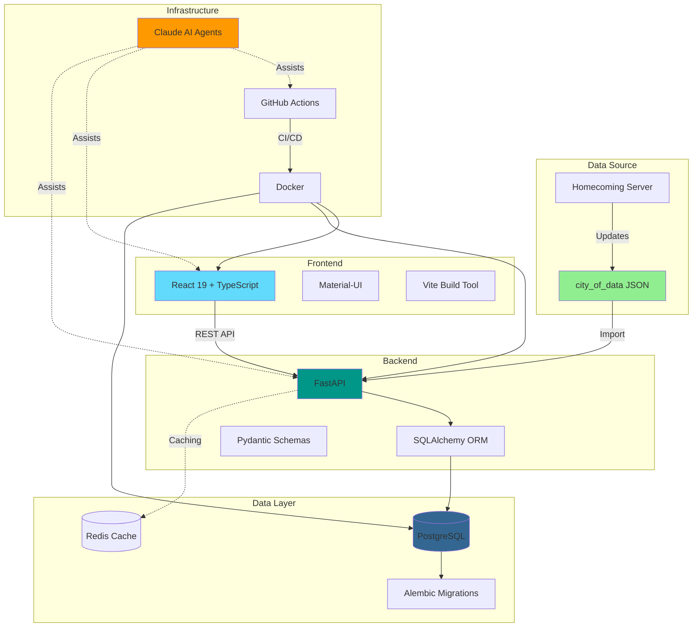
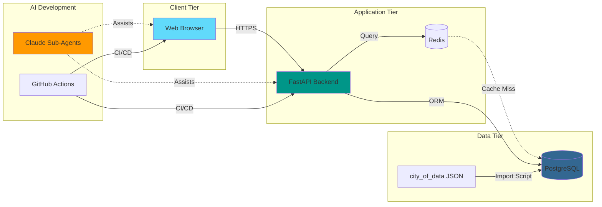
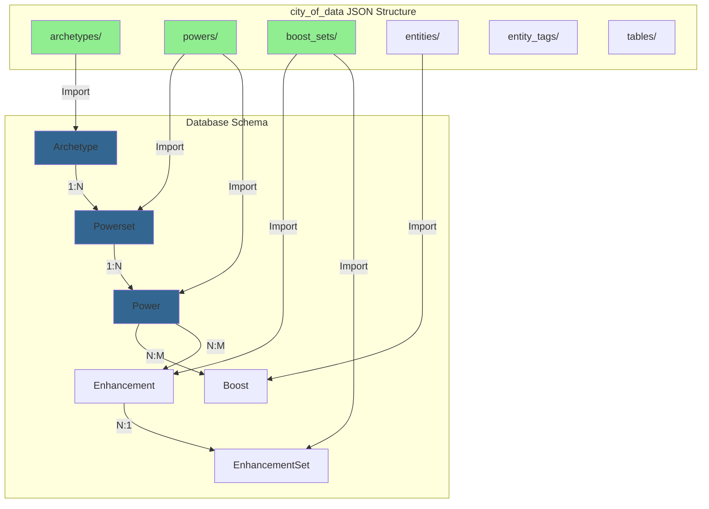
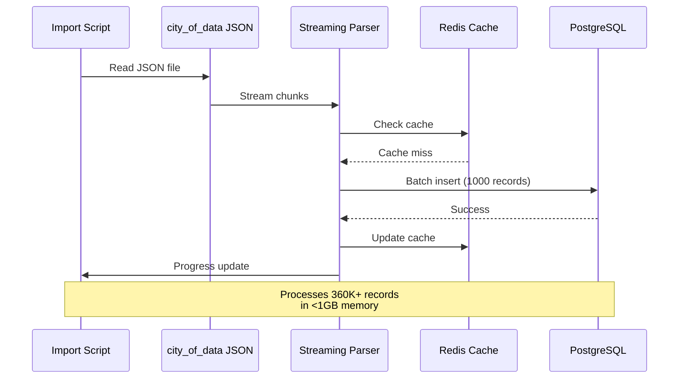
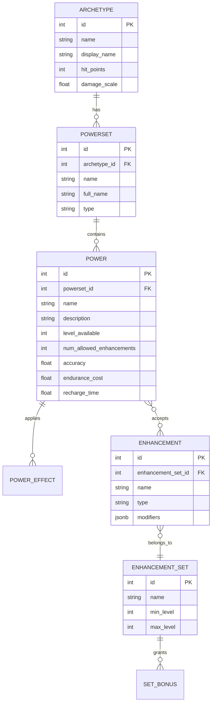

# Mids Hero Web

> **A modern, web-based character build planner for City of Heroes**
>
> Replacing the legacy Mids Reborn Windows application with a React/FastAPI stack, powered by AI-assisted development.

[](https://github.com/woodrowpearson/mids-hero-web/actions)
[](https://opensource.org/licenses/MIT)
[](https://www.python.org/downloads/)
[](https://reactjs.org/)

---

## 📖 Table of Contents

- [What is Mids Hero Web?](#what-is-mids-hero-web)
- [Problem We're Solving](#problem-were-solving)
- [Architecture](#architecture)
  - [Tech Stack](#tech-stack)
  - [System Architecture](#system-architecture)
  - [Data Model](#data-model)
- [Quick Start](#quick-start)
- [Development](#development)
- [Project Status](#project-status)
- [Contributing](#contributing)
- [License](#license)

---

## What is Mids Hero Web?

Mids Hero Web is a **modern web application** that brings the powerful character build planning capabilities of **Mids Reborn** to the browser.

### Features

- ✅ **Character Archetypes**: Select from all City of Heroes archetypes (Blaster, Controller, Defender, etc.)
- ✅ **Power Selection**: Browse and select powers from primary/secondary/pool powersets
- ✅ **Enhancement Slotting**: Plan enhancement slots with accurate set bonuses
- ✅ **Build Statistics**: Calculate damage, resistance, defense, recharge, and more
- 🚧 **Build Import/Export**: Import existing Mids builds (coming soon)
- 🚧 **Cloud Saving**: Save and share builds online (coming soon)
- 📋 **Real-time Validation**: Ensure builds follow game rules (planned)

### For Players

- **Browser-based**: No installation required
- **Cross-platform**: Works on Windows, Mac, Linux, mobile
- **Always up-to-date**: Game data synced from servers
- **Shareable**: Send build links to teammates

### For Developers

- **Modern stack**: React 19, FastAPI, PostgreSQL
- **AI-assisted**: Specialized Claude agents for each domain
- **Well-tested**: TDD approach with comprehensive test coverage
- **Well-documented**: Extensive documentation in `.claude/` and `docs/`

---

## Problem We're Solving

### The Legacy Tool: Mids Reborn

[Mids Reborn](https://github.com/LoadedCamel/MidsReborn) is a **Windows Forms desktop application** (fork of the original Mids' Hero Designer) that has been the gold standard for City of Heroes build planning since 2006.

**Limitations**:
- ❌ Windows-only (requires Wine/compatibility layers on Mac/Linux)
- ❌ Desktop installation required
- ❌ Binary `.mhd` file format (not web-compatible)
- ❌ Manual updates needed for game data changes
- ❌ No cloud saving or sharing
- ❌ Aging C# Windows Forms codebase

### Our Solution: Mids Hero Web

**Goals**:
- ✅ **Web-native**: Run in any modern browser
- ✅ **Cross-platform**: Windows, Mac, Linux, mobile
- ✅ **Modern UX**: React 19 with responsive design
- ✅ **Live data**: Automatic updates from game servers
- ✅ **Cloud builds**: Save and share builds online
- ✅ **Maintainable**: Modern TypeScript/Python stack

---

## Architecture

### Tech Stack



### System Architecture



### Data Model

#### Source: city_of_data Repository

We use the [city_of_data GitLab repository](https://gitlab.com/bearcano/coh-content-db-homecoming), which provides **JSON exports** of City of Heroes game data directly from the Homecoming server.

**Data Location**: `/Users/w/code/mids-hero-web/external/city_of_data/raw_data_homecoming-20250617_6916`



#### Import Flow



#### Database Schema (Simplified)



---

## Quick Start

### Prerequisites

- **Docker** and **Docker Compose**
- **just** command runner - [Install](https://github.com/casey/just)
- **Node.js 18+**
- **Python 3.11+**
- **uv** (Python package manager) - [Install](https://docs.astral.sh/uv/)

### Installation

1. **Clone the repository**:
   ```bash
   git clone https://github.com/woodrowpearson/mids-hero-web.git
   cd mids-hero-web
   ```

2. **Run quick start**:
   ```bash
   just quickstart
   ```

   This will:
   - Start PostgreSQL in Docker
   - Run database migrations
   - Install Python dependencies with uv
   - Install Node.js dependencies
   - Verify setup

3. **Start development servers**:
   ```bash
   just dev
   ```

4. **Access the application**:
   - **Frontend**: http://localhost:3000
   - **Backend API**: http://localhost:8000
   - **API Docs**: http://localhost:8000/docs

---

## Development

### Essential Commands

```bash
# Development
just dev            # Start all services
just health         # Run health checks
just test           # Run all tests
just quality        # Code quality checks
just lint-fix       # Auto-fix linting issues

# Database
just db-setup       # Complete database setup
just db-migrate     # Run migrations
just db-reset       # Reset database
just db-connect     # PostgreSQL shell

# Data Import
just import-all data-directory         # Import all data types
just i12-import data.json              # High-performance I12 import
just import-health                     # System health check
just cache-stats                       # Cache performance

# Git Workflow
git checkout -b feature/issue-XXX      # Create feature branch
just ucp "message"                     # Quick commit
just update-progress                   # Update progress tracking
git push -u origin feature/issue-XXX   # Push branch
gh pr create                           # Create pull request
```

### Project Structure

```
mids-hero-web/
├── frontend/              # React 19 + TypeScript
│   ├── src/
│   │   ├── components/   # React components
│   │   ├── services/     # API service layer
│   │   └── types/        # TypeScript definitions
│   └── package.json
│
├── backend/              # FastAPI application
│   ├── app/
│   │   ├── models.py     # SQLAlchemy models
│   │   ├── schemas.py    # Pydantic schemas
│   │   ├── crud.py       # Database operations
│   │   └── commands/     # CLI commands
│   ├── main.py           # FastAPI entry point
│   └── pyproject.toml    # Python dependencies
│
├── alembic/              # Database migrations
├── scripts/              # Development scripts
├── .claude/              # AI agent configuration
├── .github/              # CI/CD workflows
└── docs/                 # Documentation
```

### Development Workflow

1. **Create feature branch**:
   ```bash
   git checkout -b feature/description
   ```

2. **Run health check before starting**:
   ```bash
   just health
   ```

3. **Make changes and test**:
   ```bash
   just test
   just lint-fix
   ```

4. **Commit and push**:
   ```bash
   just ucp "feat: add power selection UI"
   git push -u origin feature/description
   ```

5. **Create pull request**:
   ```bash
   gh pr create
   ```

6. **AI Review**: Claude will automatically review your PR

### AI-Assisted Development

This project uses **Claude Code native sub-agents** for specialized assistance:

- **Database Specialist**: Schema design, migrations, query optimization
- **Backend Specialist**: FastAPI endpoints, Pydantic schemas
- **Frontend Specialist**: React components, TypeScript, UI/UX
- **Import Specialist**: Data import, city_of_data integration
- **Testing Specialist**: pytest, Vitest, E2E tests
- **DevOps Specialist**: Docker, CI/CD, deployment
- **Calculation Specialist**: Game mechanics, damage calculations
- **Documentation Specialist**: Maintaining docs

**Usage**:
- Tell Claude your task: "I need to work on database migrations"
- Claude automatically loads the appropriate specialist context
- Get domain-specific guidance and code suggestions

---

## Project Status

### Current Progress

| Epic | Status | Progress | Description |
|------|--------|----------|-------------|
| **Epic 1** | ✅ Complete | 100% | Project setup, CI/CD, Docker |
| **Epic 2** | ✅ Complete | 100% | Data model, database, JSON import |
| **Epic 2.5** | ✅ Complete | 100% | AI agents, workflows, optimization |
| **Epic 3** | 🚧 In Progress | 25% | Backend API endpoints |
| **Epic 4** | 📋 Planned | 0% | Frontend React UI |
| **Epic 5** | 📋 Planned | 0% | Deployment to GCP |
| **Epic 6** | 📋 Planned | 0% | Performance optimization |

### Completed Milestones

#### ✅ Epic 1: Project Setup (July 2025)
- Git repository and structure
- React 19 frontend scaffold
- FastAPI backend with SQLAlchemy
- Docker development environment
- GitHub Actions CI/CD
- Database migrations with Alembic

#### ✅ Epic 2: Data Import (July-August 2025)
- ~~Binary MHD parser (abandoned)~~
- ~~MidsReborn DataExporter (abandoned)~~
- JSON-native import from city_of_data
- High-performance streaming parser (360K+ records)
- Multi-tier caching (LRU + Redis)
- Database optimizations (composite indexes, GIN indexes)

#### ✅ Epic 2.5: AI-Assisted Development (August-October 2025)
- Native Claude sub-agents (8 specialists)
- GitHub Actions optimization (40% performance gain)
- Automated documentation sync
- Context health monitoring
- RAG implementation (completed, later archived)

#### 🚧 Epic 3: Backend API (October 2025 - Current)
- ✅ Core data endpoints (GET /api/archetypes, powers, etc.)
- 🚧 Build simulation endpoints
- 🚧 Calculation logic
- 📋 Write/modify operations

### Next Steps

1. **Complete Epic 3**: Finish backend API endpoints
2. **Start Epic 4**: Build React UI for power selection
3. **Epic 5 Planning**: Design GCP deployment architecture
4. **Community Feedback**: Gather feedback from CoH players

---

## Contributing

We welcome contributions! Please see our [development roadmap](docs/PROJECT_EVOLUTION.md) for current priorities.

### How to Contribute

1. **Fork the repository**
2. **Create a feature branch**: `git checkout -b feature/amazing-feature`
3. **Use just commands**: `just health`, `just test`, `just lint-fix`
4. **Commit changes**: `just ucp "Add amazing feature"`
5. **Push branch**: `git push origin feature/amazing-feature`
6. **Open Pull Request**: Claude will automatically review

### Development Guidelines

- **Use feature branches**: Never commit directly to `main`
- **Write tests**: TDD approach preferred
- **Follow conventions**: ESLint, Black, Prettier
- **Document changes**: Update relevant docs
- **Run quality checks**: `just quality` before pushing

### AI Assistance

- Use **@claude** in PR comments for help
- Claude will review for City of Heroes domain accuracy
- Automated documentation updates

---

## License

This project is licensed under the MIT License - see the [LICENSE](LICENSE) file for details.

---

## Acknowledgments

- **Mids Reborn** team for the original desktop application
- **LoadedCamel** for maintaining Mids Reborn
- **City of Heroes** community for continued support
- **Homecoming** and **Rebirth** server teams for game data
- **bearcano** for the city_of_data repository

---

## Support

For support, please:

- Check the [documentation](docs/)
- Open an issue on GitHub
- Join our Discord server (coming soon)

---

_Mids Hero Web is not affiliated with or endorsed by NCSoft or the original City of Heroes development team._

**Project Links**:
- GitHub: https://github.com/woodrowpearson/mids-hero-web
- Mids Reborn: https://github.com/LoadedCamel/MidsReborn
- city_of_data: https://gitlab.com/bearcano/coh-content-db-homecoming
- City of Heroes Homecoming: https://homecoming.wiki/
