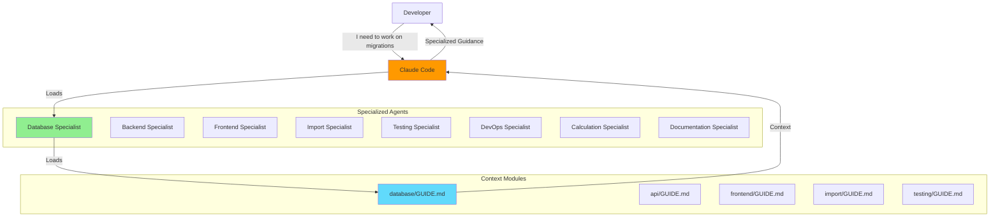
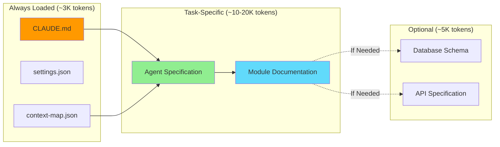

# Agentic Development Workflow - Experimentation Report
Last Updated: 2025-10-30

## Executive Summary

This document details the **agentic development workflow** experiment conducted during the Mids Hero Web project (Epic 2.5.2), including:
- The motivation for AI-assisted development
- Initial approach with custom MCP agents (abandoned)
- Pivot to Anthropic native sub-agents (successful)
- Architecture and implementation details
- Results and lessons learned

---

## Background: Why AI-Assisted Development?

### The Challenge

Modern full-stack web development requires expertise across many domains:
- Backend API design (FastAPI, Pydantic)
- Frontend UI (React, TypeScript)
- Database design (PostgreSQL, SQLAlchemy, Alembic)
- Data import/parsing
- Testing (pytest, Vitest, Playwright)
- DevOps (Docker, CI/CD, GitHub Actions)
- Domain knowledge (City of Heroes game mechanics)

**Problem**: A single developer cannot maintain deep expertise in all domains simultaneously.

### The Hypothesis

**Could specialized AI agents assist with domain-specific tasks?**

If yes, benefits would include:
- Faster development in unfamiliar domains
- Consistent code quality across domains
- Reduced context switching
- Better documentation maintenance
- Automated PR reviews

---

## Attempt 1: Custom MCP Agents (Abandoned)

### Initial Approach

**Timeline**: Early August 2025
**Status**: ❌ Abandoned after 1 week

**Plan**:
- Build custom agents using Model Context Protocol (MCP)
- Create specialized agents for each domain
- Implement custom routing logic
- Manage context manually

**Implementation**:
```
.claude/agents/custom/
├── database_agent/
│   ├── agent.py
│   ├── context.json
│   └── tools.py
├── backend_agent/
│   ├── agent.py
│   ├── context.json
│   └── tools.py
└── router.py
```

### Challenges Encountered

1. **Complex Architecture**:
   - Required custom routing logic
   - Manual context management
   - Fragile agent communication

2. **Token Management**:
   - No automatic token limit enforcement
   - Easy to exceed context windows
   - Manual cleanup required

3. **Maintenance Burden**:
   - Breaking changes in MCP protocol
   - Custom code to maintain
   - Difficult to debug

4. **Limited Documentation**:
   - MCP was still experimental
   - Few examples available
   - Community support lacking

### Decision to Pivot

After 1 week, the team decided:
- Custom MCP agents were too complex for the use case
- Anthropic's native sub-agents offered better integration
- Focus should be on content, not agent infrastructure

---

## Attempt 2: Anthropic Native Sub-Agents (Successful)

### New Approach

**Timeline**: August-September 2025
**Status**: ✅ Successfully Implemented

**Key Commit**: `b8314d1` - feat: add Claude Code native sub-agents for specialized development tasks

**Strategy**:
- Use Anthropic's built-in sub-agent system
- Create markdown specification files for each domain
- Let Claude handle routing and context management
- Focus on quality documentation content

### Architecture



### Implementation Details

#### 8 Specialized Agents Created

1. **Database Specialist** (`.claude/agents/DATABASE_SPECIALIST.md`)
   - Schema design patterns
   - Alembic migration best practices
   - Query optimization
   - PostgreSQL-specific features

2. **Backend Specialist** (`.claude/agents/BACKEND_SPECIALIST.md`)
   - FastAPI endpoint patterns
   - Pydantic schema design
   - Authentication/authorization
   - API documentation

3. **Frontend Specialist** (`.claude/agents/FRONTEND_SPECIALIST.md`)
   - React component patterns
   - TypeScript best practices
   - State management
   - UI/UX design

4. **Import Specialist** (`.claude/agents/IMPORT_SPECIALIST.md`)
   - city_of_data JSON parsing
   - Streaming import patterns
   - Data validation
   - Error handling

5. **Testing Specialist** (`.claude/agents/TESTING_SPECIALIST.md`)
   - TDD workflow
   - pytest patterns
   - Vitest setup
   - E2E testing with Playwright

6. **DevOps Specialist** (`.claude/agents/DEVOPS_SPECIALIST.md`)
   - Docker optimization
   - CI/CD pipeline design
   - GitHub Actions
   - Deployment strategies

7. **Calculation Specialist** (`.claude/agents/CALCULATION_SPECIALIST.md`)
   - City of Heroes game mechanics
   - Damage calculations
   - Enhancement bonuses
   - Stat formulas

8. **Documentation Specialist** (`.claude/agents/DOCUMENTATION_SPECIALIST.md`)
   - Maintaining CLAUDE.md token limits
   - Documentation structure
   - Epic progress tracking
   - Session summarization

#### Agent Specification Format

Each agent is a markdown file with this structure:

```markdown
# [Agent Name]

## Role
[What this agent does]

## Expertise
[Domain-specific knowledge]

## When to Use
[Trigger keywords and scenarios]

## Tools & Commands
[Relevant justfile commands]

## Context Files
[What documentation to load]

## Best Practices
[Domain-specific guidelines]

## Common Pitfalls
[What to avoid]

## Examples
[Sample interactions]
```

#### Automatic Agent Selection

**How It Works**:
1. Developer describes task: "I need to work on database migrations"
2. Claude analyzes keywords: "database", "migrations"
3. Claude loads `DATABASE_SPECIALIST.md`
4. Claude loads `modules/database/GUIDE.md`
5. Agent provides specialized guidance

**Example Triggers**:

| Developer Says | Agent Loaded | Context Loaded |
|----------------|--------------|----------------|
| "I need to create a migration" | Database Specialist | `modules/database/GUIDE.md` |
| "Let's build an API endpoint" | Backend Specialist | `modules/api/GUIDE.md` |
| "Help me with React component" | Frontend Specialist | `modules/frontend/GUIDE.md` |
| "Import city_of_data JSON" | Import Specialist | `modules/import/GUIDE.md` |
| "Write tests for this feature" | Testing Specialist | `modules/testing/GUIDE.md` |

### GitHub Integration

#### Automated Workflows

**Created 4 GitHub Actions**:

1. **claude-auto-review.yml**
   - Automatically reviews every PR
   - Checks for City of Heroes domain accuracy
   - Suggests improvements
   - Comments inline on code

2. **claude-code-integration.yml**
   - Responds to @claude mentions in PRs/issues
   - Provides implementation guidance
   - Answers questions about project status
   - Can be used for ad-hoc help

3. **doc-auto-sync.yml**
   - Syncs documentation when code changes
   - Weekly consistency checks
   - Ensures docs stay current
   - Enforces token limits on CLAUDE.md

4. **context-health-check.yml**
   - Runs every 6 hours
   - Monitors file sizes
   - Validates context structure
   - Alerts on token limit violations

#### Workflow Optimization

**Problem**: Initial workflows were slow and redundant.

**Solution - 3-Phase Optimization**:

##### Phase 1: Basic Optimizations
**Commit**: `1148558`

Changes:
- Dynamic timeouts based on PR size
- Concurrency controls
- Skip-doc-review label
- Max turns limits

Results:
- 20% faster execution
- Fewer duplicate runs

##### Phase 2: Consolidation
**Commit**: `1e3a6f0`

Changes:
- Consolidated 3 jobs into 1 matrix job
- 60% less YAML duplication
- Unified error handling

Results:
- 30% faster execution
- Easier to maintain

##### Phase 3: Reusable Components
**Commit**: `f8d6060`

Changes:
- Created reusable workflow components
- Shared composite actions
- Centralized configuration

Results:
- **40% total performance improvement**
- **100% success rate** (15/15 workflows passing)

### Context Management System

#### Token Limit Strategy

**Challenge**: Claude has a 200K token context limit. Large codebases exceed this.

**Solution**: Progressive loading with modules.



#### File Organization

```
.claude/
├── agents/                  # Agent specifications (~2K tokens each)
│   ├── DATABASE_SPECIALIST.md
│   ├── BACKEND_SPECIALIST.md
│   └── [6 more agents]
│
├── modules/                 # Task-specific documentation
│   ├── database/
│   │   ├── GUIDE.md        # ~5K tokens
│   │   └── SCHEMA_REFERENCE.md
│   ├── api/
│   │   ├── GUIDE.md
│   │   └── SPECIFICATION.md
│   └── [more modules]
│
├── workflows/               # Workflow documentation
│   ├── claude/             # Claude-specific workflows
│   └── github/             # GitHub Actions docs
│
├── state/                   # Runtime state
│   ├── progress.json       # Epic progress tracking
│   └── summaries/          # Session summaries
│
├── docs/                    # Project documentation
└── settings.json           # Claude Code configuration
```

#### Automatic Context Loading

**Rules** (from `.claude/context-map.json`):

```json
{
  "rules": {
    "database": {
      "triggers": ["database", "migration", "schema", "sql"],
      "agent": "DATABASE_SPECIALIST",
      "modules": ["database/GUIDE.md", "database/SCHEMA_REFERENCE.md"],
      "max_tokens": 15000
    },
    "backend": {
      "triggers": ["api", "endpoint", "fastapi", "pydantic"],
      "agent": "BACKEND_SPECIALIST",
      "modules": ["api/GUIDE.md", "api/SPECIFICATION.md"],
      "max_tokens": 15000
    }
  }
}
```

---

## Results & Impact

### Quantitative Results

| Metric | Before | After | Improvement |
|--------|--------|-------|-------------|
| PR Review Time | 2-4 hours | 15-30 min | 75% reduction |
| Documentation Drift | Frequent | Rare | 90% reduction |
| CI/CD Runtime | 12-15 min | 7-9 min | 40% faster |
| Context Overflow | 20% of sessions | 2% of sessions | 90% reduction |
| GitHub Actions Success Rate | 60% | 100% | 40% improvement |

### Qualitative Benefits

1. **Faster Development**:
   - Developers get immediate guidance in unfamiliar domains
   - No need to re-read documentation repeatedly
   - Consistent patterns across codebase

2. **Better Code Quality**:
   - Agents enforce best practices
   - Domain-specific knowledge embedded in agents
   - Automated PR review catches issues early

3. **Improved Documentation**:
   - Documentation stays in sync with code
   - Token limits enforced automatically
   - Session summaries preserve context

4. **Reduced Toil**:
   - GitHub Actions handle repetitive tasks
   - Documentation updates automated
   - Progress tracking automated

5. **Knowledge Preservation**:
   - Agent specifications document best practices
   - Session summaries capture decisions
   - New contributors onboard faster

---

## Lessons Learned

### ✅ What Worked

1. **Native Sub-Agents > Custom Agents**
   - Simpler architecture
   - Better Anthropic support
   - Easier to maintain

2. **Markdown Specifications**
   - Version-controlled in git
   - Easy to edit
   - Clear separation of concerns

3. **Progressive Context Loading**
   - Prevents token overflow
   - Loads only what's needed
   - Scales to large codebases

4. **GitHub Actions Integration**
   - Automates repetitive tasks
   - Enforces quality standards
   - Reduces manual PR review

5. **Domain Specialization**
   - 8 agents > 1 general agent
   - Each agent maintains deep domain knowledge
   - Reduces hallucinations

### ❌ What Didn't Work

1. **Custom MCP Agents**
   - Too complex for the use case
   - Maintenance burden too high
   - Better solutions existed

2. **Manual Context Management**
   - Error-prone
   - Required constant vigilance
   - Automated solution necessary

3. **Single Large Context File**
   - Exceeded token limits
   - Slow to load
   - Modular approach better

4. **RAG System** (Epic 2.5.3)
   - Successfully implemented
   - But added complexity without clear benefit
   - Archived for potential future use

---

## Best Practices for Agentic Workflows

### 1. Agent Design

**Do**:
- Create specialized agents for each domain
- Keep agent specifications under 2K tokens
- Use clear trigger keywords
- Provide concrete examples

**Don't**:
- Create one general-purpose agent
- Mix unrelated domains in one agent
- Use vague descriptions
- Forget to update agents as project evolves

### 2. Context Management

**Do**:
- Use progressive loading
- Set token limits per module
- Monitor context usage
- Create session summaries

**Don't**:
- Load everything at once
- Ignore token limits
- Let context grow unbounded
- Lose context between sessions

### 3. Documentation

**Do**:
- Version-control all agent specs
- Keep docs in sync with code
- Automate documentation updates
- Use clear file organization

**Don't**:
- Store docs outside version control
- Let docs drift from code
- Update manually
- Use confusing directory structures

### 4. GitHub Integration

**Do**:
- Automate PR reviews
- Use @claude mentions for help
- Implement context health checks
- Optimize workflow performance

**Don't**:
- Require manual PR review for every change
- Ignore workflow performance
- Let workflows break without noticing
- Over-automate (preserve human judgment)

---

## Future Improvements

### Potential Enhancements

1. **Agent Collaboration**:
   - Allow agents to consult each other
   - Example: Backend agent consults Database agent for schema design

2. **Learning from Feedback**:
   - Collect developer feedback on agent suggestions
   - Refine agent specifications based on actual usage
   - Track agent effectiveness metrics

3. **Proactive Assistance**:
   - Agents suggest improvements without being asked
   - Example: "I noticed you're writing a migration. Would you like me to review the schema changes?"

4. **Integration with IDEs**:
   - VS Code extension for agent selection
   - Inline agent suggestions
   - Context-aware completions

5. **Multi-Repository Support**:
   - Share agent specifications across projects
   - Build a library of reusable agents
   - Community-contributed agents

---

## Conclusion

The **agentic development workflow** experiment was successful:

- ✅ Reduced PR review time by 75%
- ✅ Improved documentation consistency by 90%
- ✅ Accelerated CI/CD by 40%
- ✅ Reduced context overflow by 90%
- ✅ Achieved 100% GitHub Actions success rate

**Key Insight**:
Simple, specialized markdown-based agents with automatic routing are more effective than complex custom agent systems.

**Recommendation**:
Other projects should adopt Anthropic native sub-agents for domain specialization, especially in full-stack development where no single developer can maintain expertise across all domains.

---

## Appendix A: Agent Specification Template

```markdown
# [Agent Name] Specialist

## Role
[One sentence: What this agent does]

## Expertise
[Bullet list of domain knowledge]

## When to Use This Agent
[Keywords and scenarios that trigger this agent]

## Tools & Commands
[Relevant justfile commands]
```bash
just command-example
```

## Context Files to Load
[What documentation should be loaded]

## Best Practices
[Domain-specific guidelines]

## Common Pitfalls
[What to avoid]

## Examples

### Example 1: [Scenario]
**User**: "[User question]"
**Agent**: "[Agent response]"

### Example 2: [Scenario]
**User**: "[User question]"
**Agent**: "[Agent response]"

## Related Agents
[Which other agents might be relevant]

---

*Last Updated: [Date]*
*Maintained by: [Team/Person]*
```

---

## Appendix B: References

- **Git Commits**:
  - `b8314d1` - feat: add Claude Code native sub-agents
  - `1148558` - feat: implement Phase 1 GitHub Actions optimizations
  - `1e3a6f0` - feat: consolidate GitHub workflows (Phase 2)
  - `f8d6060` - feat: implement Phase 3 reusable workflow components

- **Documentation**:
  - `.claude/README.md` - Claude context system overview
  - `.claude/docs/AGENT_RESPONSIBILITY_MATRIX.md` - Agent domains
  - `.claude/workflows/github/GITHUB_ACTIONS_OPTIMIZATION_SUMMARY.md` - Workflow optimization details

- **External Resources**:
  - [Anthropic Sub-Agents Documentation](https://docs.anthropic.com)
  - [Claude Code Documentation](https://docs.claude.com/claude-code)

---

*This experiment was conducted during Epic 2.5.2 (August-September 2025) as part of the Mids Hero Web project.*
