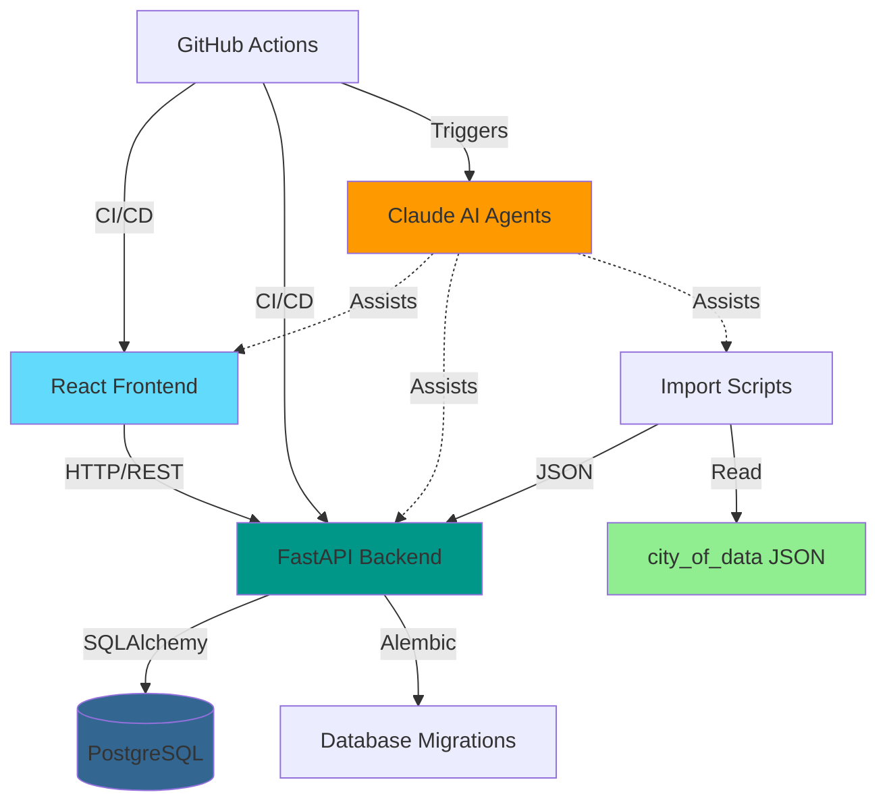

# Mids Hero Web - Codebase Structure
Last Updated: 2025-10-30

## Project Root
```
mids-hero-web/
├── frontend/              # React 19 + TypeScript UI
├── backend/               # FastAPI application
├── alembic/              # Database migrations
├── scripts/              # Development & maintenance scripts
├── .claude/              # AI agent configuration & documentation
├── .github/              # CI/CD workflows
├── external/             # External data sources
│   └── city_of_data/     # JSON game data from city_of_data repo
├── shared/               # Shared configurations
└── docs/                 # Project documentation
```

## Frontend (`/frontend`)
```
frontend/
├── src/
│   ├── components/       # React components
│   ├── services/         # API service layer
│   ├── types/           # TypeScript type definitions
│   └── App.tsx          # Main application component
├── public/              # Static assets
└── package.json         # Node.js dependencies
```

**Key Technologies**:
- React 19 with TypeScript
- Material-UI (planned)
- Vite build tool
- ESLint & Prettier

## Backend (`/backend`)
```
backend/
├── app/
│   ├── models.py        # SQLAlchemy database models
│   ├── schemas.py       # Pydantic request/response schemas
│   ├── crud.py          # Database CRUD operations
│   ├── database.py      # Database connection & session management
│   └── commands/        # CLI commands for import/export
├── main.py              # FastAPI application entry point
├── pyproject.toml       # Python dependencies (uv)
└── tests/               # Backend test suite
```

**Key Technologies**:
- FastAPI for REST API
- SQLAlchemy ORM with Alembic migrations
- PostgreSQL database
- Pydantic for validation
- uv for package management
- pytest for testing

## Database Migrations (`/alembic`)
```
alembic/
├── versions/            # Migration scripts
├── env.py              # Alembic configuration
└── script.py.mako      # Migration template
```

## Scripts (`/scripts`)
```
scripts/
├── import_json_data.py      # Generic JSON data importer
├── db_optimize.py           # Database optimization utilities
├── db_stats.py              # Database statistics
├── cache_clear.py           # Cache management
├── cache_stats.py           # Cache performance metrics
└── update_claude_docs.py    # Auto-update Claude documentation
```

## AI Agent System (`.claude/`)
```
.claude/
├── agents/                  # Native Claude sub-agents
│   ├── BACKEND_SPECIALIST.md
│   ├── FRONTEND_SPECIALIST.md
│   ├── DATABASE_SPECIALIST.md
│   ├── IMPORT_SPECIALIST.md
│   ├── TESTING_SPECIALIST.md
│   ├── DEVOPS_SPECIALIST.md
│   ├── CALCULATION_SPECIALIST.md
│   └── DOCUMENTATION_SPECIALIST.md
├── modules/                 # Task-based context modules
│   ├── api/                # API development documentation
│   ├── database/           # Database schema & migration guides
│   ├── frontend/           # Frontend architecture & patterns
│   ├── import/             # Data import guides
│   └── testing/            # Testing strategies
├── workflows/              # Development workflows
│   ├── claude/            # Claude-specific workflows
│   └── github/            # GitHub Actions documentation
├── docs/                   # Project documentation
├── state/                  # Runtime state & progress tracking
│   ├── progress.json      # Epic progress tracking
│   └── summaries/         # Session summaries
├── settings.json          # Claude Code configuration
└── context-map.json       # Context loading rules
```

## External Data (`/external`)
```
external/
└── city_of_data/
    └── raw_data_homecoming-20250617_6916/
        ├── archetypes/         # Character archetypes (JSON)
        ├── powers/             # Power definitions (JSON)
        ├── boost_sets/         # Enhancement sets (JSON)
        ├── entities/           # Entity definitions (JSON)
        └── [more directories]  # Additional game data
```

**Data Source**: [City of Data (CoD)](https://cod.uberguy.net/homecoming/raw_data_homecoming.zip)
**Format**: JSON files extracted from City of Heroes game servers
**Server**: Homecoming (primary), with planned Rebirth support

## GitHub Workflows (`.github/workflows`)
```
.github/workflows/
├── claude-auto-review.yml       # Automatic PR review with Claude
├── claude-code-integration.yml  # @claude mentions in issues/PRs
├── doc-auto-sync.yml           # Documentation synchronization
├── context-health-check.yml    # Context system validation
└── ci.yml                      # Standard CI checks
```

## Key Configuration Files

| File | Purpose |
|------|---------|
| `justfile` | Command runner (replaces Makefile) |
| `docker-compose.yml` | Local development environment |
| `Dockerfile` | Multi-stage container build |
| `CLAUDE.md` | AI assistant entry point |
| `.gitignore` | Git exclusions |
| `pyproject.toml` | Python project configuration |
| `alembic.ini` | Database migration configuration |

## Deprecated/Archive Areas

- `.claude/docs/archive/` - Old documentation and planning artifacts
- `shared/user/new-project/` - Template files from project setup

---

## Component Relationships



---

*This structure reflects the project as of October 2025 after Epic 2.5 completion.*
