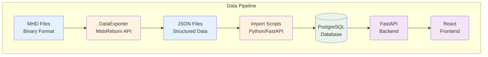
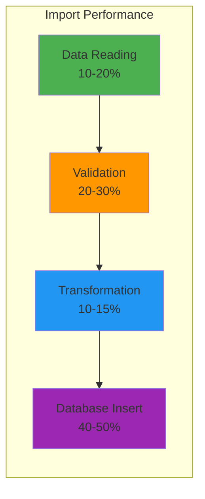

# Data Import Documentation

This directory contains comprehensive documentation for the Mids Hero Web data import system, including visual guides, architecture diagrams, and operational procedures.

## 📚 Quick Navigation

- **[Import Guide](./import-guide.md)** - Step-by-step import instructions with visual workflows
- **[Data Structures](./data-structures.md)** - JSON format specifications with examples
- **[Operations Runbook](./operations.md)** - Production procedures and maintenance
- **[Developer Guide](./developer-guide.md)** - Implementation details and architecture
- **[Troubleshooting](./troubleshooting.md)** - Common issues and solutions
- **[Architecture Overview](./architecture.md)** - System design and data flow

## 🚀 Quick Start

```bash
# Full data import (all types)
just import-all data/json

# Check system health
just import-health

# Import specific data type
just import-type powers data/json/powers.json

# High-performance I12 import
just i12-import data/json/I12_extracted.txt
```

## 📊 System Overview



## 📋 Import Status Dashboard

| Data Type | Import Command | Records | Status | Performance |
|-----------|----------------|---------|---------|-------------|
| Archetypes | `just import-archetypes` | 13 | ✅ Complete | < 1s |
| Powersets | `just import-powersets` | 182 | ✅ Complete | < 2s |
| Powers | `just import-powers` | 12,214 | ✅ Complete | 5-10s |
| I12 Powers | `just i12-import` | 360,659 | ✅ Complete | 2-3 min |
| Enhancements | `just import-enhancements` | 10,186 | ✅ Complete | 3-5s |
| Recipes | `just import-recipes` | 82,299 | ✅ Complete | 10-15s |
| Salvage | `just import-salvage` | 222 | ✅ Complete | < 1s |

## 🔧 Key Features

- **Batch Processing**: Efficient handling of large datasets
- **Progress Tracking**: Real-time import progress with ETA
- **Error Recovery**: Resume capability for interrupted imports
- **Data Validation**: Comprehensive validation at each step
- **Performance Monitoring**: Built-in metrics and diagnostics

## 📈 Performance Metrics



## 🛠️ Common Operations

### Daily Import Workflow
```bash
# 1. Export latest data from MidsReborn
cd DataExporter
dotnet run -- /path/to/mhd/files output/json

# 2. Validate exported data
just import-validate output/json

# 3. Import to database
just import-all output/json

# 4. Verify import success
just import-stats
```

### Production Deployment
```bash
# Full production import with monitoring
just import-all data/json --monitor --backup

# Check data integrity
just import-health

# Generate import report
just import-report
```

## 📞 Support

For issues or questions:
1. Check [Troubleshooting Guide](./troubleshooting.md)
2. Review [GitHub Issues](https://github.com/woodrowpearson/mids-hero-web/issues)
3. Contact the development team

## 🔄 Version History

- **v1.0** - Initial import system with basic functionality
- **v2.0** - Added I12 streaming parser for large datasets
- **v3.0** - Enhanced validation and error recovery
- **Current** - Full production-ready import pipeline