# Data Import Architecture

This document provides a comprehensive overview of the Mids Hero Web data import system architecture, including component relationships, data flow, and technical specifications.

## Table of Contents
- [System Architecture](#system-architecture)
- [Component Overview](#component-overview)
- [Data Flow](#data-flow)
- [Technology Stack](#technology-stack)
- [Scalability Design](#scalability-design)
- [Security Considerations](#security-considerations)
- [Future Architecture](#future-architecture)

## System Architecture

### High-Level Architecture

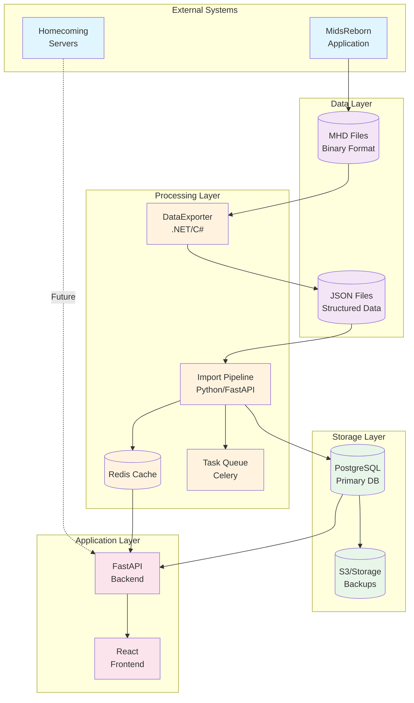

### Detailed Component Architecture

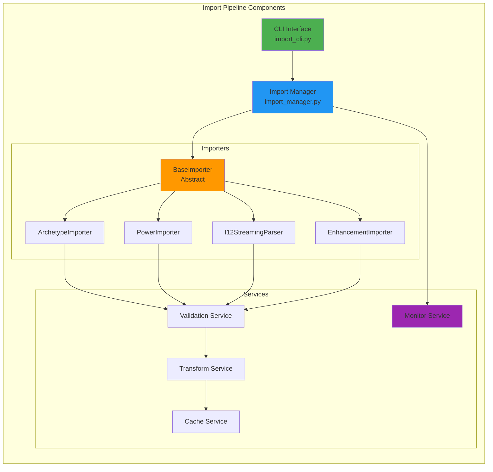

## Component Overview

### DataExporter (.NET/C#)

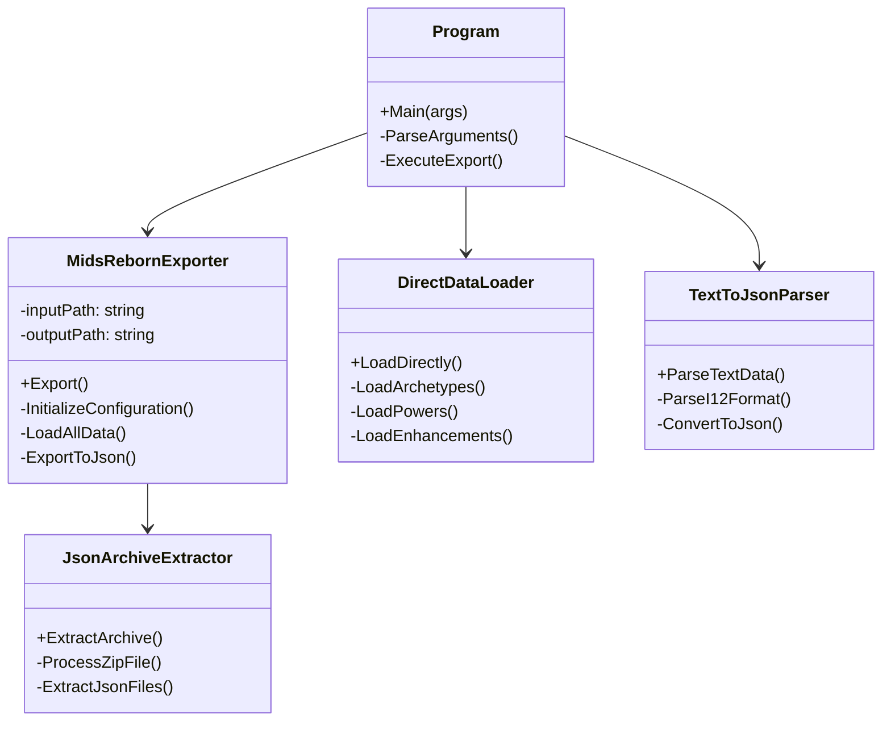

### Import Pipeline (Python)

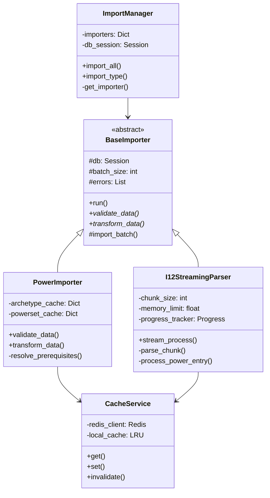

## Data Flow

### Import Process Flow

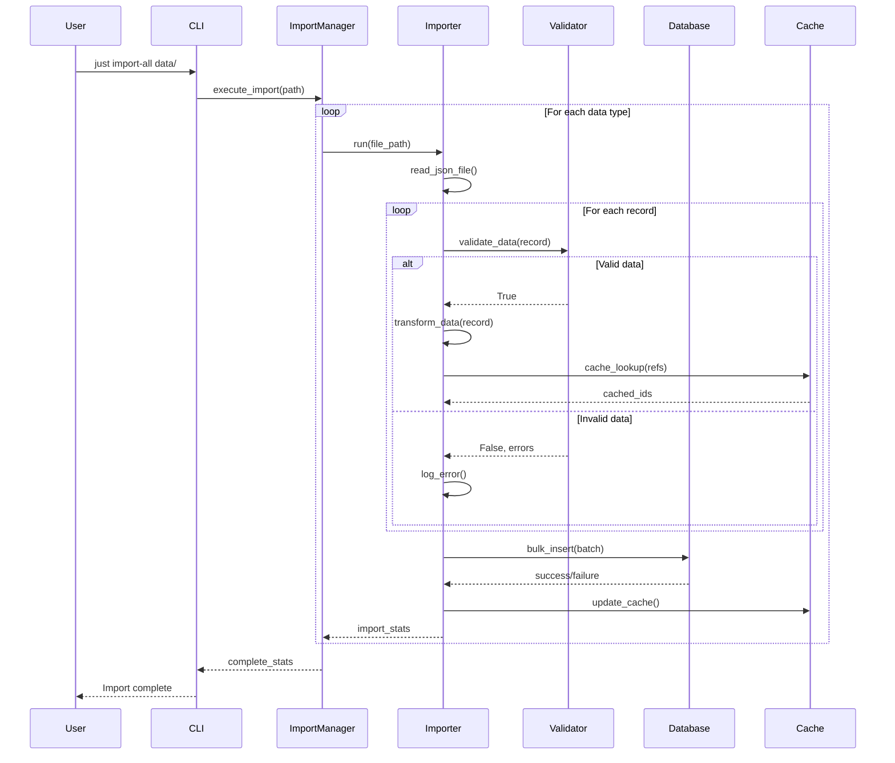

### I12 Streaming Process

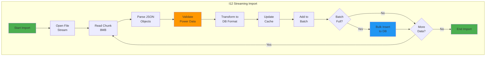

## Technology Stack

### Core Technologies

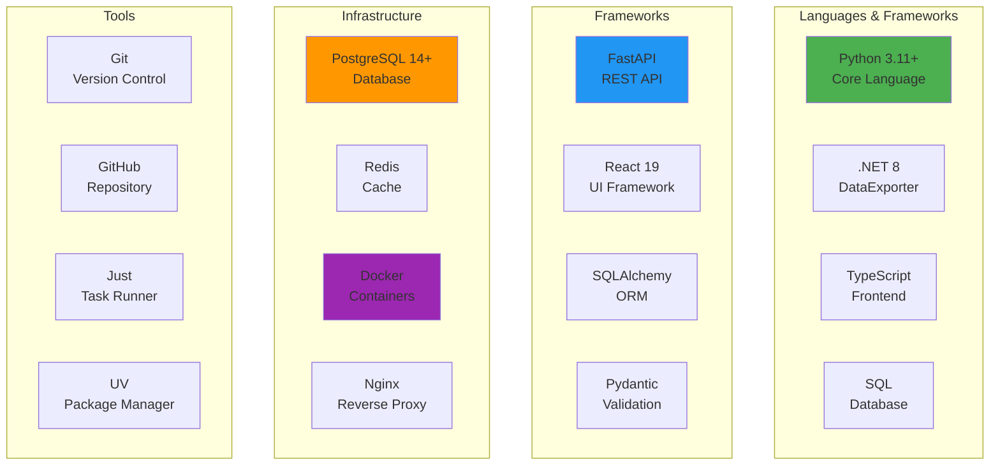

### Database Schema

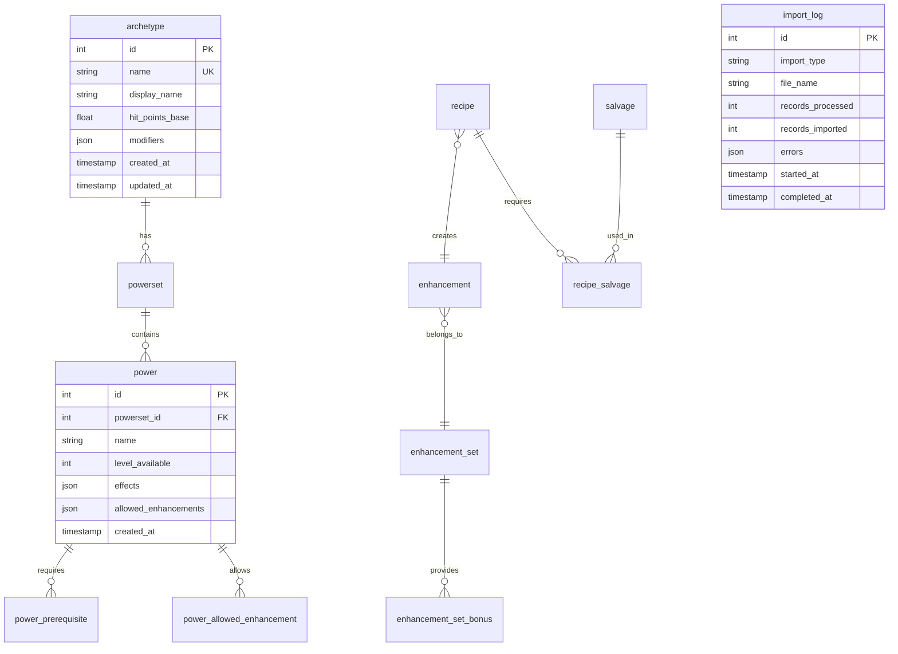

## Scalability Design

### Horizontal Scaling Architecture

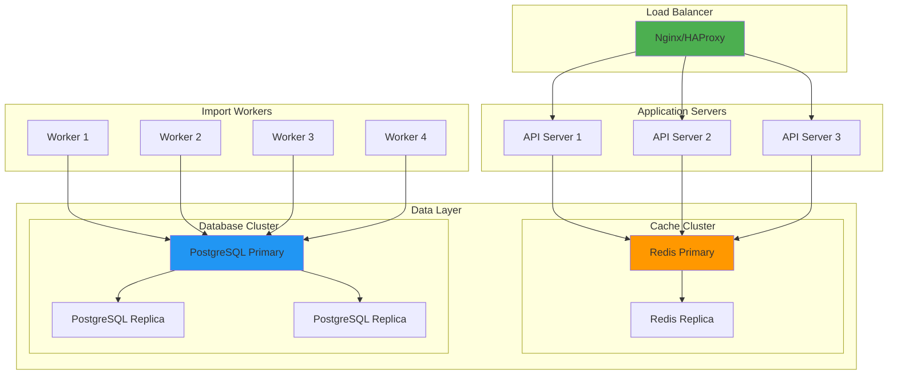

### Performance Optimization Points

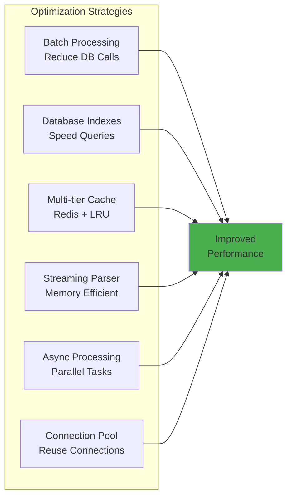

## Security Considerations

### Security Architecture

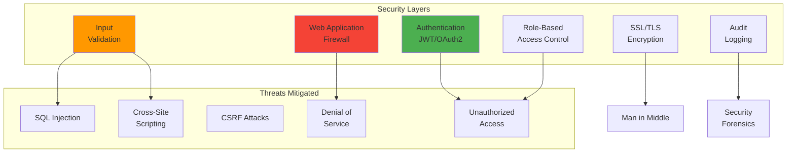

### Data Security Flow

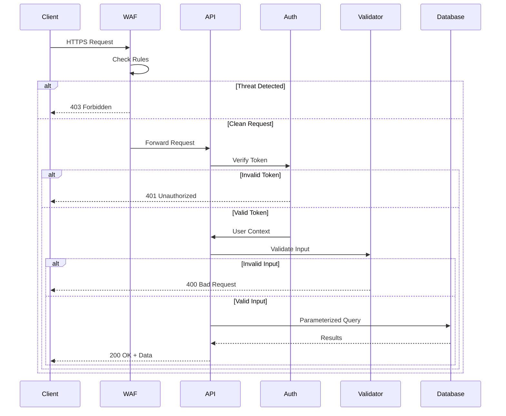

## Future Architecture

### Planned Enhancements

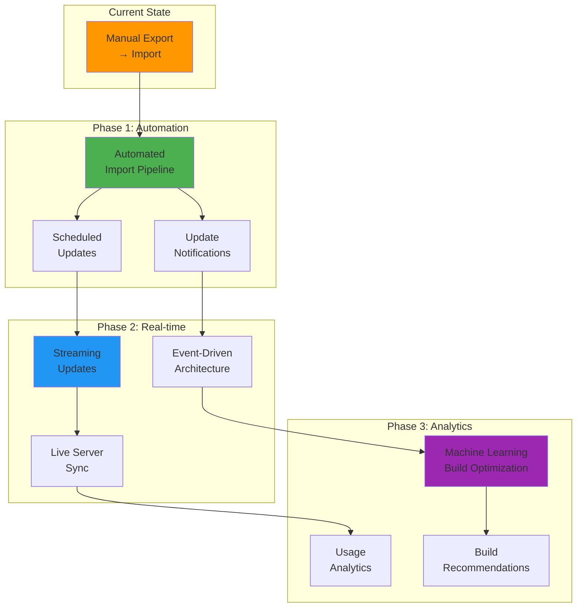

### Microservices Architecture (Future)

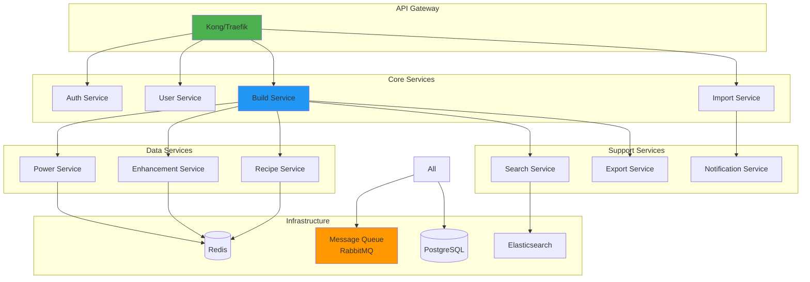

## Architecture Decision Records (ADRs)

### ADR-001: Use DataExporter with MidsReborn API

**Status**: Accepted  
**Context**: Need to parse MHD binary files  
**Decision**: Use MidsReborn's official API via DataExporter  
**Consequences**: 
- ✅ Accurate parsing
- ✅ Maintained by community
- ❌ Dependency on external project
- ❌ Windows/Mono requirement

### ADR-002: Streaming Parser for I12 Data

**Status**: Accepted  
**Context**: I12 file contains 360K+ records  
**Decision**: Implement streaming JSON parser  
**Consequences**:
- ✅ Memory efficient
- ✅ Handles large files
- ✅ Progress tracking
- ❌ More complex implementation

### ADR-003: PostgreSQL as Primary Database

**Status**: Accepted  
**Context**: Need reliable, scalable database  
**Decision**: Use PostgreSQL 14+  
**Consequences**:
- ✅ JSONB support
- ✅ Strong consistency
- ✅ Advanced indexing
- ❌ Requires administration

## Monitoring and Observability

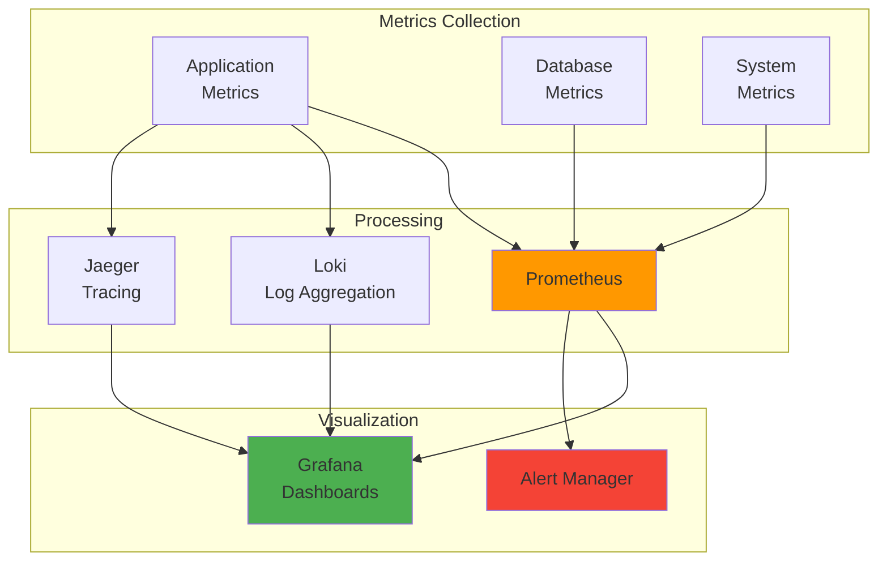

This architecture provides a solid foundation for the Mids Hero Web import system while allowing for future growth and enhancement.