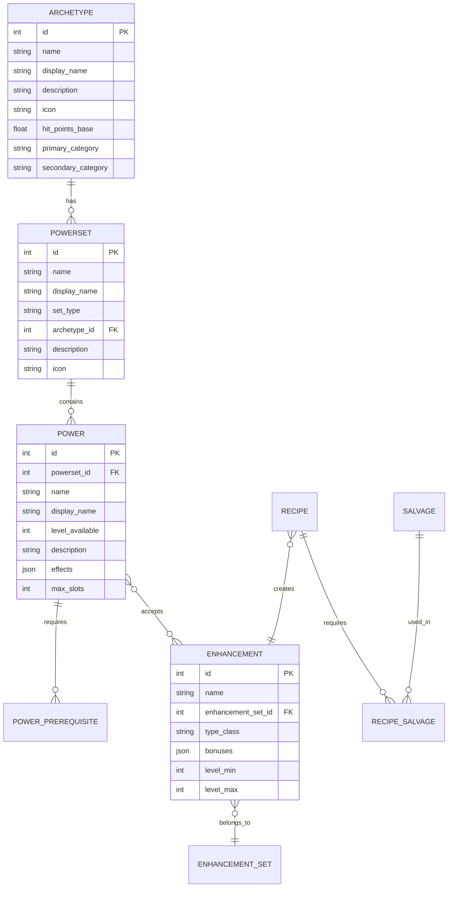
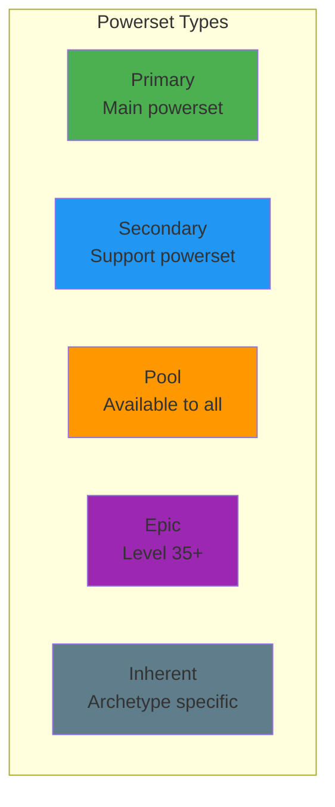
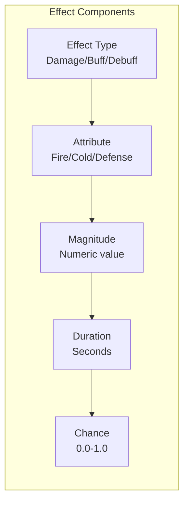
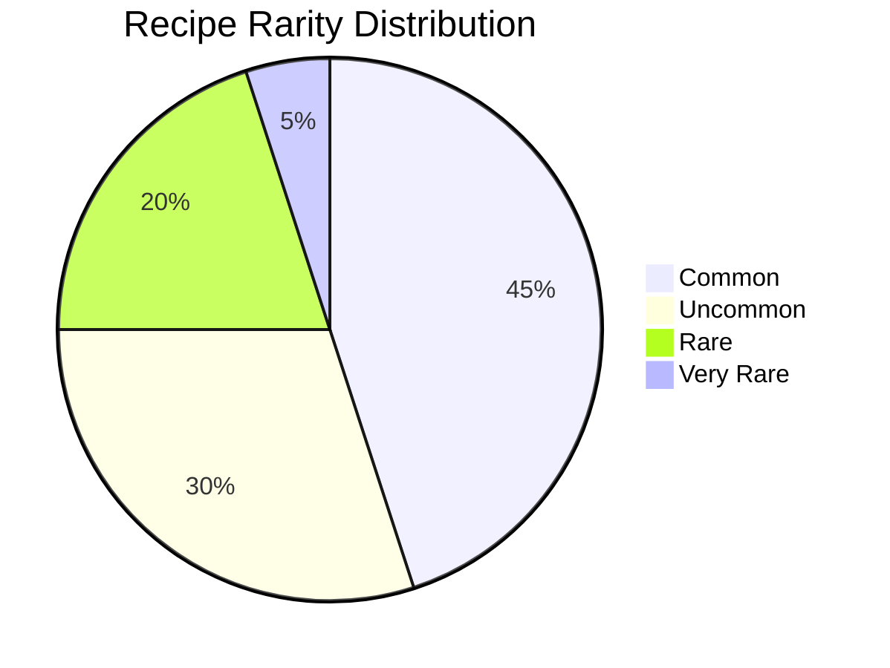
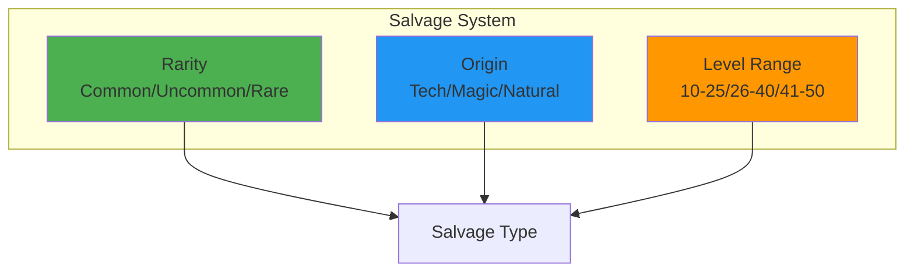
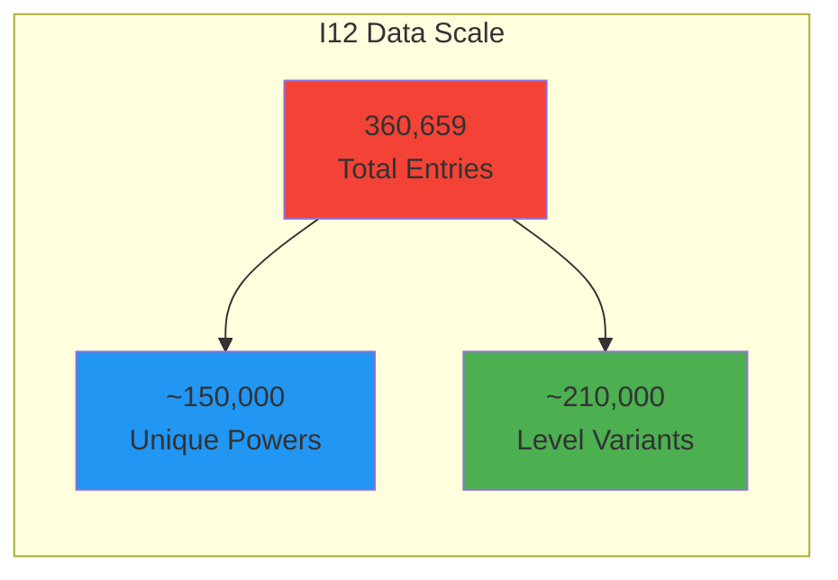
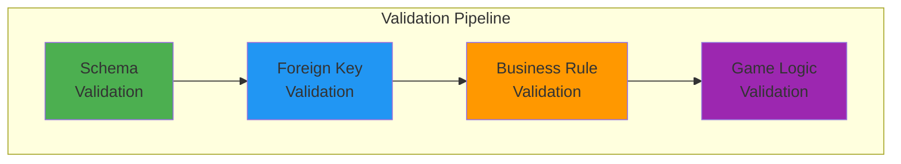

# Data Structures Documentation

This document provides detailed specifications for all JSON data formats used in the Mids Hero Web import system, including entity relationships and field descriptions.

## Table of Contents
- [Entity Relationship Overview](#entity-relationship-overview)
- [Archetype Structure](#archetype-structure)
- [Powerset Structure](#powerset-structure)
- [Power Structure](#power-structure)
- [Enhancement Structure](#enhancement-structure)
- [Recipe Structure](#recipe-structure)
- [Salvage Structure](#salvage-structure)
- [I12 Power Data Format](#i12-power-data-format)

## Entity Relationship Overview



## Archetype Structure

### JSON Format
```json
{
  "id": 1,
  "name": "Blaster",
  "display_name": "Blaster",
  "description": "Blasters are offensive juggernauts.",
  "icon": "archetypeicon_blaster.png",
  "hit_points_base": 1204.8,
  "hit_points_max": 1606.4,
  "primary_category": "Ranged",
  "secondary_category": "Support",
  "threat_level": 3,
  "damage_scalar": 1.125,
  "survivability": 3,
  "melee_damage": 0.75,
  "ranged_damage": 1.125,
  "buff_defense": 0.065,
  "debuff_defense": 0.070,
  "buff_hit_points": 0.095,
  "resistance": 0.075,
  "primary_powersets": [1, 2, 3],
  "secondary_powersets": [4, 5, 6]
}
```

### Field Descriptions
| Field | Type | Description | Required |
|-------|------|-------------|----------|
| id | integer | Unique identifier | Yes |
| name | string | Internal name (no spaces) | Yes |
| display_name | string | UI display name | Yes |
| description | text | Detailed description | No |
| icon | string | Icon filename | No |
| hit_points_base | float | Base HP at level 1 | Yes |
| hit_points_max | float | Max HP at level 50 | Yes |
| primary_category | string | Primary power category | Yes |
| secondary_category | string | Secondary power category | Yes |

## Powerset Structure

### JSON Format
```json
{
  "id": 1,
  "name": "Fire_Blast",
  "display_name": "Fire Blast",
  "set_type": "Primary",
  "archetype_id": 1,
  "description": "Fire Blast focuses on damage over time effects.",
  "icon": "powerset_fireblast.png",
  "powers": [101, 102, 103, 104, 105, 106, 107, 108, 109]
}
```

### Set Type Values


## Power Structure

### JSON Format
```json
{
  "id": 101,
  "powerset_id": 1,
  "name": "Fire_Bolt",
  "display_name": "Fire Bolt",
  "level_available": 1,
  "description": "Hurls a bolt of fire at a foe.",
  "icon": "fireblast_fireblast.png",
  "power_type": "Click",
  "target_type": "SingleTarget",
  "range": 80,
  "endurance_cost": 5.2,
  "recharge_time": 4.0,
  "cast_time": 1.67,
  "max_slots": 6,
  "effects": [
    {
      "effect_type": "Damage",
      "attribute": "Fire",
      "magnitude": 62.56,
      "duration": 0,
      "chance": 1.0
    },
    {
      "effect_type": "DoT",
      "attribute": "Fire",
      "magnitude": 12.51,
      "duration": 3.1,
      "chance": 0.8
    }
  ],
  "prerequisites": [],
  "allowed_enhancements": ["Accuracy", "Damage", "Endurance", "Range", "Recharge"]
}
```

### Power Type Values
| Type | Description | Example |
|------|-------------|---------|
| Click | Instant activation | Fire Bolt |
| Toggle | Continuous effect | Focused Fighting |
| Auto | Always active | Health |
| Passive | No activation | Stamina |

### Effect Structure


## Enhancement Structure

### JSON Format
```json
{
  "id": 501,
  "name": "Damage_IO",
  "display_name": "Damage IO",
  "enhancement_set_id": null,
  "type_class": "Common",
  "level_min": 10,
  "level_max": 50,
  "bonuses": [
    {
      "attribute": "Damage",
      "magnitude": 0.3333,
      "enhancement_level": 0
    }
  ],
  "recipe_id": null,
  "salvage_required": []
}
```

### Set Enhancement Example
```json
{
  "id": 601,
  "name": "Crushing_Impact_A",
  "display_name": "Crushing Impact: Accuracy/Damage",
  "enhancement_set_id": 45,
  "type_class": "SetO",
  "level_min": 30,
  "level_max": 50,
  "bonuses": [
    {
      "attribute": "Accuracy",
      "magnitude": 0.2625,
      "enhancement_level": 0
    },
    {
      "attribute": "Damage",
      "magnitude": 0.2625,
      "enhancement_level": 0
    }
  ],
  "set_bonuses": [
    {
      "bonus_count": 2,
      "bonus_type": "Resistance",
      "attribute": "Immobilize",
      "magnitude": 2.2
    }
  ],
  "recipe_id": 1201,
  "salvage_required": [301, 302]
}
```

## Recipe Structure

### JSON Format
```json
{
  "id": 1201,
  "name": "Crushing_Impact_A_Recipe",
  "display_name": "Crushing Impact: Acc/Dmg Recipe",
  "enhancement_id": 601,
  "rarity": "Uncommon",
  "level_min": 30,
  "level_max": 50,
  "recipe_type": "SetO",
  "cost_influence": 47600,
  "cost_merits": 20,
  "salvage_required": [
    {
      "salvage_id": 301,
      "quantity": 1,
      "rarity": "Common"
    },
    {
      "salvage_id": 302,
      "quantity": 2,
      "rarity": "Uncommon"
    }
  ]
}
```

### Recipe Rarity Distribution


## Salvage Structure

### JSON Format
```json
{
  "id": 301,
  "name": "Spell_Ink",
  "display_name": "Spell Ink",
  "rarity": "Common",
  "origin": "Magic",
  "level_min": 10,
  "level_max": 25,
  "description": "This ink is used in the creation of magical scrolls.",
  "icon": "salvage_spellInk.png",
  "sell_price": 250,
  "buy_price": 1000
}
```

### Salvage Categories


## I12 Power Data Format

### Text Format (I12_extracted.txt)
```
Power: Blaster.Fire_Blast.Fire_Bolt
  DisplayName: Fire Bolt
  Level: 1
  AllowedSlots: 6
  Effects:
    Effect: Damage(Fire)
      Magnitude: 62.56
      Duration: 0
      Chance: 1.0
    Effect: DoT(Fire)
      Magnitude: 12.51
      Duration: 3.1
      Chance: 0.8
  EnduranceCost: 5.2
  RechargeTime: 4.0
  CastTime: 1.67
  Range: 80
  TargetType: SingleTarget
```

### Parsing Rules
1. Power definitions start with "Power:" prefix
2. Nested properties use indentation (2 spaces)
3. Effects can have multiple entries
4. Numeric values maintain decimal precision
5. Boolean values: true/false or 1.0/0.0

### Data Volume


## Validation Rules

### Required Fields by Entity

| Entity | Required Fields | Validation Rules |
|--------|----------------|------------------|
| Archetype | id, name, display_name, hit_points_base | id > 0, name unique |
| Powerset | id, name, archetype_id, set_type | Valid archetype reference |
| Power | id, name, powerset_id, level_available | level 1-50, valid powerset |
| Enhancement | id, name, type_class | type_class in allowed values |
| Recipe | id, enhancement_id, rarity | Valid enhancement reference |
| Salvage | id, name, rarity, origin | origin in [Tech, Magic, Natural] |

### Cross-Entity Validation


## Best Practices

1. **Always validate JSON** before import
2. **Maintain referential integrity** - import in dependency order
3. **Use consistent naming** - snake_case for internal names
4. **Preserve numeric precision** - use exact values from source
5. **Document custom fields** - any additions to base schema