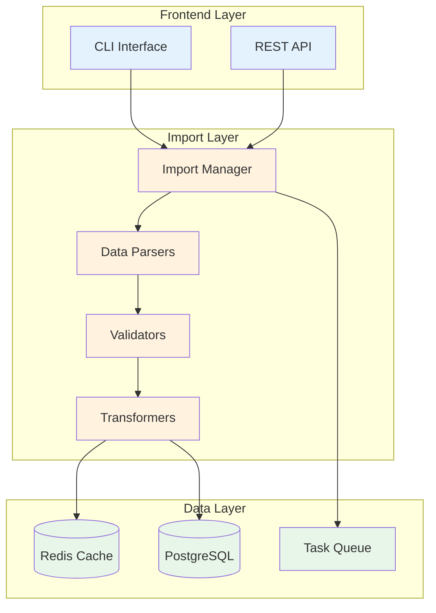
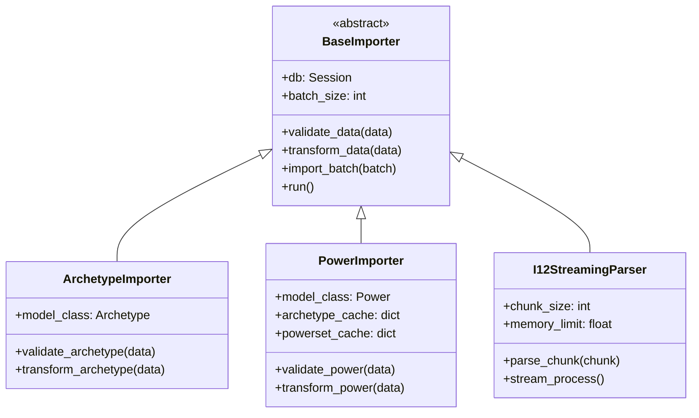
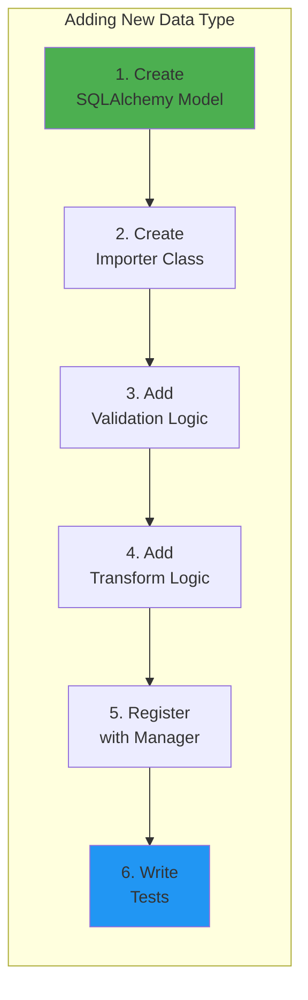
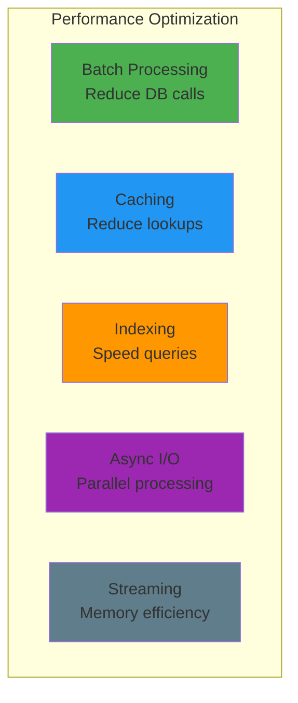

# Developer Guide

This guide provides technical implementation details for developers working on the Mids Hero Web data import system.

## Table of Contents
- [Architecture Overview](#architecture-overview)
- [Core Components](#core-components)
- [Adding New Data Types](#adding-new-data-types)
- [Extending Import Scripts](#extending-import-scripts)
- [Performance Optimization](#performance-optimization)
- [Testing Guidelines](#testing-guidelines)
- [Debugging Techniques](#debugging-techniques)

## Architecture Overview

### System Architecture



### Class Hierarchy



## Core Components

### Import Manager (`import_manager.py`)

```python
from typing import Dict, Type, Any
from .base_importer import BaseImporter

class ImportManager:
    """Orchestrates the import process for all data types."""
    
    def __init__(self):
        self.importers: Dict[str, Type[BaseImporter]] = {
            'archetypes': ArchetypeImporter,
            'powersets': PowersetImporter,
            'powers': PowerImporter,
            'enhancements': EnhancementImporter,
            'recipes': RecipeImporter,
            'salvage': SalvageImporter,
        }
        self.import_order = [
            'archetypes',
            'powersets', 
            'powers',
            'enhancements',
            'salvage',
            'recipes'
        ]
    
    def import_all(self, data_path: str) -> Dict[str, Any]:
        """Import all data types in dependency order."""
        results = {}
        
        for data_type in self.import_order:
            importer_class = self.importers[data_type]
            importer = importer_class()
            
            file_path = f"{data_path}/{data_type}.json"
            result = importer.run(file_path)
            results[data_type] = result
            
        return results
```

### Base Importer (`base_importer.py`)

```python
from abc import ABC, abstractmethod
from typing import List, Dict, Any
import json
from sqlalchemy.orm import Session

class BaseImporter(ABC):
    """Abstract base class for all data importers."""
    
    def __init__(self, db: Session, batch_size: int = 1000):
        self.db = db
        self.batch_size = batch_size
        self.errors = []
        self.stats = {
            'total': 0,
            'imported': 0,
            'skipped': 0,
            'errors': 0
        }
    
    @abstractmethod
    def validate_data(self, data: Dict[str, Any]) -> bool:
        """Validate a single data record."""
        pass
    
    @abstractmethod
    def transform_data(self, data: Dict[str, Any]) -> Any:
        """Transform data to model instance."""
        pass
    
    def import_batch(self, batch: List[Any]) -> int:
        """Import a batch of records."""
        try:
            self.db.bulk_insert_mappings(self.model_class, batch)
            self.db.commit()
            return len(batch)
        except Exception as e:
            self.db.rollback()
            self.errors.append(f"Batch import failed: {str(e)}")
            return 0
    
    def run(self, file_path: str) -> Dict[str, Any]:
        """Execute the import process."""
        with open(file_path, 'r') as f:
            data = json.load(f)
        
        batch = []
        for record in data:
            self.stats['total'] += 1
            
            if not self.validate_data(record):
                self.stats['skipped'] += 1
                continue
            
            transformed = self.transform_data(record)
            batch.append(transformed)
            
            if len(batch) >= self.batch_size:
                imported = self.import_batch(batch)
                self.stats['imported'] += imported
                batch = []
        
        # Import remaining records
        if batch:
            imported = self.import_batch(batch)
            self.stats['imported'] += imported
        
        return self.stats
```

## Adding New Data Types

### Step-by-Step Guide



### 1. Create SQLAlchemy Model

```python
# models.py
from sqlalchemy import Column, Integer, String, Float, ForeignKey
from sqlalchemy.orm import relationship
from .database import Base

class NewDataType(Base):
    __tablename__ = 'new_data_types'
    
    id = Column(Integer, primary_key=True)
    name = Column(String(100), nullable=False, unique=True)
    value = Column(Float, nullable=False)
    category_id = Column(Integer, ForeignKey('categories.id'))
    
    # Relationships
    category = relationship("Category", back_populates="items")
    
    def __repr__(self):
        return f"<NewDataType(name='{self.name}', value={self.value})>"
```

### 2. Create Importer Class

```python
# data_import/new_type_importer.py
from .base_importer import BaseImporter
from ..models import NewDataType

class NewDataTypeImporter(BaseImporter):
    """Importer for new data type."""
    
    model_class = NewDataType
    
    def __init__(self, db, batch_size=1000):
        super().__init__(db, batch_size)
        self.category_cache = {}  # Cache for foreign key lookups
    
    def validate_data(self, data):
        """Validate new data type record."""
        required_fields = ['id', 'name', 'value']
        
        # Check required fields
        for field in required_fields:
            if field not in data:
                self.errors.append(f"Missing required field: {field}")
                return False
        
        # Validate data types
        if not isinstance(data['id'], int) or data['id'] <= 0:
            self.errors.append(f"Invalid id: {data['id']}")
            return False
        
        if not isinstance(data['value'], (int, float)):
            self.errors.append(f"Invalid value type: {data['value']}")
            return False
        
        return True
    
    def transform_data(self, data):
        """Transform to model format."""
        return {
            'id': data['id'],
            'name': data['name'],
            'value': float(data['value']),
            'category_id': self.get_category_id(data.get('category'))
        }
    
    def get_category_id(self, category_name):
        """Get category ID with caching."""
        if not category_name:
            return None
            
        if category_name not in self.category_cache:
            category = self.db.query(Category).filter_by(
                name=category_name
            ).first()
            self.category_cache[category_name] = category.id if category else None
            
        return self.category_cache[category_name]
```

### 3. Register with Import Manager

```python
# import_manager.py
from .new_type_importer import NewDataTypeImporter

class ImportManager:
    def __init__(self):
        self.importers = {
            # ... existing importers ...
            'new_data_types': NewDataTypeImporter,
        }
        
        # Update import order if dependencies exist
        self.import_order = [
            'categories',  # Import categories first
            # ... other types ...
            'new_data_types',  # Add new type
        ]
```

## Extending Import Scripts

### Adding Custom Validation

```python
class ValidationMixin:
    """Mixin for custom validation logic."""
    
    def validate_game_rules(self, data):
        """Validate against game-specific rules."""
        # Example: Power level restrictions
        if data.get('level_available', 0) > 50:
            return False, "Level cannot exceed 50"
        
        # Example: Slot count limits
        if data.get('max_slots', 0) > 6:
            return False, "Maximum slots cannot exceed 6"
        
        return True, None
    
    def validate_relationships(self, data):
        """Validate foreign key relationships."""
        # Check if referenced entities exist
        if data.get('powerset_id'):
            exists = self.db.query(Powerset).filter_by(
                id=data['powerset_id']
            ).count() > 0
            
            if not exists:
                return False, f"Powerset {data['powerset_id']} not found"
        
        return True, None
```

### Adding Data Transformations

```python
class TransformationMixin:
    """Mixin for data transformation utilities."""
    
    def normalize_text(self, text):
        """Normalize text fields."""
        if not text:
            return None
        
        # Remove extra whitespace
        text = ' '.join(text.split())
        
        # Fix common encoding issues
        replacements = {
            '’': "'",
            '“': '"',
            'â€': '"',
        }
        
        for old, new in replacements.items():
            text = text.replace(old, new)
        
        return text
    
    def parse_effects(self, effects_data):
        """Parse complex effect structures."""
        parsed_effects = []
        
        for effect in effects_data:
            parsed = {
                'type': effect.get('effect_type'),
                'attribute': effect.get('attribute'),
                'magnitude': float(effect.get('magnitude', 0)),
                'duration': float(effect.get('duration', 0)),
                'chance': float(effect.get('chance', 1.0))
            }
            parsed_effects.append(parsed)
        
        return parsed_effects
```

## Performance Optimization

### Optimization Strategies



### Batch Processing Implementation

```python
class OptimizedImporter(BaseImporter):
    """Importer with performance optimizations."""
    
    def __init__(self, db, batch_size=5000):
        super().__init__(db, batch_size)
        self.use_bulk_operations = True
        self.disable_constraints = False
    
    def import_with_optimizations(self, data):
        """Import with performance optimizations."""
        # Disable foreign key checks (PostgreSQL)
        if self.disable_constraints:
            self.db.execute("SET session_replication_role = 'replica';")
        
        try:
            # Use COPY for bulk insert (PostgreSQL specific)
            if len(data) > 10000:
                self._bulk_copy(data)
            else:
                self._bulk_insert(data)
        finally:
            # Re-enable constraints
            if self.disable_constraints:
                self.db.execute("SET session_replication_role = 'origin';")
    
    def _bulk_copy(self, data):
        """Use COPY for very large datasets."""
        import csv
        import io
        
        # Create CSV in memory
        output = io.StringIO()
        writer = csv.DictWriter(output, fieldnames=data[0].keys())
        writer.writerows(data)
        output.seek(0)
        
        # Use raw connection for COPY
        raw_conn = self.db.connection().connection
        cursor = raw_conn.cursor()
        
        cursor.copy_expert(
            f"COPY {self.model_class.__tablename__} FROM STDIN WITH CSV HEADER",
            output
        )
        raw_conn.commit()
```

### Caching Strategy

```python
from functools import lru_cache
from redis import Redis
import json

class CachedImporter(BaseImporter):
    """Importer with multi-level caching."""
    
    def __init__(self, db, batch_size=1000):
        super().__init__(db, batch_size)
        self.redis = Redis(host='localhost', port=6379, db=0)
        self.local_cache = {}
    
    @lru_cache(maxsize=10000)
    def get_cached_id(self, entity_type, name):
        """Get ID with LRU cache."""
        # Check Redis cache first
        cache_key = f"{entity_type}:{name}"
        cached = self.redis.get(cache_key)
        
        if cached:
            return int(cached)
        
        # Query database
        model = self.get_model_class(entity_type)
        entity = self.db.query(model).filter_by(name=name).first()
        
        if entity:
            # Cache in Redis for 1 hour
            self.redis.setex(cache_key, 3600, entity.id)
            return entity.id
        
        return None
```

## Testing Guidelines

### Test Structure

```python
# tests/test_importers.py
import pytest
from sqlalchemy import create_engine
from sqlalchemy.orm import sessionmaker
from ..models import Base
from ..data_import import ArchetypeImporter

class TestArchetypeImporter:
    """Test suite for archetype importer."""
    
    @pytest.fixture
    def db_session(self):
        """Create test database session."""
        engine = create_engine('sqlite:///:memory:')
        Base.metadata.create_all(engine)
        Session = sessionmaker(bind=engine)
        session = Session()
        yield session
        session.close()
    
    @pytest.fixture
    def sample_data(self):
        """Sample archetype data."""
        return {
            'id': 1,
            'name': 'Blaster',
            'display_name': 'Blaster',
            'hit_points_base': 1204.8,
            'primary_category': 'Ranged'
        }
    
    def test_validate_data_valid(self, db_session, sample_data):
        """Test validation with valid data."""
        importer = ArchetypeImporter(db_session)
        assert importer.validate_data(sample_data) is True
    
    def test_validate_data_missing_field(self, db_session, sample_data):
        """Test validation with missing required field."""
        del sample_data['name']
        importer = ArchetypeImporter(db_session)
        assert importer.validate_data(sample_data) is False
    
    def test_transform_data(self, db_session, sample_data):
        """Test data transformation."""
        importer = ArchetypeImporter(db_session)
        transformed = importer.transform_data(sample_data)
        
        assert transformed['id'] == 1
        assert transformed['name'] == 'Blaster'
        assert isinstance(transformed['hit_points_base'], float)
```

### Integration Testing

```python
# tests/test_integration.py
import pytest
import json
from pathlib import Path

class TestImportIntegration:
    """Integration tests for full import pipeline."""
    
    @pytest.fixture
    def test_data_path(self, tmp_path):
        """Create test data files."""
        data_path = tmp_path / "test_data"
        data_path.mkdir()
        
        # Create test archetypes file
        archetypes = [
            {
                'id': 1,
                'name': 'Blaster',
                'display_name': 'Blaster',
                'hit_points_base': 1204.8
            }
        ]
        
        with open(data_path / "archetypes.json", 'w') as f:
            json.dump(archetypes, f)
        
        return data_path
    
    def test_full_import_pipeline(self, db_session, test_data_path):
        """Test complete import pipeline."""
        from ..import_manager import ImportManager
        
        manager = ImportManager()
        results = manager.import_all(str(test_data_path))
        
        assert 'archetypes' in results
        assert results['archetypes']['imported'] == 1
        assert results['archetypes']['errors'] == 0
```

## Debugging Techniques

### Debug Mode Implementation

```python
import logging
from contextlib import contextmanager

class DebugImporter(BaseImporter):
    """Importer with enhanced debugging capabilities."""
    
    def __init__(self, db, batch_size=1000, debug=False):
        super().__init__(db, batch_size)
        self.debug = debug
        self.setup_logging()
    
    def setup_logging(self):
        """Configure debug logging."""
        level = logging.DEBUG if self.debug else logging.INFO
        
        logging.basicConfig(
            level=level,
            format='%(asctime)s - %(name)s - %(levelname)s - %(message)s'
        )
        
        self.logger = logging.getLogger(self.__class__.__name__)
    
    @contextmanager
    def debug_context(self, operation):
        """Context manager for debug operations."""
        if self.debug:
            self.logger.debug(f"Starting {operation}")
            start_time = time.time()
        
        yield
        
        if self.debug:
            duration = time.time() - start_time
            self.logger.debug(f"Completed {operation} in {duration:.2f}s")
    
    def validate_data(self, data):
        """Validate with debug output."""
        with self.debug_context(f"validate record {data.get('id')}"):
            if self.debug:
                self.logger.debug(f"Validating: {json.dumps(data, indent=2)}")
            
            result = super().validate_data(data)
            
            if not result and self.debug:
                self.logger.debug(f"Validation failed: {self.errors[-1]}")
            
            return result
```

### Performance Profiling

```python
import cProfile
import pstats
from io import StringIO

class ProfiledImporter(BaseImporter):
    """Importer with performance profiling."""
    
    def run_with_profiling(self, file_path):
        """Run import with profiling enabled."""
        profiler = cProfile.Profile()
        
        # Run import with profiling
        profiler.enable()
        result = self.run(file_path)
        profiler.disable()
        
        # Generate report
        stream = StringIO()
        stats = pstats.Stats(profiler, stream=stream)
        stats.sort_stats('cumulative')
        stats.print_stats(20)  # Top 20 functions
        
        print("\n=== Performance Profile ===")
        print(stream.getvalue())
        
        return result
```

### Memory Debugging

```python
import tracemalloc
import psutil
import os

class MemoryDebugImporter(BaseImporter):
    """Importer with memory debugging."""
    
    def run_with_memory_tracking(self, file_path):
        """Run import with memory tracking."""
        # Start memory tracking
        tracemalloc.start()
        process = psutil.Process(os.getpid())
        
        initial_memory = process.memory_info().rss / 1024 / 1024  # MB
        
        # Run import
        result = self.run(file_path)
        
        # Get memory statistics
        current, peak = tracemalloc.get_traced_memory()
        final_memory = process.memory_info().rss / 1024 / 1024  # MB
        
        print(f"\n=== Memory Usage ===")
        print(f"Initial: {initial_memory:.2f} MB")
        print(f"Final: {final_memory:.2f} MB")
        print(f"Peak tracked: {peak / 1024 / 1024:.2f} MB")
        print(f"Memory increase: {final_memory - initial_memory:.2f} MB")
        
        # Show top memory allocations
        snapshot = tracemalloc.take_snapshot()
        top_stats = snapshot.statistics('lineno')
        
        print("\nTop 10 memory allocations:")
        for stat in top_stats[:10]:
            print(f"{stat.size / 1024:.1f} KB: {stat}")
        
        tracemalloc.stop()
        return result
```

## Best Practices

1. **Always validate before transform** - Catch errors early
2. **Use batch operations** - Minimize database round trips
3. **Implement proper error handling** - Log errors with context
4. **Cache frequently accessed data** - Reduce database queries
5. **Profile performance** - Identify bottlenecks
6. **Write comprehensive tests** - Cover edge cases
7. **Document complex logic** - Help future developers
8. **Use type hints** - Improve code clarity
9. **Follow PEP 8** - Maintain consistency
10. **Monitor memory usage** - Prevent OOM errors