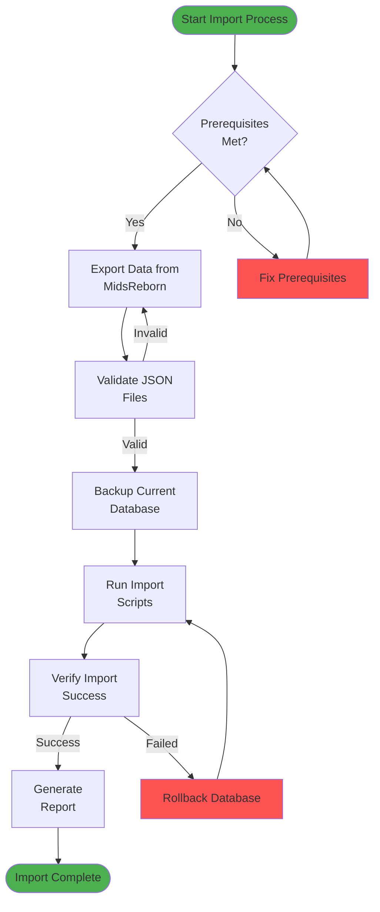
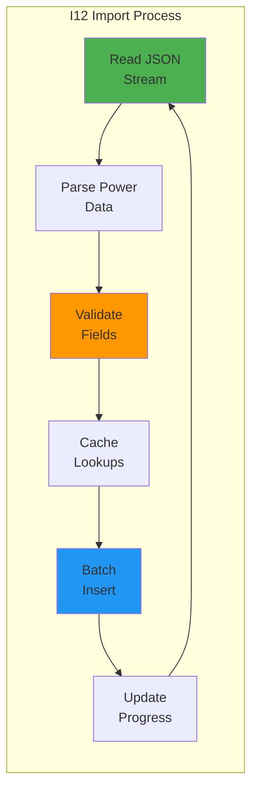
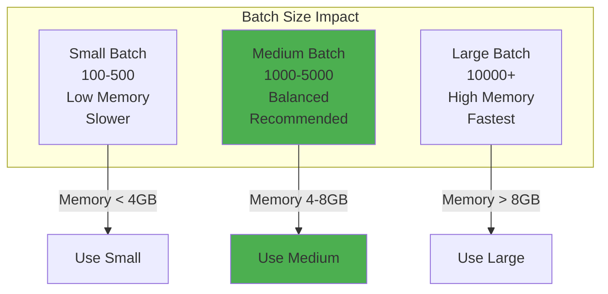
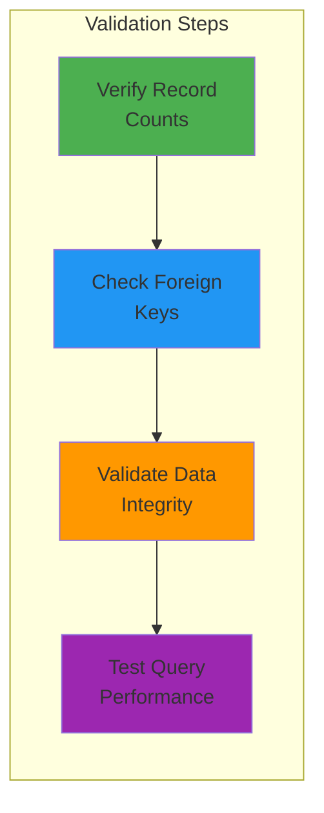

# Data Import Guide

This guide provides comprehensive instructions for importing City of Heroes data into the Mids Hero Web database, including visual workflows and best practices.

## Table of Contents
- [Prerequisites](#prerequisites)
- [Import Workflow](#import-workflow)
- [Step-by-Step Instructions](#step-by-step-instructions)
- [Import Commands](#import-commands)
- [Performance Optimization](#performance-optimization)
- [Monitoring & Validation](#monitoring--validation)

## Prerequisites

### System Requirements
- Python 3.11+
- PostgreSQL 14+
- 4GB RAM minimum (8GB recommended for I12 imports)
- 10GB free disk space

### Environment Setup
```bash
# Ensure you're in the backend directory
cd backend

# Activate virtual environment
source .venv/bin/activate  # On Windows: .venv\Scripts\activate

# Verify database connection
just db-check
```

## Import Workflow



## Step-by-Step Instructions

### 1. Export Data from MidsReborn

```bash
# Navigate to DataExporter
cd DataExporter

# Run export (Windows)
dotnet run -- "C:\MidsReborn\Data" "output\json"

# Run export (Mac/Linux)
dotnet run -- "/Users/username/MidsReborn/Data" "output/json"
```

Expected output:
```
=== MidsReborn MHD to JSON Export ===
Loading MHD data files...
Loading main database (I12.mhd)... OK - Loaded 12214 powers
Loading enhancement database... OK - Loaded 10186 enhancements
...
All data exported to: output/json
```

### 2. Validate Exported Data

```bash
# Return to project root
cd ..

# Validate all JSON files
just import-validate DataExporter/output/json

# Validate specific file
just validate-json DataExporter/output/json/powers.json
```

### 3. Import Data

#### Option A: Import All Data (Recommended)
```bash
# Import all data types in correct order
just import-all DataExporter/output/json
```

#### Option B: Import Specific Data Types
```bash
# Import in dependency order
just import-archetypes DataExporter/output/json/archetypes.json
just import-powersets DataExporter/output/json/powersets.json
just import-powers DataExporter/output/json/powers.json
just import-enhancements DataExporter/output/json/enhancements.json
just import-salvage DataExporter/output/json/salvage.json
just import-recipes DataExporter/output/json/recipes.json
```

#### Option C: High-Performance I12 Import
```bash
# For large I12 power dataset (360K+ records)
just i12-import DataExporter/output/json/I12_extracted.txt

# With custom batch size and memory limit
just i12-import DataExporter/output/json/I12_extracted.txt --batch-size 5000 --memory-limit 2.0

# Resume from specific record
just i12-import-resume DataExporter/output/json/I12_extracted.txt 150000
```

## Import Commands

### Basic Import Commands

| Command | Description | Example |
|---------|-------------|---------|
| `import-all` | Import all data types | `just import-all data/json` |
| `import-type` | Import specific type | `just import-type powers data.json` |
| `import-clear` | Clear and import | `just import-clear powers data.json` |

### I12 Import Commands



### Monitoring Commands

| Command | Description | Output |
|---------|-------------|--------|
| `import-health` | System health check | Database status, cache metrics |
| `import-status` | Current import status | Progress, ETA, errors |
| `import-stats` | Database statistics | Record counts by type |
| `cache-stats` | Cache performance | Hit rates, memory usage |

## Performance Optimization

### Batch Size Tuning



### Optimization Tips

1. **Database Optimization**
   ```bash
   # Before large imports
   just db-optimize
   
   # Disable constraints temporarily (careful!)
   just db-constraints-disable
   just import-all data/json
   just db-constraints-enable
   ```

2. **Memory Management**
   ```bash
   # Monitor memory usage
   just perf-monitor
   
   # Set memory limits
   export I12_MEMORY_LIMIT=2.0  # 2GB max
   ```

3. **Parallel Processing**
   ```bash
   # Import independent types in parallel
   just import-salvage data/salvage.json &
   just import-archetypes data/archetypes.json &
   wait
   ```

## Monitoring & Validation

### Real-time Monitoring

```bash
# Watch import progress
watch -n 1 'just import-status'

# Monitor database activity
just db-monitor

# Check error logs
tail -f logs/import_*.log
```

### Post-Import Validation



```bash
# Run comprehensive validation
just import-validate-all

# Check specific validations
just validate-relationships
just validate-game-rules
just validate-calculations
```

### Import Report

```bash
# Generate comprehensive report
just import-report > import_report_$(date +%Y%m%d).txt

# Sample report output:
# Import Summary Report
# ====================
# Date: 2025-01-19 14:30:00
# Duration: 12 minutes 34 seconds
# 
# Records Imported:
# - Archetypes: 13
# - Powersets: 182
# - Powers: 12,214
# - I12 Powers: 360,659
# - Enhancements: 10,186
# - Recipes: 82,299
# - Salvage: 222
# 
# Validation Results: PASSED
# Performance Metrics: Within normal range
```

## Troubleshooting Quick Reference

| Issue | Solution |
|-------|----------|
| Import fails with memory error | Reduce batch size: `--batch-size 500` |
| Foreign key constraint errors | Import in correct order, check relationships |
| Slow import performance | Run `just db-optimize` before import |
| Duplicate key errors | Use `import-clear` instead of `import-type` |

For detailed troubleshooting, see [Troubleshooting Guide](./troubleshooting.md).