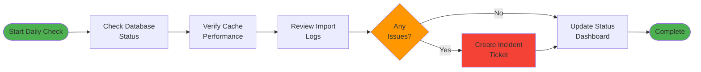
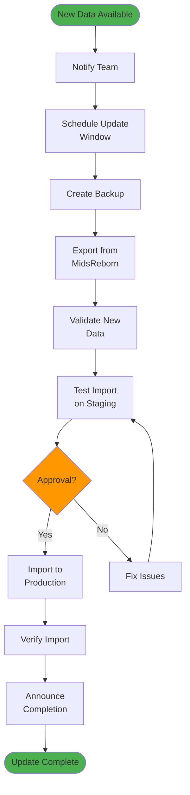
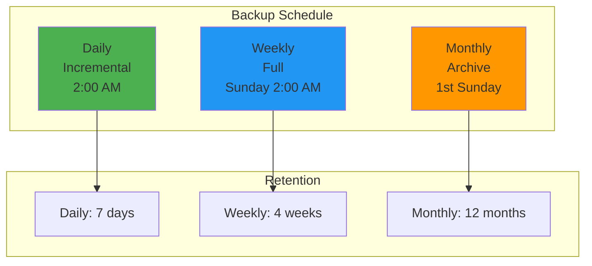
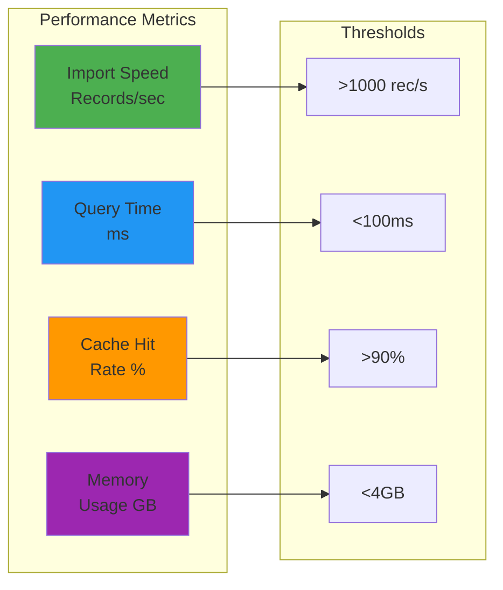
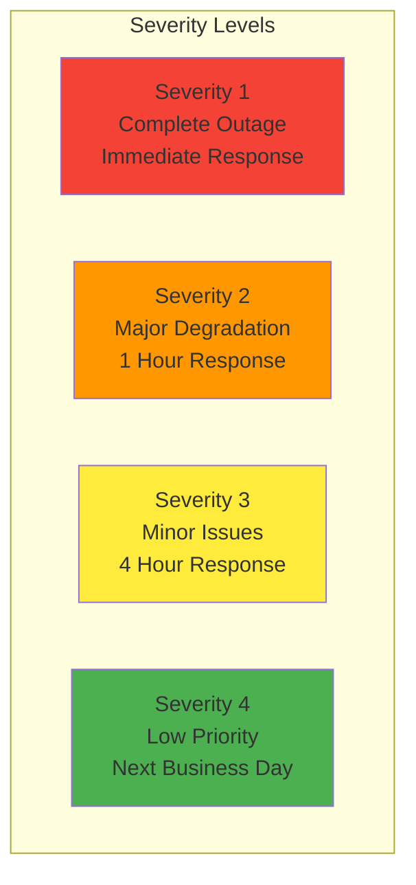
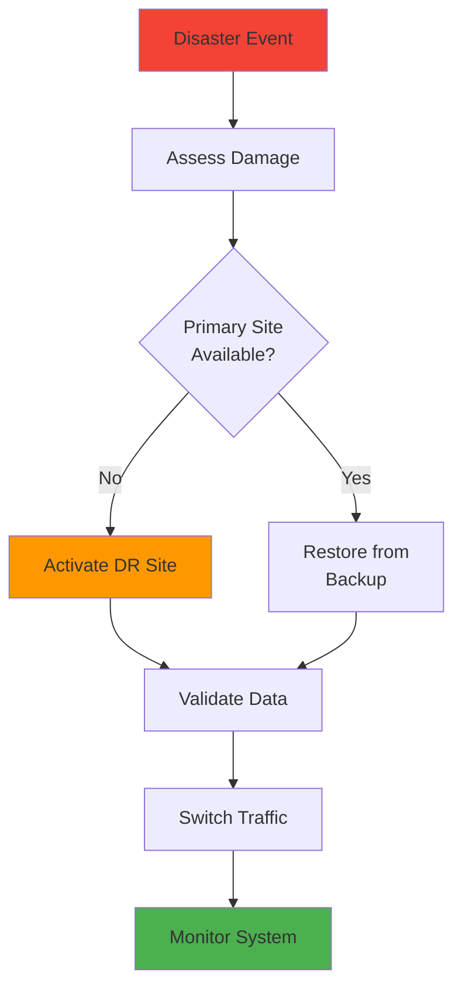

# Operations Runbook

This runbook provides operational procedures for managing the Mids Hero Web data import system in production environments.

## Table of Contents
- [Daily Operations](#daily-operations)
- [Weekly Maintenance](#weekly-maintenance)
- [Data Update Procedures](#data-update-procedures)
- [Backup and Recovery](#backup-and-recovery)
- [Performance Monitoring](#performance-monitoring)
- [Incident Response](#incident-response)
- [Disaster Recovery](#disaster-recovery)

## Daily Operations

### Morning Health Check (9:00 AM)



### Daily Checklist

```bash
#!/bin/bash
# Daily operations checklist script

echo "=== Mids Hero Web Daily Operations Check ==="
echo "Date: $(date)"
echo

# 1. Database Health
echo "1. Checking database health..."
just db-check
just import-stats

# 2. Cache Performance
echo "2. Checking cache performance..."
just cache-stats

# 3. Import System Status
echo "3. Checking import system..."
just import-health

# 4. Recent Import Logs
echo "4. Reviewing recent imports..."
just import-logs --last 24h

# 5. Error Summary
echo "5. Checking for errors..."
just import-errors --last 24h

echo
echo "Daily check complete. Review output above for any issues."
```

## Weekly Maintenance

### Maintenance Window: Sundays 2:00-4:00 AM

```mermaid
gantt
    title Weekly Maintenance Schedule
    dateFormat HH:mm
    axisFormat %H:%M
    
    section Database
    Backup Full :done, db1, 02:00, 30m
    Optimize Tables :active, db2, 02:30, 20m
    Update Statistics :db3, 02:50, 10m
    
    section Cache
    Clear Old Entries :cache1, 03:00, 15m
    Rebuild Indexes :cache2, 03:15, 15m
    
    section Validation
    Data Integrity Check :val1, 03:30, 20m
    Generate Reports :val2, 03:50, 10m
```



### Weekly Maintenance Script

```bash
#!/bin/bash
# Weekly maintenance script - run Sunday 2:00 AM

set -e  # Exit on error

echo "Starting weekly maintenance - $(date)"

# 1. Full database backup
echo "Creating full backup..."
just db-backup-full

# 2. Database optimization
echo "Optimizing database..."
just db-optimize
just db-vacuum
just db-analyze

# 3. Cache maintenance
echo "Performing cache maintenance..."
just cache-cleanup
just cache-rebuild-indexes

# 4. Data validation
echo "Running data integrity checks..."
just validate-all-data

# 5. Generate weekly report
echo "Generating weekly report..."
just generate-weekly-report

echo "Weekly maintenance complete - $(date)"
```

## Data Update Procedures

### Standard Update Process



### Update Checklist

- [ ] **Pre-Update**
  - [ ] Announce maintenance window (24h notice)
  - [ ] Create full database backup
  - [ ] Verify staging environment ready
  - [ ] Document current data versions

- [ ] **Export Phase**
  - [ ] Export data from MidsReborn
  - [ ] Validate JSON files
  - [ ] Compare with previous export
  - [ ] Document any schema changes

- [ ] **Testing Phase**
  - [ ] Import to staging database
  - [ ] Run full validation suite
  - [ ] Performance benchmarks
  - [ ] User acceptance testing

- [ ] **Production Import**
  - [ ] Final backup before import
  - [ ] Execute import scripts
  - [ ] Monitor progress
  - [ ] Verify completion

- [ ] **Post-Update**
  - [ ] Run integrity checks
  - [ ] Update documentation
  - [ ] Notify users
  - [ ] Monitor for issues (24h)

## Backup and Recovery

### Backup Strategy



### Backup Commands

```bash
# Daily incremental backup
just db-backup-incremental

# Weekly full backup
just db-backup-full

# Monthly archive
just db-backup-archive

# Verify backup
just db-backup-verify backup_20250119_full.sql

# List available backups
just db-backup-list
```

### Recovery Procedures

#### Scenario 1: Corrupted Import
```bash
# 1. Stop import process
just import-stop

# 2. Restore from backup
just db-restore backup_20250119_full.sql

# 3. Verify restoration
just db-check
just import-stats

# 4. Resume operations
just import-health
```

#### Scenario 2: Complete Database Loss
```bash
# 1. Restore database structure
just db-create

# 2. Restore from latest full backup
just db-restore-full backup_20250119_full.sql

# 3. Apply incremental backups
just db-restore-incremental backup_20250119_incr.sql

# 4. Verify and validate
just validate-all-data
```

## Performance Monitoring

### Key Metrics Dashboard



### Monitoring Commands

```bash
# Real-time performance monitoring
just perf-monitor

# Import performance metrics
just import-perf --last 7d

# Database query performance
just db-slow-queries

# Cache performance analysis
just cache-analyze

# System resource usage
just system-resources
```

### Performance Tuning Guidelines

| Metric | Normal | Warning | Critical | Action |
|--------|--------|---------|----------|--------|
| Import Speed | >1000/s | 500-1000/s | <500/s | Increase batch size |
| Query Time | <50ms | 50-100ms | >100ms | Optimize indexes |
| Cache Hit Rate | >95% | 90-95% | <90% | Increase cache size |
| Memory Usage | <2GB | 2-4GB | >4GB | Reduce batch size |

## Incident Response

### Incident Severity Levels



### Incident Response Playbook

#### Import Failure
```bash
#!/bin/bash
# Incident: Import process failed

# 1. Assess impact
just import-status
just import-errors --last 1h

# 2. Attempt recovery
just import-resume  # Try to resume

# 3. If resume fails
just import-rollback  # Rollback changes
just db-check  # Verify database state

# 4. Root cause analysis
just import-debug --verbose

# 5. Document incident
echo "Incident details..." > incidents/$(date +%Y%m%d)_import_failure.md
```

#### Performance Degradation
```bash
#!/bin/bash
# Incident: Slow import performance

# 1. Identify bottleneck
just perf-analyze

# 2. Quick fixes
just cache-clear  # Clear cache if full
just db-optimize  # Quick optimization

# 3. Monitor improvement
just perf-monitor --duration 10m

# 4. Escalate if needed
# Contact DBA team if database issue persists
```

## Disaster Recovery

### DR Plan Overview



### DR Procedures

1. **Assessment Phase** (0-30 minutes)
   ```bash
   # Check all systems
   just dr-assess
   
   # Document impact
   just dr-report --initial
   ```

2. **Recovery Phase** (30 minutes - 4 hours)
   ```bash
   # Activate DR site
   just dr-activate
   
   # Restore data
   just dr-restore --latest
   
   # Validate restoration
   just dr-validate
   ```

3. **Verification Phase** (4-6 hours)
   ```bash
   # Full system check
   just dr-verify-all
   
   # Performance baseline
   just dr-perf-test
   ```

4. **Communication**
   - Status page updates every 30 minutes
   - Email notifications to stakeholders
   - Slack channel: #dr-updates

### Recovery Time Objectives

| Component | RTO | RPO | Priority |
|-----------|-----|-----|----------|
| Database | 4 hours | 1 hour | Critical |
| Import System | 6 hours | 24 hours | High |
| Cache Layer | 2 hours | N/A | Medium |
| Documentation | 24 hours | 7 days | Low |

## Appendices

### A. Contact List

| Role | Name | Contact | Escalation |
|------|------|---------|------------|
| Primary On-Call | Rotation | #ops-oncall | Immediate |
| Database Admin | DBA Team | #dba-team | 15 minutes |
| Development Lead | Dev Team | #dev-team | 30 minutes |
| Management | Manager | email | 1 hour |

### B. Useful Commands Reference

```bash
# Emergency commands
just emergency-stop      # Stop all imports
just emergency-backup    # Quick backup
just emergency-restore   # Quick restore
just emergency-status    # System status

# Diagnostic commands
just diag-full          # Full diagnostics
just diag-quick         # Quick health check
just diag-report        # Generate report
```

### C. Log Locations

- Import logs: `/var/log/midshero/import/`
- Database logs: `/var/log/postgresql/`
- Application logs: `/var/log/midshero/app/`
- Cache logs: `/var/log/midshero/cache/`