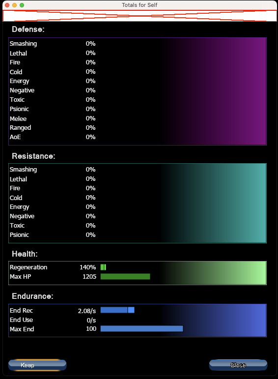
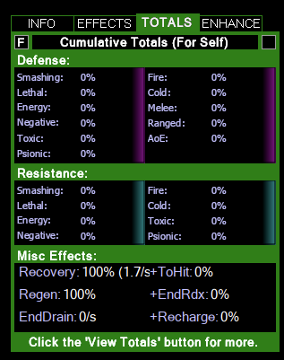

# MidsReborn UI Analysis: Epic 4.2 - HP, Endurance, Recharge Displays

**Created**: 2025-11-18
**Epic**: 4.2 - HP, Endurance, Recharge Displays
**MidsReborn Forms Analyzed**: frmTotalsV2.cs, frmTotalsV2.Designer.cs

## Executive Summary

Epic 4.2 implements HP (health/regeneration), Endurance (recovery/usage), and Recharge (global haste) displays for the character totals panel. MidsReborn uses a custom `CtlMultiGraph` control to render horizontal bars with gradient fills, showing base values, enhanced values, caps, and absorb shields. The HP section uses green gradients, Endurance uses blue gradients, and Recharge uses orange gradients. All values include tooltips with detailed breakdowns of base stats, caps, and enhancement bonuses.

## MidsReborn UI Components

### Component 1: frmTotalsV2 - Totals Window (Core Stats Tab)

- **File**: `external/dev/MidsReborn/MidsReborn/Forms/WindowMenuItems/frmTotalsV2.cs`
- **Designer**: `external/dev/MidsReborn/MidsReborn/Forms/WindowMenuItems/frmTotalsV2.Designer.cs`
- **Purpose**: Main totals display window with tabbed interface showing Defense, Resistance, HP, Endurance, and misc stats
- **Layout**: Vertically stacked sections with headers ("Defense:", "Resistance:", "Health:", "Endurance:")
- **Data Displayed**:
  - **Health Section** (lines 708-743):
    - Regeneration: percentage value (e.g., "140%") with base 100%
    - Max HP: numeric value (e.g., "1205") with archetype base HP
    - Absorb: shield value capped at base HP
  - **Endurance Section** (lines 746-774):
    - End Rec: recovery per second (e.g., "2.08/s")
    - End Use: usage per second (e.g., "0/s")
    - Max End: numeric value (e.g., "100") with base 100
  - **Misc Buffs Tab** (lines 786-846):
    - Haste: global recharge percentage (e.g., "125.0%") with base 100%
    - ToHit: to-hit bonus percentage
    - Accuracy: accuracy bonus percentage
    - Damage: damage bonus percentage (base 100%)

- **Visual Design**:
  - **HP bars** (`graphHP`, lines 212-258):
    - Border: PaleGreen
    - ColorBase: FromArgb(51, 204, 51) - medium green
    - ColorEnh: FromArgb(64, 255, 64) - bright green
    - ColorFadeEnd: FromArgb(150, 251, 150) - light green
    - ColorAbsorbed: Gainsboro - gray for shields
    - Dual mode with base/enhanced bars
  - **Endurance bars** (`graphEnd`, lines 165-210):
    - Border: RoyalBlue
    - ColorBase: Blue
    - ColorEnh: Yellow
    - ColorFadeEnd: FromArgb(65, 105, 224) - royal blue
    - Stacked style showing multiple values
  - **Haste bar** (`graphHaste`, lines 809-854):
    - Border: FromArgb(242, 81, 0) - dark orange
    - ColorBase: FromArgb(204, 102, 0) - brown-orange
    - ColorEnh: FromArgb(255, 128, 0) - bright orange
    - ColorFadeEnd: FromArgb(184, 62, 0) - dark orange-red
    - Shows overcap values

### Component 2: CtlMultiGraph Control

- **File**: `external/dev/MidsReborn/MidsReborn/Controls/ctlMultiGraph.cs`
- **Purpose**: Reusable horizontal bar graph component
- **Features**:
  - Dual mode (base + enhanced values)
  - Stacked mode (multiple values)
  - Gradient fills from ColorFadeStart (black) to ColorFadeEnd
  - Border highlights
  - Overcap visualization
  - Absorb shield overlay
  - Tooltip support
  - Dynamic height based on content

### Component 3: UpdateData Method - Data Population

- **Location**: frmTotalsV2.cs, lines 623-920
- **Purpose**: Fetches character stats and populates all graphs
- **Data Flow**:
  ```csharp
  var displayStats = MidsContext.Character.DisplayStats;
  
  // HP/Regen (lines 708-743)
  var regenValue = displayStats.HealthRegenPercent(false); // capped
  var regenValueUncapped = displayStats.HealthRegenPercent(true);
  var hpValue = displayStats.HealthHitpointsNumeric(false);
  var absorbValue = Math.Min(displayStats.Absorb, hpBase);
  
  // Endurance (lines 746-774)
  var endRecValue = displayStats.EnduranceRecoveryNumeric;
  var endRecValueUncapped = displayStats.EnduranceRecoveryNumericUncapped;
  var endRecBase = Archetype.BaseRecovery * displayStats.EnduranceMaxEnd / 60f;
  
  // Haste (lines 786-792)
  var hasteValue = displayStats.BuffHaste(false); // capped
  var hasteUncapped = displayStats.BuffHaste(true);
  ```

## Screenshot Analysis

### view-total-window.png



**Health Section** (bottom third):
- **Layout**: Vertical stack under "Health:" label
- **Regeneration bar**:
  - Label: "Regeneration"
  - Value: "140%" (right-aligned)
  - Bar: Green gradient fill showing 140% of base
  - Width: Full panel width (~526px)
  - Small vertical bar indicator on left showing base 100%
- **Max HP bar**:
  - Label: "Max HP"
  - Value: "1205" (right-aligned)
  - Bar: Green gradient fill showing enhanced HP
  - Light green overlay segment (likely absorb shield)
  - Vertical bar indicator showing base HP

**Endurance Section** (below Health):
- **Layout**: Vertical stack under "Endurance:" label
- **End Rec bar**:
  - Label: "End Rec"
  - Value: "2.08/s" (right-aligned with /s suffix)
  - Bar: Blue gradient fill
  - Small base indicator on left
- **End Use bar**:
  - Label: "End Use"
  - Value: "0/s"
  - Bar: Minimal/no fill (no usage in static build)
- **Max End bar**:
  - Label: "Max End"
  - Value: "100"
  - Bar: Blue gradient showing extended endurance pool

**Visual Styling**:
- Black background
- White text labels
- Gradient bars with darker edges fading to bright centers
- Consistent bar height (~13-15px)
- Left-aligned labels with right-aligned values
- TextWidth: 187px for label area

### total-screen-1.png



**Misc Effects Section** (compact view):
- **Layout**: List-based format, not bars
- **Stats shown**:
  - "Recovery: 100% (1.7/s+ToHit: 0%)" - Combined display
  - "Regen: 100%" - Regeneration percentage
  - "+EndRdx: 0%" - Endurance reduction
  - "EndDrain: 0/s" - Endurance drain rate
  - "+Recharge: 0%" - Global recharge bonus
- **Styling**: Green text on dark background
- **Format**: Compact, two-column layout with stat name + value

**Key Observation**: This shows an alternate "inline" view with text-only display. For web app, we'll focus on the full bar-based view from view-total-window.png.

## Feature Requirements

### MUST-HAVE Features

#### 1. HP Panel - Health Display

**Description**: Show Max HP, Regeneration %, and Absorb shield

**MidsReborn Implementation**:
- Two horizontal bars (Regeneration, Max HP)
- Green gradient color scheme
- Base value indicators (vertical bars on left)
- Absorb shown as light overlay on Max HP bar
- Tooltip format: `"{value} HP ({archetype} HP cap: {cap} HP)\r\nBase: {base} HP\r\nAbsorb: {absorb} ({percent}% of base HP)"`

**Web Equivalent**:
```tsx
<HPPanel>
  <StatBar 
    label="Regeneration" 
    value={140.0} 
    base={100} 
    cap={null}
    unit="%" 
    colorTheme="hp-regen"
    tooltip="140% Regeneration (2.8 HP/s)\nBase: 100%"
  />
  <StatBar 
    label="Max HP" 
    value={1205} 
    base={803}
    cap={2409}
    absorb={0}
    colorTheme="hp-max"
    tooltip="1205 HP (Tanker HP cap: 2409 HP)\nBase: 803 HP"
  />
</HPPanel>
```

**Data Requirements**:
- `totals.hp.max` - Current max HP (numeric)
- `totals.hp.base` - Archetype base HP
- `totals.hp.cap` - Archetype HP cap
- `totals.hp.regen_percent` - Regeneration % (e.g., 140.0)
- `totals.hp.regen_per_second` - HP/s (for tooltip)
- `totals.hp.absorb` - Absorb shield value (optional)

#### 2. Endurance Panel - Endurance Display

**Description**: Show Max End, Recovery/s, Usage/s

**MidsReborn Implementation**:
- Three horizontal bars (End Rec, End Use, Max End)
- Blue gradient color scheme
- Recovery shown with /s suffix
- Usage often 0/s in static builds
- Tooltip shows percentage and caps

**Web Equivalent**:
```tsx
<EndurancePanel>
  <StatBar 
    label="End Rec" 
    value={2.08} 
    base={1.67}
    cap={null}
    unit="/s" 
    colorTheme="endurance-rec"
    tooltip="2.08/s End. (208%) (Tanker End. recovery cap: 300%)\nBase: 1.67/s"
  />
  <StatBar 
    label="End Use" 
    value={0.0} 
    base={0}
    unit="/s" 
    colorTheme="endurance-use"
    tooltip="0/s End. (Net gain: 2.08/s)"
  />
  <StatBar 
    label="Max End" 
    value={100} 
    base={100}
    colorTheme="endurance-max"
    tooltip="100 Maximum Endurance (base: 100)"
  />
</EndurancePanel>
```

**Data Requirements**:
- `totals.endurance.max` - Current max endurance
- `totals.endurance.recovery_per_second` - Recovery/s
- `totals.endurance.recovery_percent` - Recovery % (for tooltip)
- `totals.endurance.recovery_cap` - Archetype recovery cap
- `totals.endurance.usage_per_second` - Usage/s
- `totals.endurance.net_gain` - Net gain/s (recovery - usage)

#### 3. Recharge Panel - Global Recharge Display

**Description**: Show global recharge % from set bonuses and IOs

**MidsReborn Implementation**:
- Single horizontal bar labeled "Haste"
- Orange gradient color scheme
- Base 100%, enhanced shows total %
- Tooltip shows base and enhancement breakdown

**Web Equivalent**:
```tsx
<RechargePanel>
  <StatBar 
    label="Haste" 
    value={125.0} 
    base={100}
    cap={null}
    unit="%" 
    colorTheme="recharge"
    tooltip="125% Haste\nBase: 100%\n(Enh: 25%)"
  />
</RechargePanel>
```

**Data Requirements**:
- `totals.recharge.global_percent` - Global recharge % (e.g., 125.0)
- Base is always 100%

#### 4. Misc Stats Panel - Accuracy, ToHit, Damage

**Description**: Show misc combat bonuses

**MidsReborn Implementation**:
- Individual bars for ToHit, Accuracy, Damage
- Yellow (ToHit, Accuracy), Red (Damage) color schemes
- ToHit and Accuracy: base 0%, can be positive or negative
- Damage: base 100%

**Web Equivalent**:
```tsx
<MiscStatsPanel>
  <StatBar 
    label="ToHit" 
    value={0.0} 
    base={0}
    unit="%" 
    colorTheme="tohit"
    allowNegative
  />
  <StatBar 
    label="Accuracy" 
    value={15.0} 
    base={0}
    unit="%" 
    colorTheme="accuracy"
    allowNegative
  />
  <StatBar 
    label="Damage" 
    value={150.0} 
    base={100}
    unit="%" 
    colorTheme="damage"
  />
</MiscStatsPanel>
```

**Data Requirements**:
- `totals.misc.tohit` - ToHit bonus %
- `totals.misc.accuracy` - Accuracy bonus %
- `totals.misc.damage` - Damage bonus %

### SHOULD-HAVE Features

#### 1. Absorb Shield Visualization

- **Description**: Show absorb value as overlay on Max HP bar
- **Implementation**: Light gray overlay segment on HP bar (like MidsReborn)
- **Data**: `totals.hp.absorb` (capped at base HP)

#### 2. Overcap Indicators

- **Description**: Show when values exceed archetype caps
- **Implementation**: Different bar color (darker) for overcap portion
- **Tooltip**: Show both capped and uncapped values

#### 3. Color-Coded Thresholds

- **Description**: Change bar colors based on value ranges
- **Example**: 
  - Regen < 100%: Red (below base)
  - Regen 100-200%: Green (normal)
  - Regen > 200%: Bright green (high)

#### 4. Detailed Tooltips

- **Description**: Rich tooltips showing base, enhanced, cap, and calculations
- **Format**: Multi-line with base/cap/enhancement breakdown
- **Example**: "140% Regeneration (2.8 HP/s)\nBase: 100%\nCapped at: 1000%"

### COULD-SKIP Features

#### 1. Advanced Endurance Usage Breakdown

- **Description**: Detailed per-power endurance consumption
- **Reason**: Requires attack chain simulation
- **Defer to**: v2 or Epic 6 (Attack Chain Analysis)

#### 2. Recharge Source Breakdown

- **Description**: Show individual contributors to global recharge
- **Reason**: Requires detailed set bonus tracking
- **Defer to**: v2 or when set bonus viewer is implemented

#### 3. Animation/Transitions for Bar Changes

- **Description**: Smooth bar width transitions when values update
- **Reason**: Nice-to-have, not critical for v1
- **Defer to**: Polish phase after Epic 7

## State Management Analysis

### Server State (TanStack Query)

**Endpoint**: `POST /api/calculations/totals` (already exists from Epic 4.1)

**Request**:
```typescript
{
  archetype: "tanker",
  level: 50,
  powers: [...],
  slots: [...],
  enhancements: [...]
}
```

**Response** (Epic 4.2 additions highlighted):
```typescript
{
  defense: { ... }, // Epic 4.1
  resistance: { ... }, // Epic 4.1
  
  // NEW for Epic 4.2
  hp: {
    max: 1205,
    base: 803,
    cap: 2409,
    regen_percent: 140.0,
    regen_per_second: 2.8,
    absorb: 0
  },
  
  endurance: {
    max: 100,
    recovery_per_second: 2.08,
    recovery_percent: 208.0,
    recovery_cap: 300.0,
    usage_per_second: 0.0,
    net_gain: 2.08
  },
  
  recharge: {
    global_percent: 125.0
  },
  
  misc: {
    tohit: 0.0,
    accuracy: 15.0,
    damage: 150.0
  }
}
```

**Query Hook**: `useCalculations` (already exists)

**Status**: No new endpoints needed. Backend already returns hp, endurance, recharge, misc in Epic 4.1's totals response. Epic 4.2 just needs to display them.

### Client State (Zustand)

**Store**: `characterStore` (already exists from Epic 4.1)

**State Structure**:
```typescript
interface CharacterStore {
  totals: CalculatedTotals | null; // Already includes hp, endurance, recharge
  isCalculating: boolean; // Loading state
  // ... other state
}

interface CalculatedTotals {
  defense: DefenseTotals; // Epic 4.1
  resistance: ResistanceTotals; // Epic 4.1
  hp: HPTotals; // Epic 4.2 (already returned by API)
  endurance: EnduranceTotals; // Epic 4.2
  recharge: RechargeTotals; // Epic 4.2
  misc: MiscStatsTotals; // Epic 4.2
}
```

**No new state needed**. Epic 4.1 already set up `characterStore.totals` with full structure. Epic 4.2 components just read from existing state.

### Derived State

**Bar Widths** (calculated in components):
```typescript
// Regeneration bar width (relative to cap or max value)
const regenBarWidth = (totals.hp.regen_percent / 1000) * 100; // 1000% is cap

// Max HP bar width (relative to cap)
const hpBarWidth = (totals.hp.max / totals.hp.cap) * 100;

// Absorb overlay width (relative to base HP)
const absorbOverlayWidth = (totals.hp.absorb / totals.hp.base) * 100;
```

**Color Classes** (based on thresholds):
```typescript
const regenColorClass = totals.hp.regen_percent < 100 
  ? 'text-red-500' 
  : totals.hp.regen_percent > 200 
    ? 'text-green-400' 
    : 'text-green-500';
```

## Web Component Mapping

| MidsReborn Pattern | Web Equivalent | Library/Component | Notes |
|-------------------|----------------|-------------------|-------|
| Health Regeneration bar (green) | StatBar | Reuse from Epic 4.1 | Green gradient theme, base 100% |
| Max HP bar (green) | StatBar | Reuse from Epic 4.1 | Green gradient, absorb overlay |
| End Rec bar (blue) | StatBar | Reuse from Epic 4.1 | Blue gradient, /s suffix |
| End Use bar (blue) | StatBar | Reuse from Epic 4.1 | Blue gradient, /s suffix |
| Max End bar (blue) | StatBar | Reuse from Epic 4.1 | Blue gradient |
| Haste bar (orange) | StatBar | Reuse from Epic 4.1 | Orange gradient theme |
| ToHit bar (yellow) | StatBar | Reuse from Epic 4.1 | Yellow gradient |
| Accuracy bar (yellow) | StatBar | Reuse from Epic 4.1 | Yellow gradient |
| Damage bar (red) | StatBar | Reuse from Epic 4.1 | Red gradient theme |

**Key Insight**: All HP/Endurance/Recharge displays can use the existing `StatBar` component from Epic 4.1. Just need to create wrapper panels (HPPanel, EndurancePanel, RechargePanel, MiscStatsPanel) that configure the StatBars with appropriate themes and labels.

## Component Reuse from Epic 4.1

### Already Built (Reuse These)

✅ **StatBar.tsx** (from Epic 4.1)
- **Purpose**: Horizontal bar with label, value, gradient fill
- **Props**: 
  ```typescript
  interface StatBarProps {
    label: string;
    value: number;
    base?: number;
    cap?: number;
    unit?: string;
    colorTheme: 'defense' | 'resistance' | 'hp-regen' | 'hp-max' | 'endurance-rec' | 'endurance-use' | 'endurance-max' | 'recharge' | 'tohit' | 'accuracy' | 'damage';
    tooltip?: string;
    absorb?: number; // NEW for Epic 4.2
    allowNegative?: boolean; // NEW for Epic 4.2
  }
  ```
- **Enhancements Needed for Epic 4.2**:
  - Add `absorb` overlay rendering (light gray segment)
  - Add `allowNegative` to support ToHit/Accuracy negative values
  - Add new color themes: `hp-regen`, `hp-max`, `endurance-*`, `recharge`, `tohit`, `accuracy`, `damage`

✅ **TotalsPanel.tsx** (from Epic 4.1)
- **Purpose**: Container for all stat panels
- **Current**: Shows DefensePanel, ResistancePanel
- **Enhancement**: Add HPPanel, EndurancePanel, RechargePanel, MiscStatsPanel
- **Layout**: 2-column grid on desktop, 1-column on mobile

✅ **characterStore.totals** (from Epic 4.1)
- **Purpose**: Zustand store with calculated totals
- **Fields**: Already includes `hp`, `endurance`, `recharge`, `misc`
- **No changes needed**: Epic 4.1 set up the full structure

✅ **useCalculations hook** (from Epic 4.1)
- **Purpose**: TanStack Query hook for POST /api/calculations/totals
- **Returns**: All totals including hp, endurance, recharge
- **No changes needed**: Already fetches everything

### New Components to Build

#### 1. HPPanel.tsx

**Purpose**: Health section wrapper

**Structure**:
```tsx
export function HPPanel() {
  const { totals } = useCharacterStore();
  
  if (!totals?.hp) return null;
  
  return (
    <div className="space-y-2">
      <h3 className="text-lg font-semibold text-gray-200">Health</h3>
      
      <StatBar
        label="Regeneration"
        value={totals.hp.regen_percent}
        base={100}
        unit="%"
        colorTheme="hp-regen"
        tooltip={`${totals.hp.regen_percent}% Regeneration (${totals.hp.regen_per_second} HP/s)\nBase: 100%`}
      />
      
      <StatBar
        label="Max HP"
        value={totals.hp.max}
        base={totals.hp.base}
        cap={totals.hp.cap}
        absorb={totals.hp.absorb}
        colorTheme="hp-max"
        tooltip={`${totals.hp.max} HP (Cap: ${totals.hp.cap} HP)\nBase: ${totals.hp.base} HP${totals.hp.absorb > 0 ? `\nAbsorb: ${totals.hp.absorb}` : ''}`}
      />
    </div>
  );
}
```

**Dependencies**: StatBar (Epic 4.1), characterStore, CalculatedTotals types

#### 2. EndurancePanel.tsx

**Purpose**: Endurance section wrapper

**Structure**:
```tsx
export function EndurancePanel() {
  const { totals } = useCharacterStore();
  
  if (!totals?.endurance) return null;
  
  return (
    <div className="space-y-2">
      <h3 className="text-lg font-semibold text-gray-200">Endurance</h3>
      
      <StatBar
        label="End Rec"
        value={totals.endurance.recovery_per_second}
        base={1.67} // Base recovery (to calculate from archetype)
        unit="/s"
        colorTheme="endurance-rec"
        tooltip={`${totals.endurance.recovery_per_second}/s End. (${totals.endurance.recovery_percent}%)\nCap: ${totals.endurance.recovery_cap}%`}
      />
      
      <StatBar
        label="End Use"
        value={totals.endurance.usage_per_second}
        base={0}
        unit="/s"
        colorTheme="endurance-use"
        tooltip={`${totals.endurance.usage_per_second}/s End. (Net gain: ${totals.endurance.net_gain}/s)`}
      />
      
      <StatBar
        label="Max End"
        value={totals.endurance.max}
        base={100}
        colorTheme="endurance-max"
        tooltip={`${totals.endurance.max} Maximum Endurance (base: 100)`}
      />
    </div>
  );
}
```

#### 3. RechargePanel.tsx

**Purpose**: Recharge/Haste display

**Structure**:
```tsx
export function RechargePanel() {
  const { totals } = useCharacterStore();
  
  if (!totals?.recharge) return null;
  
  return (
    <div className="space-y-2">
      <h3 className="text-lg font-semibold text-gray-200">Recharge</h3>
      
      <StatBar
        label="Haste"
        value={totals.recharge.global_percent}
        base={100}
        unit="%"
        colorTheme="recharge"
        tooltip={`${totals.recharge.global_percent}% Haste\nBase: 100%\n(Enh: ${totals.recharge.global_percent - 100}%)`}
      />
    </div>
  );
}
```

#### 4. MiscStatsPanel.tsx

**Purpose**: Misc combat stats display

**Structure**:
```tsx
export function MiscStatsPanel() {
  const { totals } = useCharacterStore();
  
  if (!totals?.misc) return null;
  
  return (
    <div className="space-y-2">
      <h3 className="text-lg font-semibold text-gray-200">Misc Buffs</h3>
      
      <StatBar
        label="ToHit"
        value={totals.misc.tohit}
        base={0}
        unit="%"
        colorTheme="tohit"
        allowNegative
        tooltip={`${totals.misc.tohit > 0 ? '+' : ''}${totals.misc.tohit}% ToHit`}
      />
      
      <StatBar
        label="Accuracy"
        value={totals.misc.accuracy}
        base={0}
        unit="%"
        colorTheme="accuracy"
        allowNegative
        tooltip={`${totals.misc.accuracy > 0 ? '+' : ''}${totals.misc.accuracy}% Accuracy`}
      />
      
      <StatBar
        label="Damage"
        value={totals.misc.damage}
        base={100}
        unit="%"
        colorTheme="damage"
        tooltip={`${totals.misc.damage}% Damage\nBase: 100%\n(Enh: ${totals.misc.damage - 100}%)`}
      />
    </div>
  );
}
```

## API Integration Points

### Backend Endpoint

**Endpoint**: `POST /api/calculations/totals`

**Status**: ✅ Already exists (implemented in Epic 1.4, used in Epic 4.1)

**Request Body**:
```typescript
{
  archetype: string;
  level: number;
  powers: Power[];
  slots: Slot[];
  enhancements: Enhancement[];
}
```

**Response Fields Used by Epic 4.2**:
```typescript
{
  // Epic 4.1 fields (already used)
  defense: { ... },
  resistance: { ... },
  
  // Epic 4.2 fields (NEW usage)
  hp: {
    max: number;
    base: number;
    cap: number;
    regen_percent: number;
    regen_per_second: number;
    absorb: number;
  },
  endurance: {
    max: number;
    recovery_per_second: number;
    recovery_percent: number;
    recovery_cap: number;
    usage_per_second: number;
    net_gain: number;
  },
  recharge: {
    global_percent: number;
  },
  misc: {
    tohit: number;
    accuracy: number;
    damage: number;
  }
}
```

**Backend Work Needed**:
- ✅ Endpoint exists
- ⚠️ Verify response includes all Epic 4.2 fields (hp, endurance, recharge, misc)
- ⚠️ If fields missing, add to backend calculations

**Integration Steps**:
1. Verify Epic 4.1's `/api/calculations/totals` returns hp/endurance/recharge/misc fields
2. If missing, update backend to include these fields in response
3. Update TypeScript types (`CalculatedTotals`) to match response structure
4. Components read from `characterStore.totals` (already wired by Epic 4.1)

## Visual Design Recommendations

### Color Themes (Tailwind CSS)

**HP Bars** (Green):
```typescript
const hpTheme = {
  regen: {
    gradient: 'from-green-500 via-green-400 to-green-500',
    border: 'border-green-400',
    text: 'text-green-400',
    glow: 'shadow-green-500/50'
  },
  max: {
    gradient: 'from-green-600 via-green-500 to-green-600',
    border: 'border-green-500',
    text: 'text-green-300',
    absorb: 'from-gray-400 via-gray-300 to-gray-400' // Overlay
  }
};
```

**Endurance Bars** (Blue):
```typescript
const enduranceTheme = {
  recovery: {
    gradient: 'from-blue-600 via-blue-400 to-blue-600',
    border: 'border-blue-400',
    text: 'text-blue-300',
    glow: 'shadow-blue-500/50'
  },
  usage: {
    gradient: 'from-yellow-500 via-yellow-400 to-yellow-500', // Different for usage
    border: 'border-yellow-400',
    text: 'text-yellow-300'
  },
  max: {
    gradient: 'from-blue-700 via-blue-500 to-blue-700',
    border: 'border-blue-500',
    text: 'text-blue-300'
  }
};
```

**Recharge Bar** (Orange):
```typescript
const rechargeTheme = {
  gradient: 'from-orange-600 via-orange-400 to-orange-600',
  border: 'border-orange-400',
  text: 'text-orange-300',
  glow: 'shadow-orange-500/50'
};
```

**Misc Stats** (Various):
```typescript
const miscTheme = {
  tohit: {
    gradient: 'from-yellow-500 via-yellow-300 to-yellow-500',
    border: 'border-yellow-400',
    text: 'text-yellow-300'
  },
  accuracy: {
    gradient: 'from-yellow-600 via-yellow-400 to-yellow-600',
    border: 'border-yellow-500',
    text: 'text-yellow-300'
  },
  damage: {
    gradient: 'from-red-600 via-red-400 to-red-600',
    border: 'border-red-400',
    text: 'text-red-300',
    glow: 'shadow-red-500/50'
  }
};
```

### Layout

**Desktop (2-column grid)**:
```
┌─────────────────┬─────────────────┐
│ Defense Panel   │ HP Panel        │
│ (Epic 4.1)      │ (Epic 4.2)      │
├─────────────────┼─────────────────┤
│ Resistance      │ Endurance Panel │
│ Panel           │ (Epic 4.2)      │
│ (Epic 4.1)      │                 │
│                 ├─────────────────┤
│                 │ Recharge Panel  │
│                 │ (Epic 4.2)      │
│                 ├─────────────────┤
│                 │ Misc Stats      │
│                 │ Panel           │
│                 │ (Epic 4.2)      │
└─────────────────┴─────────────────┘
```

**Mobile (1-column stack)**:
```
┌─────────────────┐
│ Defense Panel   │
├─────────────────┤
│ Resistance      │
│ Panel           │
├─────────────────┤
│ HP Panel        │
├─────────────────┤
│ Endurance Panel │
├─────────────────┤
│ Recharge Panel  │
├─────────────────┤
│ Misc Stats      │
│ Panel           │
└─────────────────┘
```

**TotalsPanel.tsx Update** (from Epic 4.1):
```tsx
export function TotalsPanel() {
  return (
    <div className="grid grid-cols-1 lg:grid-cols-2 gap-6">
      {/* Column 1 (Epic 4.1) */}
      <div className="space-y-6">
        <DefensePanel />
        <ResistancePanel />
      </div>
      
      {/* Column 2 (Epic 4.2) */}
      <div className="space-y-6">
        <HPPanel />
        <EndurancePanel />
        <RechargePanel />
        <MiscStatsPanel />
      </div>
    </div>
  );
}
```

## Implementation Notes

### Key Behaviors to Replicate

#### 1. Real-time Updates

- **MidsReborn**: Updates when powers/slots/enhancements change
- **Web**: Already works via Epic 4.1's `useCalculations` hook
- **Trigger**: Any change to `characterStore.powers`, `characterStore.slots`, `characterStore.enhancements`

#### 2. Percentage Formatting

**MidsReborn**:
```csharp
$"{regenValue:###0.##}%" // 1-2 decimal places, drops trailing zeros
```

**Web**:
```typescript
const formatPercent = (value: number) => {
  return `${value.toFixed(1)}%`; // Always 1 decimal: "140.0%"
};
```

#### 3. Per-Second Formatting

**MidsReborn**:
```csharp
$"{endRecValue:##0.##}/s" // Up to 2 decimals, /s suffix
```

**Web**:
```typescript
const formatPerSecond = (value: number) => {
  return `${value.toFixed(2)}/s`; // Always 2 decimals: "2.08/s"
};
```

#### 4. Whole Number Formatting

**MidsReborn**:
```csharp
$"{hpValue:###0.##}" // Whole numbers for HP/End
```

**Web**:
```typescript
const formatWhole = (value: number) => {
  return Math.round(value).toString(); // "1205"
};
```

#### 5. Absorb Overlay

**MidsReborn Implementation** (lines 727-741):
```csharp
var absorbValue = Math.Min(displayStats.Absorb, hpBase);
graphHP.AddItemPair("Max HP", $"{hpValue:###0.##}",
  Math.Max(0, hpBase),
  Math.Max(0, hpValue),
  Math.Max(0, hpValueUncapped),
  Math.Max(0, absorbValue), // Absorb as 5th parameter
  tooltip);
```

**Web Implementation**:
```tsx
<StatBar
  value={totals.hp.max}
  absorb={Math.min(totals.hp.absorb, totals.hp.base)} // Cap at base HP
  // StatBar renders absorb as light overlay segment
/>
```

### UX Improvements for Web

#### 1. Smooth Bar Animations

**CSS Transitions**:
```css
.stat-bar-fill {
  transition: width 300ms ease-in-out;
}
```

**Benefit**: Visual feedback when values change (Epic 4.1 already does this)

#### 2. Rich Tooltips

**Radix UI Tooltip**:
```tsx
<Tooltip.Root>
  <Tooltip.Trigger asChild>
    <StatBar {...props} />
  </Tooltip.Trigger>
  <Tooltip.Content className="bg-gray-900 text-white p-3 rounded shadow-lg">
    <div className="space-y-1 text-sm">
      <div>140% Regeneration (2.8 HP/s)</div>
      <div className="text-gray-400">Base: 100%</div>
      <div className="text-gray-400">Capped at: 1000%</div>
    </div>
  </Tooltip.Content>
</Tooltip.Root>
```

**Benefit**: More information without cluttering UI

#### 3. Responsive Layout

**Tailwind Grid**:
```tsx
<div className="grid grid-cols-1 lg:grid-cols-2 gap-6">
  {/* Auto-stacks on mobile, 2-column on desktop */}
</div>
```

**Benefit**: Better mobile experience than MidsReborn's fixed-width window

#### 4. Modern Gradients

**MidsReborn**: Flat colors with simple gradients
**Web**: CSS gradients with glow effects

```css
background: linear-gradient(to right, 
  theme('colors.green.600'), 
  theme('colors.green.400'), 
  theme('colors.green.600')
);
box-shadow: 0 0 10px theme('colors.green.500/50');
```

**Benefit**: More visually polished than MidsReborn

## Warnings & Edge Cases

### 1. Absorb Value Edge Cases

**Issue**: Absorb can exceed base HP in some builds
**MidsReborn Solution** (line 727):
```csharp
var absorbValue = Math.Min(displayStats.Absorb, hpBase);
```
**Web Solution**: Cap absorb display at base HP
```typescript
const displayAbsorb = Math.min(totals.hp.absorb ?? 0, totals.hp.base);
```

### 2. Endurance Usage in Static Builds

**Issue**: End usage is 0 when not actively using powers
**Display**: Show "0/s" with tooltip explaining it's a static build
**Tooltip**: "0/s End. (Net gain: 2.08/s)"

### 3. Negative ToHit/Accuracy

**Issue**: ToHit and Accuracy can be negative (debuffs)
**MidsReborn** (line 799):
```csharp
GenericDataTooltip3(displayStats.BuffToHit, 0, displayStats.BuffToHit, "ToHit", "%", "", true)
// plusSignEnabled = true shows "+" for positive values
```
**Web Solution**: Use `allowNegative` prop on StatBar
```tsx
<StatBar
  value={-10.0}
  allowNegative
  // Renders bar in opposite direction for negative values
/>
```

### 4. Recharge Cap Confusion

**Issue**: No hard cap on recharge, but common targets exist
- Perma-Hasten: +70% global recharge
- Perma-PA (Illusion): +123% global recharge
**Solution**: Don't show cap, but add tooltip note about common targets
**Tooltip**: "125% Haste (Base: 100%, Enh: 25%)\nCommon targets: +70% (Perma-Hasten), +123% (Perma-PA)"

### 5. HP Cap vs Overcap

**Issue**: HP can exceed cap with certain buffs
**MidsReborn** (lines 733-735):
```csharp
(hpValueUncapped > hpValue & hpValue > 0
  ? $"{hpValueUncapped:##0.##} HP, capped at {MidsContext.Character.Archetype.HPCap} HP"
  : $"{hpValue:##0.##} HP ({atName} HP cap: {MidsContext.Character.HPCap} HP)"
)
```
**Web Solution**: Show overcap indicator if value exceeds cap
```tsx
{totals.hp.max > totals.hp.cap && (
  <div className="text-xs text-orange-400">
    Overcapped (actual: {totals.hp.max_uncapped})
  </div>
)}
```

### 6. Recovery Cap

**Issue**: Endurance recovery has archetype-specific caps
**Typical Caps**: 300% for most ATs, 250% for some
**Display**: Show cap in tooltip, highlight if at/over cap

### 7. Decimal Precision

**Issue**: Floating point precision errors
**Solution**: Round to appropriate decimals
```typescript
const roundTo = (value: number, decimals: number) => {
  const factor = Math.pow(10, decimals);
  return Math.round(value * factor) / factor;
};

// Usage
formatPercent(roundTo(totals.hp.regen_percent, 1)); // "140.0%"
formatPerSecond(roundTo(totals.endurance.recovery_per_second, 2)); // "2.08/s"
```

## TypeScript Type Definitions

### CalculatedTotals (Update from Epic 4.1)

```typescript
// types/calculations.ts

export interface CalculatedTotals {
  defense: DefenseTotals; // Epic 4.1
  resistance: ResistanceTotals; // Epic 4.1
  
  // Epic 4.2 additions
  hp: HPTotals;
  endurance: EnduranceTotals;
  recharge: RechargeTotals;
  misc: MiscStatsTotals;
}

export interface HPTotals {
  max: number;
  base: number;
  cap: number;
  regen_percent: number;
  regen_per_second: number;
  absorb: number;
}

export interface EnduranceTotals {
  max: number;
  recovery_per_second: number;
  recovery_percent: number;
  recovery_cap: number;
  usage_per_second: number;
  net_gain: number;
}

export interface RechargeTotals {
  global_percent: number;
}

export interface MiscStatsTotals {
  tohit: number;
  accuracy: number;
  damage: number;
}
```

### StatBar Props (Update from Epic 4.1)

```typescript
// components/stats/StatBar.tsx

export type StatBarColorTheme = 
  | 'defense' 
  | 'resistance'
  | 'hp-regen'
  | 'hp-max'
  | 'endurance-rec'
  | 'endurance-use'
  | 'endurance-max'
  | 'recharge'
  | 'tohit'
  | 'accuracy'
  | 'damage';

export interface StatBarProps {
  label: string;
  value: number;
  base?: number;
  cap?: number;
  unit?: string;
  colorTheme: StatBarColorTheme;
  tooltip?: string;
  absorb?: number; // NEW for Epic 4.2
  allowNegative?: boolean; // NEW for Epic 4.2
  className?: string;
}
```

## Testing Considerations

### Unit Tests

#### 1. HPPanel Component
- Renders regeneration bar with correct percentage
- Renders max HP bar with correct value
- Shows absorb overlay when absorb > 0
- Hides absorb when absorb = 0
- Formats tooltip correctly

#### 2. EndurancePanel Component
- Renders recovery bar with /s suffix
- Renders usage bar (often 0/s)
- Renders max end bar
- Shows net gain in tooltip

#### 3. RechargePanel Component
- Renders haste percentage
- Shows base 100% correctly
- Calculates enhancement bonus (value - 100)

#### 4. MiscStatsPanel Component
- Renders ToHit with positive/negative values
- Renders Accuracy with positive/negative values
- Renders Damage percentage

#### 5. StatBar Enhancements
- Absorb overlay renders at correct width
- Negative values render correctly (allowNegative)
- New color themes apply correct gradients

### Integration Tests

#### 1. TotalsPanel Integration
- All panels render in correct order
- Responsive layout works (2-col desktop, 1-col mobile)
- Loading state shows when isCalculating = true
- Error state shows when API fails

#### 2. State Management
- characterStore.totals updates when build changes
- All panels re-render with new values
- No unnecessary re-renders (React.memo optimization)

### E2E Tests

#### 1. Build Change Flow
- User adds power → totals recalculate → HP/End/Recharge update
- User adds enhancement → totals update → bars animate to new values

#### 2. Visual Regression
- Compare screenshots of HP panel (green bars)
- Compare screenshots of Endurance panel (blue bars)
- Verify gradient colors match design

---

**Analysis Complete**: Ready for planning phase

**Next Steps**:
1. Verify backend API returns hp/endurance/recharge/misc fields
2. Update StatBar component to support absorb overlay and allowNegative
3. Create HPPanel, EndurancePanel, RechargePanel, MiscStatsPanel components
4. Add color themes to StatBar
5. Update TotalsPanel to include new panels
6. Add unit tests for all new components
7. Visual QA against MidsReborn screenshots
