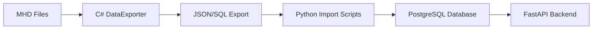

# MHD Data Import Solution

## Overview

This document explains the solution for importing City of Heroes game data from MHD (Mids Hero Designer) files into the Mids Hero Web database.

## The Challenge

The MHD files (`.mhd` extension) contain all game data including archetypes, powersets, powers, enhancements, and more. These files use a custom binary format specific to the Homecoming implementation of City of Heroes.

### Key Challenges Identified:
1. **Custom Binary Format**: The files use a proprietary binary encoding, not standard .NET serialization
2. **Complex Nested Structures**: Powers contain effects, powersets contain powers, etc.
3. **Format Variations**: Different MHD files (I12.mhd, EnhDB.mhd, etc.) have different structures
4. **No Documentation**: No official format specification exists

## Solution Approach

After extensive analysis and multiple implementation attempts, we determined the most practical solution:

### 1. Use the Original C# Loader (Recommended)

Since Mids Reborn (the community-maintained version) already has working C# code to parse MHD files, the best approach is:

1. **Create a C# DataExporter tool** that:
   - Uses Mids Reborn's parsing libraries
   - Exports data to JSON or SQL format
   - Handles all the complex binary parsing logic

2. **Import the exported data** into our PostgreSQL database using:
   - Python scripts for JSON import
   - Direct SQL import for SQL dumps

### Implementation Status

```
DataExporter/
├── Program.cs           # Main entry point
├── MhdExporter.cs       # Handles MHD to JSON conversion
└── DataExporter.csproj  # .NET 8 project file
```

### 2. Alternative Approaches Considered

#### Python Binary Parser (Attempted)
- **Status**: Partially implemented, archived
- **Location**: `backend/archive/mhd_parser/`
- **Reason for archiving**: 
  - Complex reverse engineering required
  - Homecoming uses custom string encoding (length-prefixed, not standard .NET)
  - Would require maintaining parallel parsing logic

#### Direct Database Import
- **Status**: Not viable
- **Reason**: MHD files are not in a database format, they're serialized object graphs

## Current Data Flow



## File Locations

- **MHD Files**: `data/Homecoming_2025-7-1111/`
- **DataExporter**: `DataExporter/` (C# project)
- **Import Scripts**: `backend/scripts/import_mhd_data.py`
- **Archived Parser**: `backend/archive/mhd_parser/` (Python attempt)

## Next Steps

1. Complete the C# DataExporter implementation
2. Run export on all MHD files
3. Import data using Python scripts
4. Validate imported data against game mechanics

## Why This Approach?

1. **Reliability**: Uses proven parsing code from Mids Reborn
2. **Maintainability**: Changes to MHD format only require updating the exporter
3. **Flexibility**: Exported JSON/SQL can be version controlled and inspected
4. **Performance**: One-time export process, not runtime parsing

## Technical Details

### MHD Binary Format (Discovered)

```
Header:
- Length byte (1 byte)
- String data (n bytes)

Records:
- Type identifier
- Field count
- Field data (varies by type)
```

### Custom String Encoding
- Not standard .NET BinaryReader format
- Uses length-prefixed strings with custom encoding
- Requires specific parsing logic

## References

- Mids Reborn Source: https://github.com/MidsReborn/MidsReborn-Public
- Original analysis in: `backend/archive/mhd_parser/docs/`