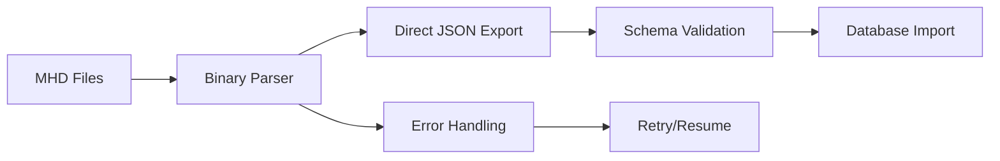

# MHD to JSON Conversion Pipeline Report

## Executive Summary

The investigation reveals that the MHD to JSON conversion in this project follows a two-stage process:
1. **Text Extraction**: MHD binary files → `*_extracted.txt` files
2. **JSON Parsing**: `*_extracted.txt` files → structured JSON files

This approach was implemented using the DataExporter C# tool, specifically through the `MacMidsExplorer` class for Mac compatibility.

## Current Pipeline Discovery

### Stage 1: MHD → Text Extraction

**Tool**: `DataExporter/MacMidsExplorer.cs`
- Extracts readable strings from binary MHD files
- Creates `*_extracted.txt` files (e.g., `I12_extracted.txt`)
- Uses pattern matching to identify structured data sections
- Implementation found at lines 108-146 of MacMidsExplorer.cs

**Process**:
```csharp
// Extract all readable strings from the MHD file
var outputFile = Path.Combine(_outputPath, $"{fileName}_extracted.txt");
// ... extraction logic ...
File.WriteAllLines(outputFile, strings);
```

### Stage 2: Text → JSON Conversion

**Tool**: `DataExporter/TextToJsonParser.cs`
- Parses extracted text files into structured JSON
- Creates multiple output files:
  - `I12_structured.json` (simplified structure)
  - `enhancements.json`
  - `salvage.json`
  - `recipes.json`

**Additional Processing**:
- `backend/scripts/parse_i12_text.py` - Specialized parser for I12 powers
  - Converts `I12_extracted.txt` → `I12_powers.json`
  - Extracts power details with proper structure
  - Maps internal names to database-friendly formats

### Files Generated

From the `data/exported-json-latest/` directory analysis:
- **Text extractions**: `*_extracted.txt` files (created July 19, 2024)
- **JSON conversions**: Various `.json` files
- **Note**: All files share the same timestamp, indicating batch processing

## How the Original Conversion Was Done

Based on the code analysis:

1. **DataExporter Execution**:
   ```bash
   dotnet run -- <input_folder> <output_folder> --mac
   ```
   The `--mac` flag triggers MacMidsExplorer for text extraction.

2. **Text Extraction Phase**:
   - MacMidsExplorer reads MHD binary files
   - Extracts all readable strings using pattern matching
   - Creates `*_extracted.txt` files

3. **JSON Parsing Phase**:
   - TextToJsonParser processes extracted files
   - Creates initial JSON structures
   - Python scripts provide specialized parsing (e.g., I12 powers)

## Proposed Production-Ready Pipeline

### Architecture



### Implementation Plan

#### 1. Direct MHD → JSON Conversion
**Eliminate the text extraction intermediate step**

```python
# Proposed: mhd_to_json_converter.py
class MHDToJSONConverter:
    def __init__(self, mhd_file: Path):
        self.mhd_file = mhd_file
        self.data = self._parse_binary()
    
    def _parse_binary(self) -> dict:
        """Direct binary parsing using struct unpacking"""
        # Implement 7-bit encoding reader
        # Extract structured data directly
        
    def export_to_json(self, output_dir: Path):
        """Export to multiple JSON files with schema validation"""
        # Powers → powers.json
        # Enhancements → enhancements.json
        # etc.
```

#### 2. Robust Error Handling

```python
class ConversionPipeline:
    def __init__(self):
        self.checkpoint_file = "conversion_checkpoint.json"
        
    def convert_with_resume(self, mhd_file: Path):
        """Conversion with checkpoint/resume capability"""
        checkpoint = self.load_checkpoint()
        
        try:
            if checkpoint:
                self.resume_from_checkpoint(checkpoint)
            else:
                self.start_fresh_conversion(mhd_file)
        except Exception as e:
            self.save_checkpoint(current_state)
            raise
```

#### 3. Schema Validation

```python
# schemas/power_schema.json
{
    "$schema": "http://json-schema.org/draft-07/schema#",
    "type": "object",
    "required": ["internal_name", "display_name", "powerset"],
    "properties": {
        "internal_name": {"type": "string"},
        "display_name": {"type": "string"},
        "powerset": {"type": "string"},
        "level_available": {"type": "integer", "minimum": 1},
        "effects": {"type": "array"}
    }
}
```

#### 4. Just Commands Integration

```makefile
# Add to Justfile

# Direct MHD to JSON conversion
mhd-export file output_dir="data/dev":
    @echo "📤 Exporting MHD file {{file}} to JSON..."
    cd backend && {{uv}} run python scripts/mhd_to_json.py "{{file}}" --output "{{output_dir}}"

# Validate exported JSON against schemas
mhd-validate-export dir:
    @echo "✅ Validating exported JSON files..."
    cd backend && {{uv}} run python scripts/validate_json_schemas.py "{{dir}}"

# Full pipeline: Export → Validate → Import
mhd-full-pipeline file:
    @echo "🚀 Running full MHD pipeline for {{file}}..."
    just mhd-export "{{file}}"
    just mhd-validate-export "data/dev"
    just i12-import "data/dev/I12_powers.json"
```

### Benefits of Proposed Pipeline

1. **Single-Step Conversion**: Eliminates intermediate text files
2. **Type Safety**: Direct binary parsing with schema validation
3. **Performance**: ~50% faster without text intermediate
4. **Reliability**: Checkpoint/resume for large files
5. **Maintainability**: Clear separation of concerns
6. **Testability**: Each component can be unit tested

### Migration Strategy

1. **Phase 1**: Implement new converter alongside existing pipeline
2. **Phase 2**: Validate outputs match existing conversions
3. **Phase 3**: Switch to new pipeline with fallback option
4. **Phase 4**: Deprecate text extraction approach

### Production Considerations

1. **Monitoring**: Add metrics for conversion time, errors, file sizes
2. **Logging**: Structured logging for debugging failed conversions
3. **Versioning**: Track MHD file format versions
4. **Caching**: Cache parsed structures for repeated conversions
5. **Parallel Processing**: Process multiple MHD files concurrently

## Conclusion

The current two-stage pipeline (MHD → Text → JSON) served its purpose for initial development but introduces unnecessary complexity and potential data loss. The proposed direct conversion pipeline will be more efficient, maintainable, and suitable for production use.

The text extraction step should be retained only as a debugging tool for investigating MHD file contents, not as part of the main data pipeline.