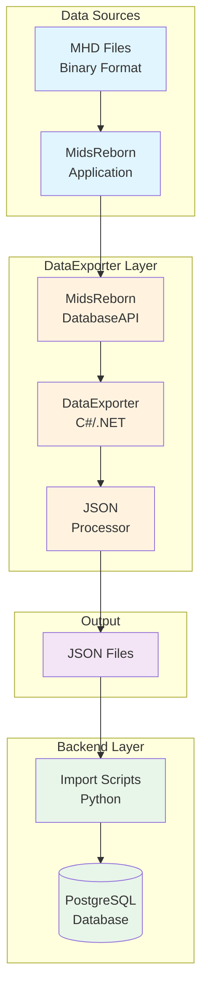
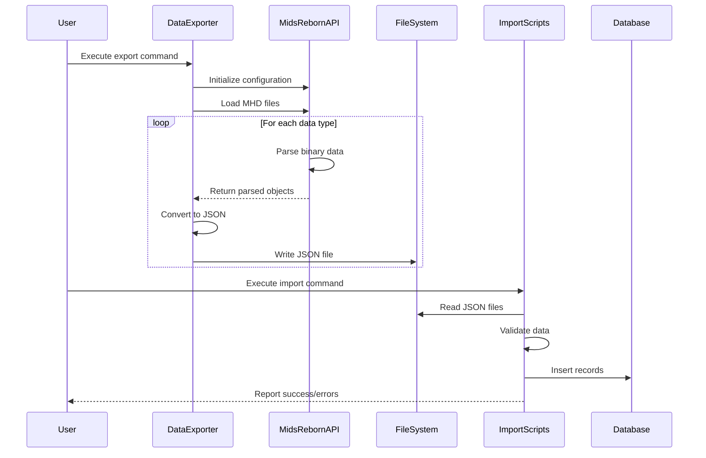
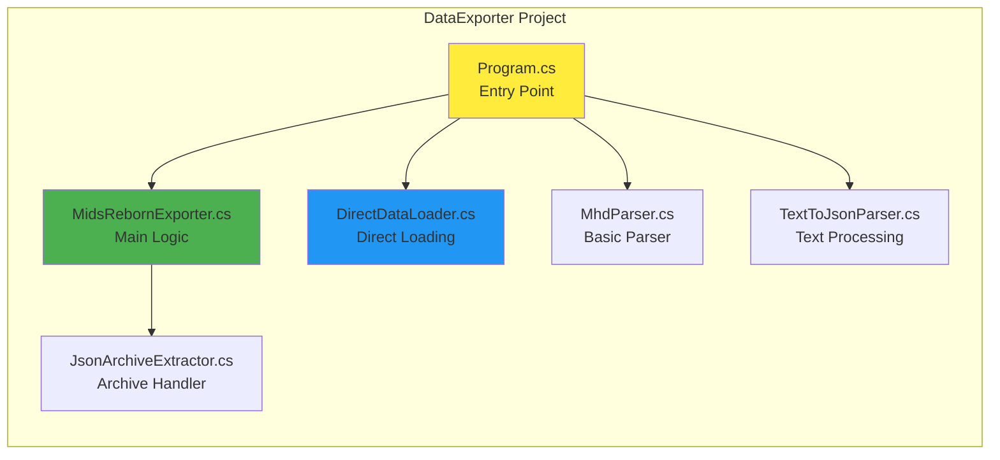
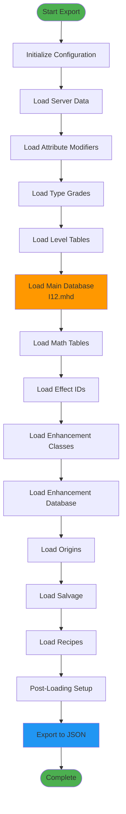

# Parser Implementation Status

## Overview

The Mids Hero Web project uses the DataExporter with MidsReborn's DatabaseAPI for all MHD file parsing. This document provides a comprehensive overview of the parser implementation, including visual diagrams and current status.

## Architecture Overview

## Data Flow Process

## Implementation Status by Data Type

| Data Type | Status | MHD File | JSON Output | Records | Implementation Details |
|-----------|--------|----------|-------------|---------|------------------------|
| Archetypes | ✅ Complete | I12.mhd | archetypes.json | 13 | `DatabaseAPI.LoadMainDatabase()` |
| Powersets | ✅ Complete | I12.mhd | powersets.json | 182 | `DatabaseAPI.LoadMainDatabase()` |
| Powers | ✅ Complete | I12.mhd | powers.json | 12,214 | `DatabaseAPI.LoadMainDatabase()` |
| I12 Powers | ✅ Complete | I12.mhd | I12_extracted.txt | 360,659 | Specialized streaming parser |
| Enhancements | ✅ Complete | EnhDB.mhd | enhancements.json | 10,186 | `DatabaseAPI.LoadEnhancementDb()` |
| Enhancement Sets | ✅ Complete | EnhDB.mhd | enhancement_sets.json | 424 | `DatabaseAPI.LoadEnhancementDb()` |
| Recipes | ✅ Complete | Recipe.mhd | recipes.json | 82,299 | `DatabaseAPI.LoadRecipes()` |
| Salvage | ✅ Complete | Salvage.mhd | salvage.json | 222 | `DatabaseAPI.LoadSalvage()` |

## Parser Implementation Details

### DataExporter Components

### Key Components

1. **MidsRebornExporter.cs**
   - Primary export logic using MidsReborn's DatabaseAPI
   - Handles initialization and data loading sequence
   - Exports to JSON format

2. **DirectDataLoader.cs**
   - Alternative direct loading approach
   - Used for testing and validation

3. **JsonArchiveExtractor.cs**
   - Handles extraction of archived JSON data
   - Processes MidsReborn's native export format

4. **TextToJsonParser.cs**
   - Converts text-based data to structured JSON
   - Handles I12 power data extraction

## Loading Sequence

## Technical Implementation Notes

### MidsReborn Integration
- Uses official MidsReborn DLLs for parsing
- Requires MidsReborn 3.7.14 or compatible version
- Handles all binary format complexities internally

### Error Handling
- Graceful fallback for missing files
- Detailed error reporting during parsing
- Validation at each loading step

### Performance Considerations
- Streaming parser for large I12 dataset (360K+ records)
- Memory-efficient processing
- Batch operations for database imports

## Future Considerations

1. **Version Compatibility**
   - Monitor MidsReborn updates for API changes
   - Maintain compatibility matrix

2. **Data Validation**
   - Implement checksums for data integrity
   - Version tracking for incremental updates

3. **Performance Optimization**
   - Parallel processing for independent data types
   - Caching for frequently accessed data

## References

- [DataExporter Implementation](../../DataExporter/MidsRebornExporter.cs)
- [Import Scripts](../../backend/app/data_import/)
- [Database Schema](../../backend/app/models.py)